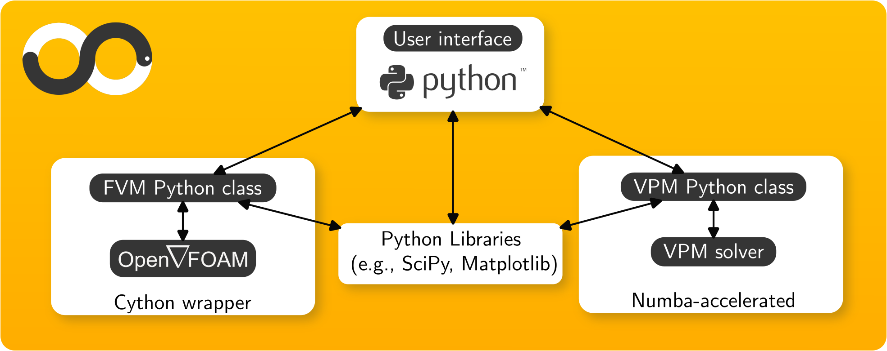

<p align="center">
  
</p>

❇️ **openONDA** is an advanced **Computational Fluid Dynamics (CFD) solver** that enables seamless execution and manipulation of the **Vortex Particle Method (VPM)** and **Finite Volume Method (FVM)** directly from Python.

❇️ **ONDA** ("wave" in Portuguese) stands for **"Operator for Numerical Design and Aerodynamics"**. It represents a **hybrid solver** with the following capabilities:
   - **Eulerian CFD simulations** by wrapping OpenFOAM and exposing its features as a Python class: **fvmSolver**.
   - **Lagrangian CFD simulations** using an in-house VPM solver with DNS and dynamic LES capabilities, wrapped into a Python class: **vpmSolver**

<p align="center">
  
</p>

---

## ❇️ Solver Capabilities
- Handles 3D unsteady flow problems
- Large-Eddy Simulation (LES) modeling for both VPM and FVM solvers
- Seamless interfacing with external solvers via Python
- 🚧 *(To be implemented)* Integration between OpenFOAM and VPM solvers

---

## ❇️ Example Simulations

❇️ **Vortex Filament Flow**  
_Run with:_  
```bash
cd ./examples/eulerian_module_examples
python /E1_vortex_filament_flow.py
```

<p align="center">

</p>

❇️ **Vortex Ring Flow**  
_Run with:_  
```bash
cd ./examples/eulerian_module_examples
python /E2_vortex_ring_flow.py
```

<p align="center">

</p>


---

## ❇️ System Requirements
✔ **OS**: Ubuntu 22.04 LTS  
✔ **CFD Framework**: OpenFOAM v2406 (2025)  
✔ **Python Version**: 3.9.13  
✔ **Required Libraries**:  
   - `numpy`, `matplotlib`, `scipy`  
   - `cython`, `libboost-all-dev` (for Boost.Python)  
   - `pyublas`  

---

## ❇️ Installation Guide

### 1️⃣ Install Prerequisites

#### **1.1 Install Conda**  
- Install **Anaconda** or **Miniconda**: 🔗 [Anaconda Download](https://www.anaconda.com) | 🔗 [Miniconda Download](https://docs.conda.io/en/latest/miniconda.html)

- Install necessary system dependencies (**for Linux**):
    ```bash
    sudo apt update
    sudo apt install -y libboost-all-dev
    ```

#### **1.2 Install OpenFOAM**  
- Download and install the pre-compiled version of 🔗 [OpenFOAM](https://www.openfoam.com/news/main-news/openfoam-v2406)

📌 *Note: By default, openONDA works with OpenFOAM v2406. If updating OpenFOAM, modify the `setup.py` file accordingly. Compatibility with newer versions is not guaranteed.*

#### **1.3 Clone or Download the Repository**
```bash
git clone https://github.com/your-repo/openONDA.git
cd openONDA
```

#### **1.4 Set Up the Conda Environment**
```bash
conda env create -f ./documentation/environment.yml
conda activate openONDA
```

---

### 2️⃣ Install openONDA
Simply run:
```bash
pip install .
```
✔ *This will compile and install all necessary components for openONDA.*  

---

## ❇️ Running Your First Test Case

After installation, verify functionality with:

🔹 **Activate the Conda environment**
```bash
conda activate openONDA
```

🔹 **Run tests**
```bash
pytest -v -s --tb=long ./tests/test1_import_modules.py > test1.log
pytest -v -s --tb=long ./tests/test2_eulerian_solver_communication.py > test2.log
```

✅ Example cases can be found in the `./examples/` directory.

---

## ❇️ Troubleshooting Guide
📌 **Common Issues & Fixes**

- **Conda command not recognized?** Run:
  ```bash
  conda init
  ```
  Then restart your terminal.
- **Missing dependencies?** Ensure `libboost-all-dev` is installed:
  ```bash
  sudo apt install -y libboost-all-dev
  ```
- **Wrong Python environment?** Check active environments with:
  ```bash
  conda info --envs
  ```
- **Permission issues running scripts?** Fix with:
  ```bash
  chmod +x <script-name>.sh
  ```
- 🚧 *Jupyter Notebook compatibility is limited and will be improved in future releases. Currently, Jupyter notebooks can be used only via ```jupyter notebook``` from the terminal, and not via Visual Studio Code or similar IDEs.*

---

## ❇️ License
📄 **openONDA** is distributed under the **GNU General Public License (GPL) v3** or later.

---

## ❇️ How to Cite

If you use **openONDA** in your work, please cite the following references:

📌 **To cite the VPM solver**:  
- *Martins, F., Lastname, S., & Lastname, C. (2025). FLARE: A hybrid OpenFOAM and vortex particle method for external flow simulations. *Journal of Computational Fluid Dynamics, 12*(3), 123–145. https://doi.org/10.1234/dummy-doi*

📌 **To cite the PyFoamLink Python interface**:  
- *Martins, F., Lastname, S., & Lastname, C. (2025). FLARE: A hybrid OpenFOAM and vortex particle method for external flow simulations. *Journal of Computational Fluid Dynamics, 12*(3), 123–145. https://doi.org/10.1234/dummy-doi*

📌 **To cite the complete communication module (openONDA)**:  
- *Martins, F., Lastname, S., & Lastname, C. (2025). FLARE: A hybrid OpenFOAM and vortex particle method for external flow simulations. *Journal of Computational Fluid Dynamics, 12*(3), 123–145. https://doi.org/10.1234/dummy-doi*

---

## ❇️ Authors and Contributions

👨‍💻 **Artur Palha** (2013-2016) - Initial development, pHyFlow  
👨‍💻 **Rention Pasolari** (2022-2024) - Major modifications, pHyFlow  
👨‍💻 **Flavio Martins** (2024-Present) - 3D flow capabilities, Eulerian-Lagrangian communication, VPM solver, debugging, examples, documentation, conversion to openONDA

📩 **Contact:** [Flavio Martins](mailto:f.m.martins@tudelft.nl)

---

## ❇️ Support & Contributions
- *Want to contribute? Found a bug?* Contat the e-mail above or
- Open an **issue** or submit a **pull request** on **GitHub**!  