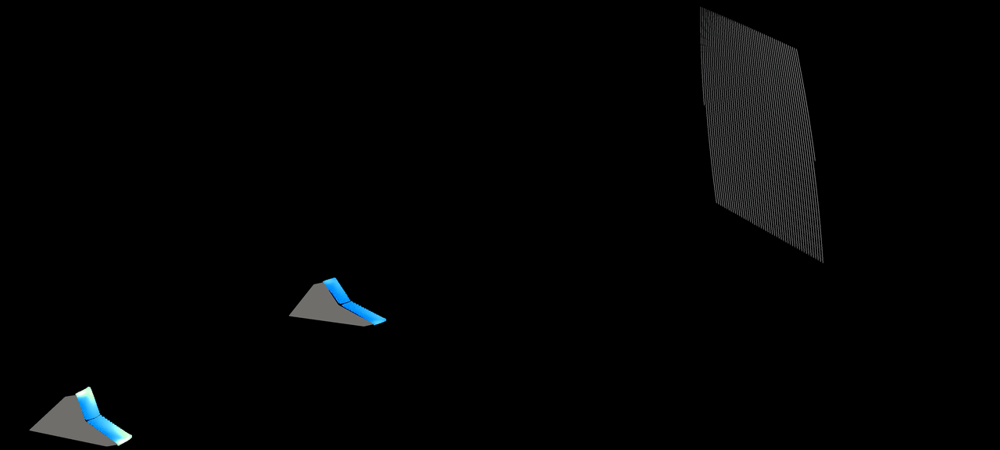

# OpenONDA

<p align="center">
  
</p>

**OpenONDA is a Python library for simulating fluid flow and aerodynamics.**
It combines finite-volume, vortex-particle, and vortex-lattice methods to study
viscous flows, wakes, wings, rotors, and interacting vortices.

<p align="center">
  
</p>

<p align="center"><em>Vortex wake from the <a href="tutorials/vpm/05_delta_wing/README.md">two heaving delta wings</a> tutorial.</em></p>

## Main capabilities

- **FVM:** incompressible flow, native mesh generation, immersed bodies, and sampling.
- **VPM/VLM:** particle-based wake evolution and aerodynamic lifting surfaces, with CPU and supported GPU backends.
- **Hybrid coupling:** native FVM near-field flow coupled to a VPM outer domain.

## Installation

Use Python **3.11–3.13** on Linux or Apple Silicon macOS; Intel macOS requires
Python **3.11**. A virtual environment is recommended.

```bash
GIT_LFS_SKIP_SMUDGE=1 git clone https://github.com/EngFlavioMartins/OpenONDA.git
cd OpenONDA
python install.py
```

The installed package works from any directory:

```python
from openonda import fvm, vpm, coupler
```

The installer installs dependencies into the Python environment you are using
and verifies the result outside the checkout. Use `python install.py --dev`
to work on the source without reinstalling after edits. Ordinary
`python -m pip install .` is also supported.

To run a case:

```bash
cd tutorials/vpm/01_lamb_oseen_vortex
python setup.py vortex CS
python assets/rwm_ensemble.py vortex --number-of-realizations 10 --converge
```

See [installation details](docs/installation.md) for environment setup,
optional mesh import and MPI/PETSc support.

## Tutorials

```bash
openonda tutorial list
openonda tutorial create vpm/vortex_ring ./ring-workspace
```

The clone command above downloads source without Git LFS datasets. To retrieve
archived datasets when LFS access is available, install Git LFS and run
`git lfs pull` in the checkout. Keep newly generated samples and complete restart
checkpoints with your simulation archives; they are not uploaded automatically.

Each case includes its own instructions and input assets. See the [tutorial guide](docs/tutorials.md) for running and editing local cases.

## Documentation

- [FVM solver guide](docs/fvm.md)
- [VPM solver guide](docs/vpm.md)
- [FVM--VPM coupling guide](docs/coupling.md)
- [Solution-output layout](docs/solution_layout.md)
- [Visualization style and colour maps](docs/visualization.md)
- [FVM package/API notes](source/solvers/fvm/README.md)
- [VPM numerical references](source/solvers/vpm/REFERENCES.md)
- [Tutorials and hybrid examples](docs/tutorials.md)
- [Installation and optional tools](docs/installation.md)
- Command-line help: `openonda --help` and `openonda api fvm.FVMCase`

## Development and contributing

Install with `python -m pip install -e ".[dev]"`. See the
[test index](tests/README.md) for verification commands.
Report problems through [GitHub issues](https://github.com/EngFlavioMartins/OpenONDA/issues).

## AI assistance

Human maintainers direct the physics, numerical methods, and base architecture.
AI tools assist with code implementation, docstrings, documentation, and code
review. Human maintainers are responsible for final review and publication.

OpenONDA is licensed under [GPL-3.0-or-later](license).
For research use, see [citation.cff](citation.cff).
