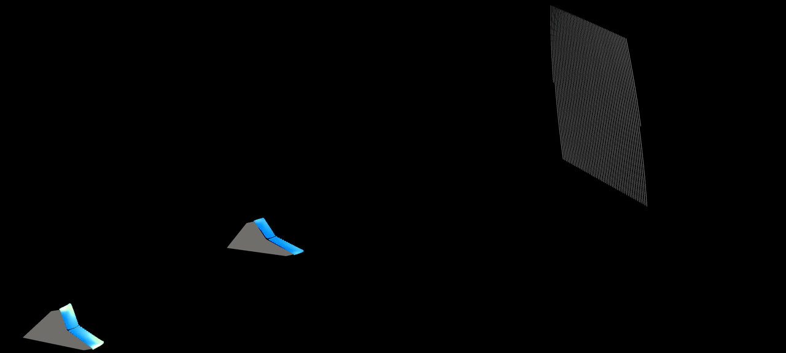

# OpenONDA

<p align="center">
  
</p>

**OpenONDA is a Python library for simulating fluid flow and aerodynamics.**
It combines finite-volume, vortex-particle, and vortex-lattice methods to study
viscous flows, wakes, wings, rotors, and interacting vortices.

<p align="center">
  
</p>

<p align="center"><em>Vortex wake from an archived run of the <a href="tutorials/vpm/05_delta_wing/README.md">two heaving delta wings</a> tutorial.</em></p>

## Main capabilities

- **FVM:** incompressible flow, native mesh generation, immersed bodies, and sampling.
- **VPM/VLM:** particle-based wake evolution and aerodynamic lifting surfaces, with CPU and supported GPU backends.
- **Hybrid coupling:** native FVM near-field flow coupled to a VPM outer domain.

## Installation

Use **CPython 3.11** on Linux and macOS (Apple Silicon or Intel).
Only the 3.11 release series is supported; 3.11 security and bug-fix updates
remain allowed. Create a virtual environment with that interpreter:

```bash
git lfs install
git clone --depth 1 --branch development \
  https://github.com/EngFlavioMartins/OpenONDA.git
cd OpenONDA
python3.11 -m venv .venv
source .venv/bin/activate
python install.py
```

The installer installs dependencies into the Python environment you are using
and verifies the result outside the checkout. Use `python install.py --dev`
to work on the source without reinstalling after edits. Ordinary
`python -m pip install .` is also supported.

See [installation details](docs/installation.md) for environment setup,
optional mesh import and MPI/PETSc support.

To reproduce archived tutorial figures, install [Git LFS](https://git-lfs.com/)
before cloning and the [rendering dependencies](docs/installation.md#optional-external-software).
Run `./allplot.sh` inside the case. Its lossless result archive restores missing
plot inputs; existing local runs are preserved. Archives record whether their
results are complete, partial or stopped on a numerical health check. See the
[archive checklist](docs/verification/tutorial_results_archive.md) for coverage
and remaining numerical work. Result archives are separate from the pip package.

## Two small examples

Run either snippet as a Python script from any writable directory. These are
coarse, short examples to illustrate the API; all inputs use SI units.

### FVM: uniform flow in a periodic box

```python
from openonda import fvm

case = fvm.FVMCase(
    name="uniform-flow",
    directory="fvm-example",
    mesh=fvm.mesher.periodic_square_mesh(16),
    numerics=fvm.Numerics(
        transport=fvm.TransportConfig(kinematic_viscosity=0.01),
    ),
    boundaries=(
        fvm.BoundaryConfig.cyclic("xmin", "xmax"),
        fvm.BoundaryConfig.cyclic("xmax", "xmin"),
        fvm.BoundaryConfig.cyclic("ymin", "ymax"),
        fvm.BoundaryConfig.cyclic("ymax", "ymin"),
        fvm.BoundaryConfig.empty("zmin"),
        fvm.BoundaryConfig.empty("zmax"),
    ),
    initial_conditions=fvm.InitialFields(velocity=(1.0, 0.0, 0.0)),
    run=fvm.RunPlan(end_time=0.05, time_step_size=0.01),
)
with fvm.FVMSolver(case) as solver:
    solver.run()
```

### VPM: a viscous vortex ring

```python
from openonda import vpm

ring = vpm.VortexRing(
    radius=1.0, vortex_core_radius=0.2, circulation=1.0,
    kinematic_viscosity=0.001,
    distribution=vpm.ToroidalDistribution(
        ring_radius=1.0, tube_radius=0.4, spacing=0.2, core_radius_ratio=1.5,
    ),
)
case = vpm.VPMCase(
    directory="vpm-example",
    numerics=vpm.Numerics(
        time_step_size=0.01, compute_device="CPU", max_n_particles=5000,
    ),
    initial_conditions=(ring,),
    run=vpm.RunPlan(steps=5),
)
vpm.VPMSolver(case).run()
```

Open `fvm-example/solution/fvm.pvd` or `vpm-example/solution/vpm.pvd`
in ParaView. See the solver guides below for boundary conditions, sampling,
GPU induction, and restart.

## Tutorials

```bash
openonda tutorial list
openonda tutorial create vpm/vortex_ring ./ring-workspace
```

Working samples and restart checkpoints remain local. Published result snapshots
are versioned losslessly through Git LFS under each case's `assets/results`;
`allplot.sh` restores them in a fresh clone. The pip package contains tutorial
inputs and scripts; result archives are distributed with the Git repository.

Each case includes its own instructions and input assets. See the [tutorial guide](docs/tutorials.md) for running and editing local cases.

## Documentation

- [FVM solver guide](docs/fvm.md)
- [VPM solver guide](docs/vpm.md)
- [FVM--VPM coupling guide](docs/coupling.md)
- [Solution-output layout](docs/solution_layout.md)
- [Plotting and ParaView](docs/visualization.md)
- [VPM numerical references](source/solvers/vpm/REFERENCES.md)
- [Tutorials and hybrid examples](docs/tutorials.md)
- [Installation and optional tools](docs/installation.md)
- Command-line help: `openonda --help` and `openonda api fvm.FVMCase`

## Development and contributing

Install with `python -m pip install -e ".[dev]"`. See the
[test index](tests/README.md) for verification commands.
Report problems through [GitHub issues](https://github.com/EngFlavioMartins/OpenONDA/issues).

## AI assistance

Human maintainers wrote the physics, numerical methods, and base architecture. AI tools assist with docstrings, documentation, code review and debugging. Human maintainers are responsible for final review and publication. All code in this repository were reviewed by a human.

OpenONDA is licensed under [GPL-3.0-or-later](license).
For research use, see [citation.cff](citation.cff).
