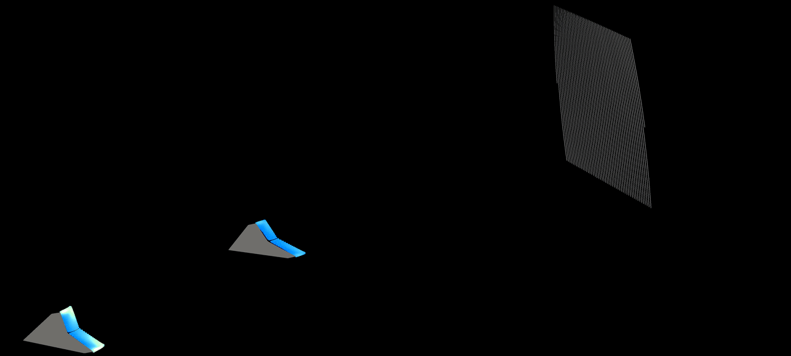
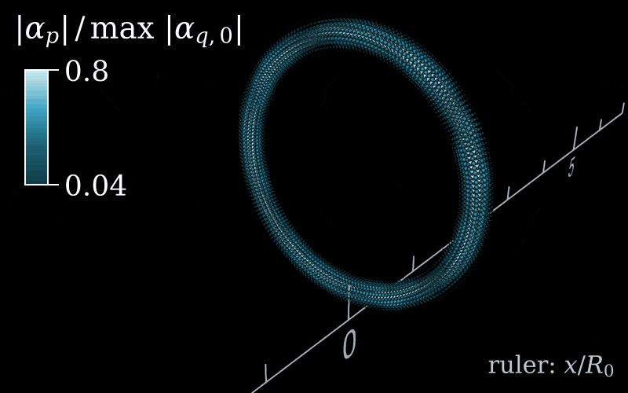
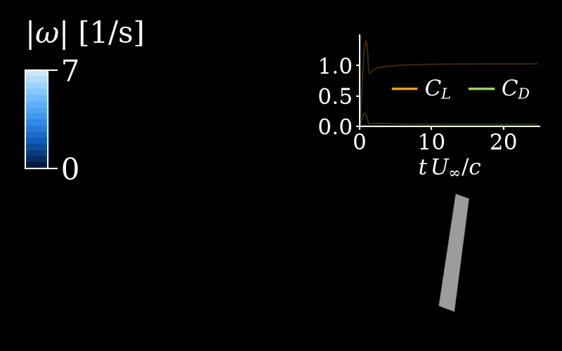
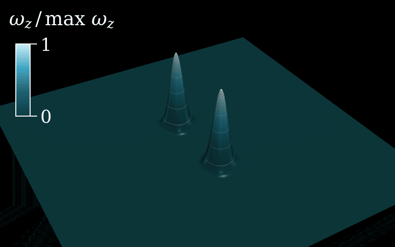
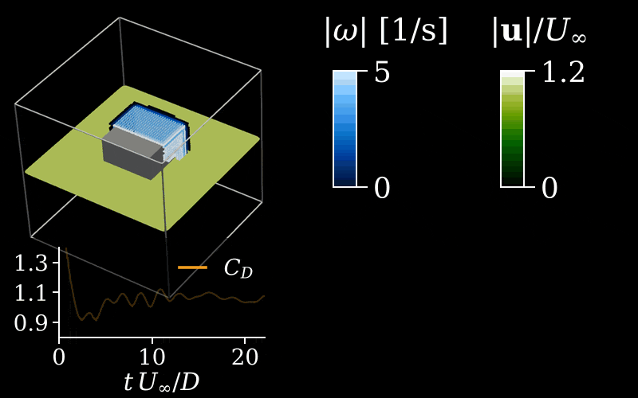
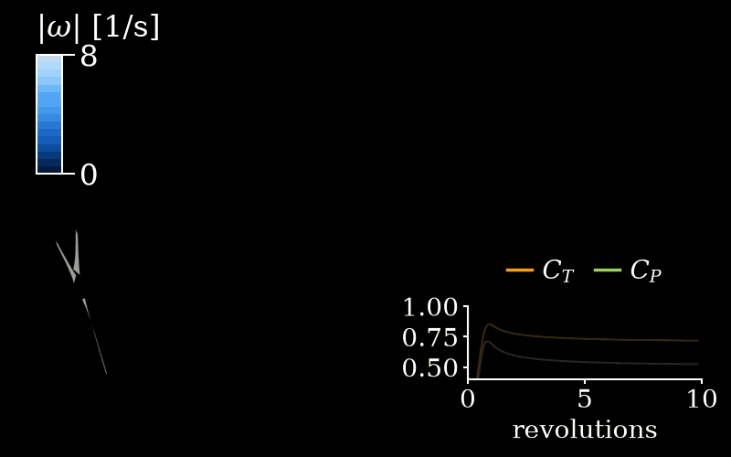

<p align="center">
  
</p>

<p align="center">
  <a href="https://github.com/EngFlavioMartins/OpenONDA/actions/workflows/ci.yml"></a>
  <a href="https://doi.org/10.5281/zenodo.15111460"></a>
  
  
  
  <a href="LICENSE"></a>
</p>

# OpenONDA

**Simulate vortices, wakes, wings and rotors in a few lines of Python.**

OpenONDA, the *Operator for Numerical Design and Aerodynamics* (*onda* is
Portuguese for "wave"), brings three flow solvers into one Python package:

- **Finite volumes (FVM)** resolve viscous flow around walls on a mesh.
- **Vortex particles (VPM)** carry vorticity freely through space, so wakes travel far without a mesh.
- **Vortex lattices (VLM)** turn wings and rotor blades into lifting surfaces that shed those wakes.

Use each on its own, or let FVM resolve the flow near a body while particles
carry its wake. The solvers run on your CPU or GPU, and every case is a short,
readable script.

<p align="center">
  
  <br><em>Two heaving delta wings and their wake, from the <a href="tutorials/vpm/05_delta_wing/README.md">delta-wing tutorial</a>.</em>
</p>

## Installation

On Linux or macOS, run:

```bash
git clone --depth 1 https://github.com/EngFlavioMartins/OpenONDA.git
cd OpenONDA
source install.sh
```

That's it. The installer sets up an `OpenONDA` Conda environment (installing
Miniforge first if you have no Conda), installs OpenONDA, and finishes by
solving and restarting a tiny case with every solver. Next time, start with
`conda activate OpenONDA`. Details and the optional CUDA extras are in the
[installation guide](docs/installation.md).

## Your first simulation

Every tutorial is a ready-to-run case:

```bash
cd tutorials/fvm/taylor_green
./allrun.sh     # run the simulation
./allplot.sh    # make the figures
```

Then open `solution/fvm.pvd` in ParaView, or edit `setup.py` to change the
physics. The [tutorial index](docs/tutorials.md) suggests where to go next.

## Write your own

A viscous vortex column, with particles on a lattice and core spreading for
viscosity:

```python
import numpy as np
from openonda import vpm

# particle spacing [m], core radius [m], viscosity [m²/s]
h, a, nu = 0.2, 0.35, 0.01

class GaussianColumn:
    """Vortex column of unit circulation along z, sampled on a cubic lattice."""

    def build(self):
        x = np.arange(-1.0, 1.0 + h / 2, h)
        position = np.stack(np.meshgrid(x, x, x, indexing="ij"), axis=-1).reshape(-1, 3)
        n = len(position)
        radius_squared = position[:, 0] ** 2 + position[:, 1] ** 2
        strength = np.zeros((n, 3))
        strength[:, 2] = np.exp(-radius_squared / a**2) / (np.pi * a**2) * h**3  # omega * V
        return vpm.VortexParticleSet(
            position=position,
            velocity=np.zeros((n, 3)),
            vortex_strength=strength,
            core_radius=np.full(n, 1.2 * h),
            particle_volume=np.full(n, h**3),
            kinematic_viscosity=np.full(n, nu),
            spacing=h,
        )

case = vpm.VPMCase(
    name="gaussian_column",
    directory="vpm-example",
    numerics=vpm.Numerics(
        time_step_size=0.01,
        compute_device="cpu",
        max_n_particles=5000,
        viscous=vpm.ViscousConfig.cs(kinematic_viscosity=nu, particle_spacing=h),
    ),
    initial_conditions=(GaussianColumn(),),
    run=vpm.RunPlan(end_time=0.02),
)
vpm.VPMSolver(case).run()
```

<details>
<summary>And a finite-volume flow through a box</summary>

```python
import numpy as np

from openonda import fvm

x = np.linspace(0.0, 2.0, 17)  # m, 16 cells along x and y
mesh = fvm.mesher.box_mesh_3d(x, x, np.array([0.0, 0.125]), empty_spanwise=True)

case = fvm.FVMCase(
    name="uniform-flow",
    directory="fvm-example",
    mesh=mesh,
    numerics=fvm.Numerics(
        time_step_size=0.01,
        transport=fvm.TransportConfig(kinematic_viscosity=0.01),
    ),
    boundaries=(
        fvm.BoundaryConfig.inlet("inlet", [1.0, 0.0, 0.0]),
        fvm.BoundaryConfig.outlet("outlet"),
        fvm.BoundaryConfig.slip("ymin"),
        fvm.BoundaryConfig.slip("ymax"),
        fvm.BoundaryConfig.empty("zmin"),
        fvm.BoundaryConfig.empty("zmax"),
    ),
    initial_conditions=fvm.InitialFields(velocity=(1.0, 0.0, 0.0)),
    run=fvm.RunPlan(end_time=0.05),
)
with fvm.FVMSolver(case) as solver:
    solver.run()
```

</details>

Inputs are in SI units. Open `vpm-example/solution/vpm.pvd` or
`fvm-example/solution/fvm.pvd` in ParaView to see the flow.

## Gallery

<table>
  <tr>
    <td width="50%"><a href="tutorials/vpm/02_vortex_ring/README.md"></a><br><sub><b>Vortex ring</b>: a vortex-ring flow.</sub></td>
    <td width="50%"><a href="tutorials/vpm/04_flat_plate/README.md"></a><br><sub><b>Flat plate</b>: a lifting, flat-plate surface sheds its tip vortices.</sub></td>
  </tr>
  <tr>
    <td width="50%"><a href="tutorials/vpm/01_lamb_oseen_vortex/README.md"></a><br><sub><b>Vortex merging</b>: two co-rotating vortices become one.</sub></td>
    <td width="50%"><a href="tutorials/coupled_fvm_vpm/02_cube_flow/README.md"></a><br><sub><b>Flow past a cube</b>: FVM near the body, particles in the wake.</sub></td>
  </tr>
  <tr>
    <td width="50%"><a href="tutorials/vpm/06_rotor_flow/README.md"></a><br><sub><b>Rotor</b>: VLM blades shed a helical particle wake while thrust and power settle.</sub></td>
    <td width="50%"></td>
  </tr>
</table>

## Learn more

- [Tutorials](docs/tutorials.md): the best place to start.
- [Finite volumes](docs/fvm.md), [vortex particles and lifting surfaces](docs/vpm.md) and [FVM–VPM coupling](docs/coupling.md): the models and their settings.
- [Continuing runs](docs/continuation.md), [saved results](docs/solution_layout.md) and [visualization](docs/visualization.md).
- The full manual as one PDF: [`docs/OpenONDA_manual.pdf`](docs/OpenONDA_manual.pdf).

## Citing OpenONDA

If OpenONDA helps your research, please cite it. GitHub's *Cite this
repository* button uses [CITATION.cff](CITATION.cff), and every release is
archived on [Zenodo](https://doi.org/10.5281/zenodo.15111460).

## License

Copyright © 2024–2026 Flavio Martins.
OpenONDA is free software under the [GNU General Public License v3.0 or later](LICENSE).
