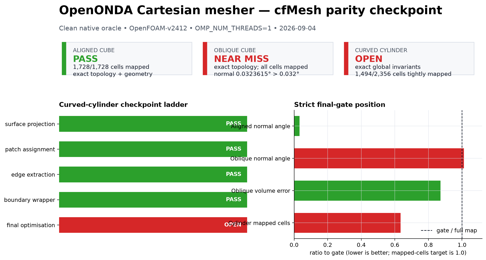
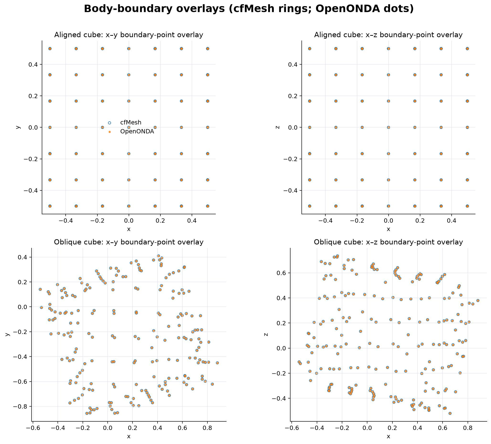
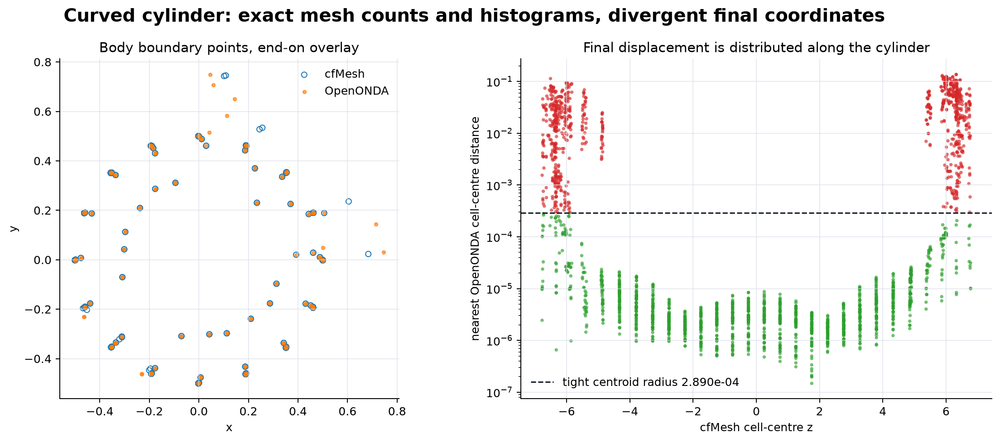
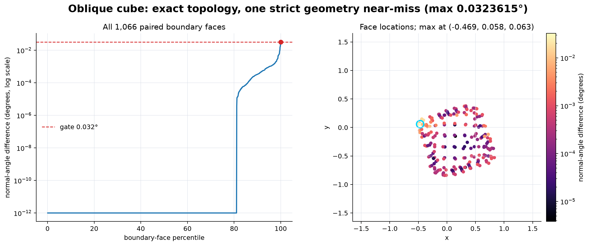

# OpenONDA Cartesian mesher cfMesh-parity handoff

Status captured 2026-09-04 on branch `development`, base commit
`59933d5f7ce1213712c76f81a42ce33ae3fdb008`.

## Executive decision

Checkpoint this work and ask for a focused second review now.

The implementation is on the right architectural track: the differential
oracle exists, the pipeline follows cfMesh checkpoints, the aligned cube passes
the strict final comparison, the oblique cube has exact final topology, and the
curved cylinder has exact global topology invariants through the final stage.
The remaining failure is no longer a broad meshing-design problem. It is a
numerically sensitive final-optimisation reproduction problem where continued
single-agent trial-and-error has shown diminishing returns.

This is **partial implementation**, not certified cfMesh parity. Do not use the
completion phrase from the original plan.

## Prompt to forward to another agent

> Review the OpenONDA Cartesian mesher cfMesh-parity checkpoint in
> `docs/verification/cartesian_mesher/handoff_2026-09-04/REPORT.md` and its
> evidence bundle. Focus on the first remaining discrepancy in cfMesh's final
> optimisation sequence. The aligned cube passes. The oblique cube has exact
> topology and a single body face at 0.0323614697 degrees normal error against a
> 0.032-degree gate. The curved cylinder passes through
> `boundaryLayerGeneration`, retains exact final global invariants, but only
> 1,494/2,356 cells satisfy the tight final mapping; the displacement is
> concentrated near both axial ends. Compare the implementation against cfMesh
> source commit `3ff8555514827646c34cacfe5f0f691e49cdbc96`, especially operation
> order, point/face iteration order, scalar expression order, and the individual
> `optimizeMeshFV`, `optimizeLowQualityFaces`, `optimizeBoundaryLayer`, and
> `untangleMeshFV` transitions. Do not loosen topology or geometry gates, add
> geometry-specific branches, or preserve an experiment without a measurable
> oracle improvement. First explain the most likely cause and identify the
> smallest discriminating checkpoint/instrumentation change; implement a fix
> only if it is source-supported and re-run every earlier parity gate.

## What is complete

### Differential oracle and audit trail

The development harness under `tools/mesh_parity/` now:

- converts one OpenONDA case specification into an equivalent cfMesh case;
- runs the locally compiled `cartesianMesh` through the OpenFOAM-v2412 launcher;
- forces deterministic `OMP_NUM_THREADS=1` reference runs;
- captures executable/launcher hashes, OpenFOAM version, source STL hash,
  effective configuration, Git commit, full logs, and both ASCII `polyMesh`
  results;
- compares exact numbering-independent global invariants;
- builds a bounded centroid/volume/topology-constrained cell correspondence;
- verifies adjacency, face topology, and patch incidence after relabelling;
- reports cell/face-centre, volume, normal, STL-distance, total-volume, and
  bounding-box errors;
- exposes cfMesh's checkpoint ladder with stage-specific audited geometry
  profiles.

The main entry points are:

- `tools/mesh_parity/parity_report.py:143` — single parity run;
- `tools/mesh_parity/parity_report.py:254` — checkpoint ladder;
- `tools/mesh_parity/cfmesh_oracle.py:612` — native cfMesh invocation;
- `tools/mesh_parity/cfmesh_oracle.py:693` — OpenONDA invocation;
- `tools/mesh_parity/compare_meshes.py:739` — Level A–D comparison.

### cfMesh-ordered production path

The implementation is split by conceptual cfMesh stage:

- `cfmesh_template.py:407` — Cartesian/octree template and general polyhedra;
- `cfmesh_edge_extraction.py:399` — feature/edge extraction;
- `cfmesh_surface_optimisation.py:586` — cfMesh-style surface optimisation;
- `cfmesh_boundary_layer.py` — topological wrapper/boundary-layer generation;
- `cfmesh_mesh_optimisation.py:1359` — final volume and boundary-layer
  optimisation;
- `mesher.py:493` — public build path and `stop_after` checkpoints.

No cylinder name, cylinder dimensions, canonical cell counts, or patch-name
special case appears in the production algorithm. Requested mesh size remains
an input; the parity path does not silently fit a different background size.

## Clean-oracle results



### Final cases

| Case | Level A | Cell map | Levels B/C | Level D | Result |
| --- | --- | ---: | --- | --- | --- |
| Aligned cube | exact | 1,728/1,728 | zero mismatches | within all gates | **PASS** |
| Oblique cube | exact | 1,755/1,755 | zero mismatches | one normal-angle near miss | **FAIL: geometry** |
| Coarse curved cylinder | exact | 1,494/2,356 | not evaluated after incomplete map | not evaluated after incomplete map | **FAIL: cell mapping** |

The cube boundary-point overlays visually confirm that the reference and
candidate surfaces coincide at plotting scale:



### Curved-cylinder stage ladder

| Checkpoint | Cells mapped | Result | Key observation |
| --- | ---: | --- | --- |
| `surfaceProjection` | 624/624 | PASS | max boundary-centre error 1.536e-7 |
| `patchAssignment` | 624/624 | PASS | exact topology; curved-wall geometry inside audited stage profile |
| `edgeExtraction` | 1,082/1,082 | PASS | exact topology and complete map |
| `boundaryLayerGeneration` | 2,356/2,356 | PASS | exact 7,356 faces, 5,914 internal faces, 1,442 boundary faces, 2,684 points |
| `boundaryLayerRefinement` | 1,494/2,356 | FAIL | exact final counts/histograms, but 862 cfMesh cells have no admissible tight correspondence |

At `boundaryLayerGeneration`, patch counts agree exactly:

| Patch | Faces | Type |
| --- | ---: | --- |
| `body` | 412 | wall |
| `front_back` | 134 | patch |
| `inlet` | 224 | patch |
| `outlet` | 224 | patch |
| `walls` | 448 | patch |

The final-cylinder comparison uses a centroid candidate radius of
`2.8904618999695545e-4`. The strict comparator maps 1,494 cells after also
checking cell volume, face count, neighbour count, and patch incidence. A plain
nearest-neighbour diagnostic puts 1,530 cell centres inside that radius. The
largest nearest-centre displacement is `0.1369254662`; the 95th and 99th
percentiles are `0.0640246087` and `0.1055555588`. The spatial plot shows that
the meaningful divergence is concentrated near both cylinder ends rather than
uniformly throughout the volume.



### Oblique-cube near miss

All 1,066 boundary faces are paired after a complete cell mapping. Exactly one
face exceeds the normal-angle gate:

- maximum: `0.03236146973877208` degrees;
- gate: `0.032` degrees;
- excess: `0.00036146973877208` degrees, about 1.13% of the gate;
- cfMesh face: 4,781;
- OpenONDA face: 4,919;
- patch: `body`;
- cfMesh face centre: `(-0.4687103791, 0.0576761101, 0.0633377633)`;
- maximum cell-centre distance: `3.901763328845853e-5`;
- maximum relative cell-volume error: `2.17873188184138e-4`, inside the
  `2.5e-4` gate;
- adjacency, internal-face topology, boundary-face topology, and patch
  incidence: zero mismatches.



This should be treated as an arithmetic/iteration-order clue, not a reason to
round the result or widen the gate.

## Rejected experiments retained as evidence

The current source has been restored to the best verified baseline. Two
symmetry-branch experiments are saved under
`evidence/rejected_experiments/`:

| Experiment | Tight cylinder map | Decision |
| --- | ---: | --- |
| Baseline retained in source | 1,494/2,356 | checkpoint baseline |
| Prefer reflected quadrant during the divide search | 1,539/2,356 | rejected: improves aggregate count but changes the local optimisation trajectory/radius without source support |
| Run the baseline trajectory, then reflect only the final symmetric result | 1,487/2,356 | rejected: measurable regression |

The first experiment is still diagnostically valuable: a branch decision can
move dozens of downstream cells without changing final topology counts. It
does not justify keeping that branch rule. The second result demonstrates that
forcing geometric symmetry after optimisation is not sufficient.

`cfmesh_surface_optimisation.py` still contains
`_DIVIDE_TIE_TOLERANCE = 1.0e-4`. Setting it to strict zero caused a native-oracle
regression in earlier testing, so it remains in the checkpoint. Its exact
justification should be reviewed; a source-faithful expression/iteration order
would be preferable to any empirical tie tolerance.

## Most useful next investigation

1. Add diagnostic-only checkpoints around each operation currently grouped
   under final optimisation, on both cfMesh and OpenONDA. The key question is
   which specific sub-operation first produces the large axial-end movement.
2. Compare actual point visitation order, not just formulae. cfMesh's label
   lists, face ordering, boundary patch ranges, and in-place versus staged
   updates can select different equivalent minima.
3. Compare scalar expression order and intermediate precision at the oblique
   face identified above. It is a small, deterministic reproducer and should be
   solved before using the cylinder for further tuning.
4. Inspect how front/back patch points participate in `optimizeBoundaryLayer`
   and `untangleMeshFV`. The cylinder screenshot makes the axial end treatment
   more suspicious than the central curved-wall smoother.
5. Re-run the aligned cube and every earlier cylinder checkpoint after each
   change. Keep a change only when the first failing oracle metric improves or
   disappears without an upstream regression.

Do not work on rectangular refinement, patch refinement, unseen geometry, the
full-resolution reference cylinder, cleanup, or the flow certification yet.
Those are downstream of the unresolved no-refinement final gate.

## Reproduction

The saved evidence is self-contained for inspection. To generate a fresh final
case from the repository root:

```bash
python -m tools.mesh_parity.parity_report \
  tests/mesh_parity/cases/cube_aligned.json \
  --output /private/tmp/openonda-cube-aligned \
  --cfmesh-executable /Users/flaviomartins/OpenFOAM/flaviomartins-v2412/platforms/darwin64ClangDPInt32Opt/bin/cartesianMesh \
  --cfmesh-launcher /Applications/OpenFOAM-v2412.app/Contents/Resources/etc/openfoam
```

For the cylinder ladder:

```bash
python -m tools.mesh_parity.parity_report \
  tests/mesh_parity/cases/cylinder_coarse.json \
  --output /private/tmp/openonda-cylinder-ladder \
  --checkpoint-ladder \
  --cfmesh-executable /Users/flaviomartins/OpenFOAM/flaviomartins-v2412/platforms/darwin64ClangDPInt32Opt/bin/cartesianMesh \
  --cfmesh-launcher /Applications/OpenFOAM-v2412.app/Contents/Resources/etc/openfoam
```

Regenerate the screenshots and derived diagnostics without invoking either
mesher:

```bash
MPLCONFIGDIR=/private/tmp/openonda-mpl \
python docs/verification/cartesian_mesher/handoff_2026-09-04/render_figures.py
```

## Validation at handoff

- `46 passed` across `tests/mesh_parity` plus the relevant Cartesian config,
  phase-0, surface-recovery, and cylinder-reference tests.
- Ruff lint and format checks pass for all changed/new Python files.
- Focused Pyrefly: `0 errors (4 suppressed, 29 warnings not shown)` using
  `/opt/anaconda3/envs/OpenONDA/bin/python`.
- `git diff --check` passes.
- The clean native cfMesh source checkout has exactly one local modification:
  the captured macOS portability patch. No `OPENONDA_` diagnostic hooks or
  debug output remain in the executable.

The test suite establishes regression coverage; it is not being presented as
proof of final parity.

## Evidence bundle map

`evidence/best/` contains the complete copied run directory for:

- aligned cube final;
- oblique cube final;
- curved-cylinder surface projection;
- curved-cylinder patch assignment;
- curved-cylinder edge extraction;
- curved-cylinder boundary wrapper;
- curved-cylinder final optimisation.

Each directory contains the original `parity_report.json`,
`parity_summary.txt`, the byte-preserving compressed cfMesh log at
`cartesianMesh.log.txt.gz`, the effective configuration, OpenONDA generation
report, and both ASCII `constant/polyMesh` trees.

`evidence/rejected_experiments/` contains complete final-cylinder evidence for
the two discarded reflection variants. `derived_metrics.json` stores the
numbers used in the screenshots. `MANIFEST.sha256` checksums every file in the
handoff. `environment/` records the native oracle and contains the exact,
byte-preserving compressed cfMesh portability patch at
`cfmesh_macos_portability.patch.gz`.

The absolute `/private/tmp/...` paths in the copied JSON are provenance from the
original run. Use the adjacent copied `cfmesh/` and `openonda/` directories for
durable local inspection.

## Worktree and commit boundary

The OpenONDA changes are intentionally uncommitted at this handoff. The branch
is `development`; `origin` is `https://github.com/EngFlavioMartins/OpenONDA.git`.

One pre-existing untracked file is unrelated and must not be included in the
mesher checkpoint commit:

```text
tutorials/vpm/lamb_oseen_vortex/run_manifest.json
```

A checkpoint commit should include the Cartesian cfMesh-stage implementation,
parity harness/tests, documentation, and this handoff bundle, while explicitly
describing the two open final-gate failures. It should not claim completion or
certification.
