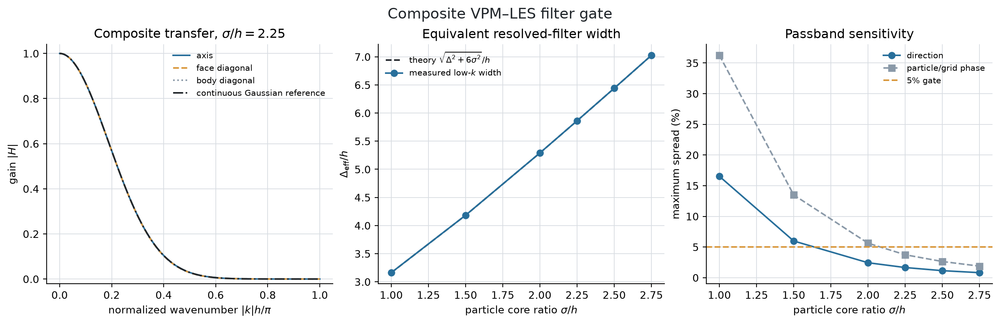
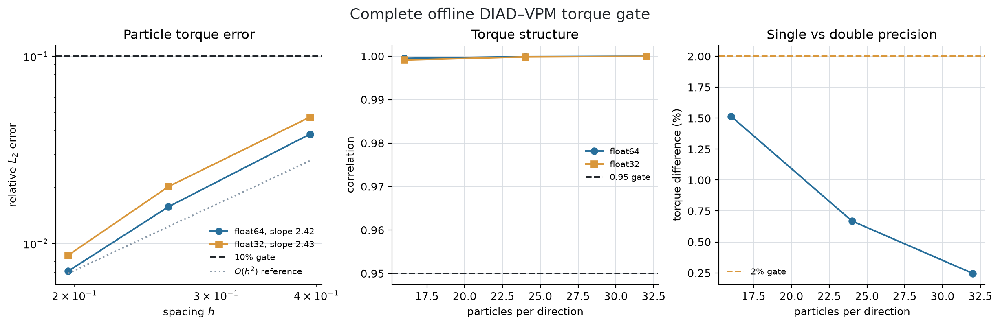
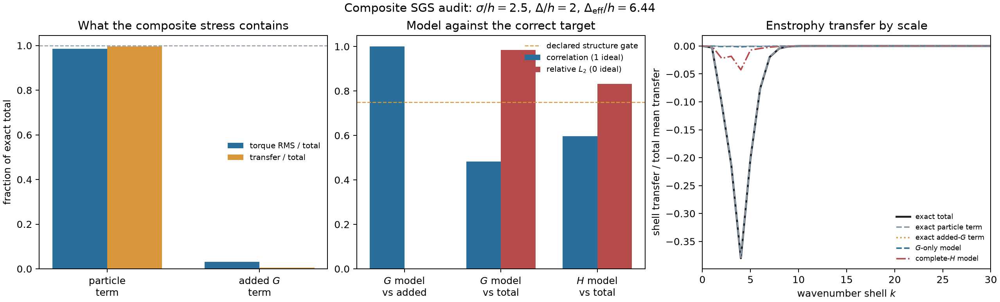
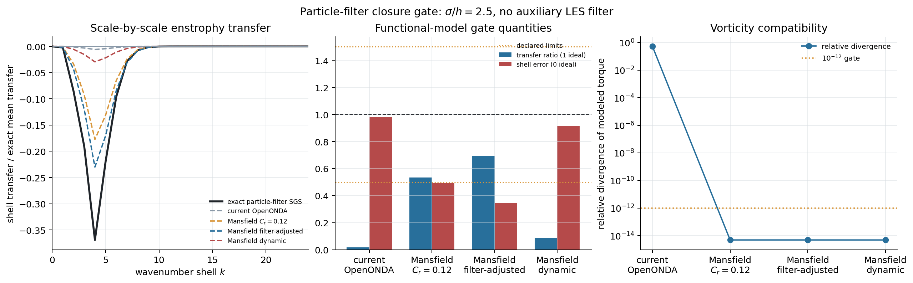
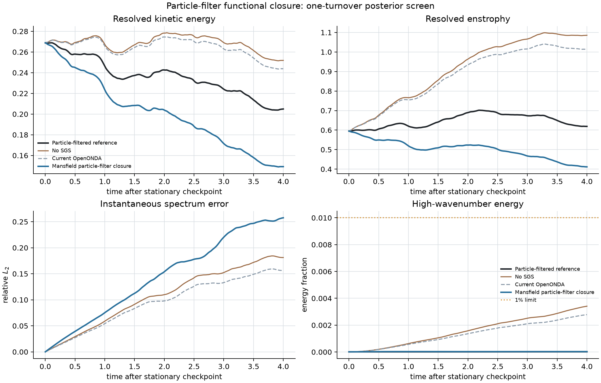
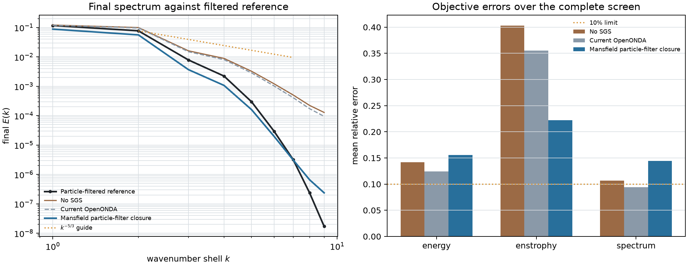
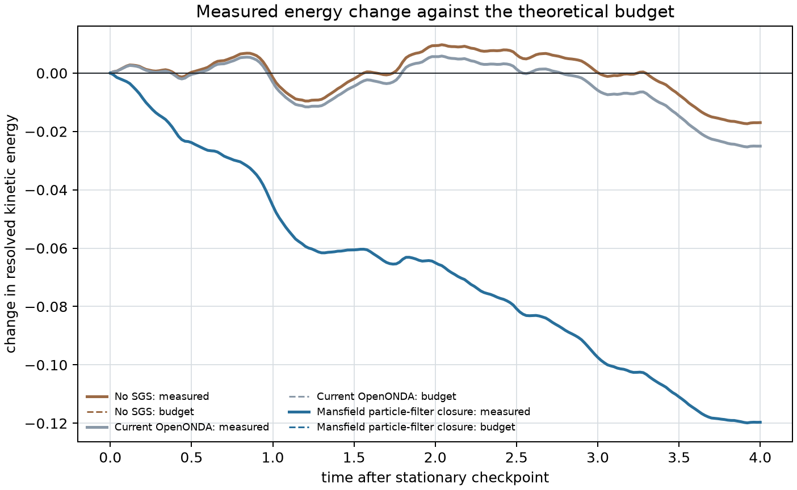

# OpenONDA vortex-particle LES: independent audit record

**Audit state:** complete for the tested formulations

**Last updated:** 17 August 2026

**Intended reader:** an independent researcher or AI reviewer

## Decision first

This project asked whether OpenONDA can obtain a stable and physically correct
three-dimensional large-eddy simulation (LES) by adding a turbulence closure
to its vortex-particle method (VPM).

The present answer is **no, not with either closure tested here**:

1. Dynamic iterative approximate deconvolution (DIAD) was implemented
   consistently for an added Gaussian filter, but that filter accounts for
   only $0.44\%$ of the true unresolved enstrophy transfer. Particle smoothing
   accounts for the other $99.56\%$. DIAD therefore solves the wrong dominant
   closure problem in the current architecture.
2. A filter-consistent Mansfield eddy-diffusivity model was then tested as a
   fallback. Its fixed coefficient improved enstrophy in one posterior test,
   but overdamped kinetic energy and the energy spectrum. Its primary dynamic
   coefficient was negative and became zero under the required non-negative
   clipping. It also failed the stated acceptance gates.

These are useful negative results, not a validated VPM--LES. No tested closure
should be merged into production. OpenONDA may still use VPM for adequately
resolved coherent wakes and use the finite-volume LES solver in turbulent
regions. A new meshless LES effort must model the particle-filter stress
directly or adopt a substantially reformulated VPM.

## 1. Question, scope, and acceptance standard

The incompressible vorticity equation is

$$
\frac{\partial\boldsymbol\omega}{\partial t}
+\boldsymbol u\cdot\nabla\boldsymbol\omega
=\boldsymbol\omega\cdot\nabla\boldsymbol u
+\nu\nabla^2\boldsymbol\omega.
$$

LES resolves large motions and represents the influence of unresolved motions
with a subgrid-scale (SGS) vorticity source $\boldsymbol g_{SGS}$. The research
goal was a closure that:

- follows from the filtered vorticity equation;
- respects the actual OpenONDA particle and grid filters;
- is numerically stable and insensitive to ordinary round-off;
- reproduces SGS structure and enstrophy transfer in an a-priori test;
- improves kinetic energy, enstrophy, and spectra in a time-dependent test;
- keeps molecular diffusion separate from the LES contribution.

This audit covers theory, offline numerical implementation, an a-priori test
against a $128^3$ homogeneous-turbulence field, and a one-turnover posterior
test. It does **not** claim publication-level validation across Reynolds
numbers, resolutions, or engineering flows.

## 2. The decisive theoretical point

OpenONDA smooths the field once through its particle representation and again
through the auxiliary LES filter used by DIAD. Let $P=K_\sigma$ denote particle
regularization, $G=G_\delta$ the added Gaussian filter, and $H=GP$ their total
effect:

$$
\widetilde{\boldsymbol u}=P\boldsymbol u,
\qquad
\overline{\boldsymbol u}=G\widetilde{\boldsymbol u}.
$$

The exact stress under the total filter is

$$
\tau^H_{ij}=H(u_i u_j)-H(u_i)H(u_j).
$$

Adding and subtracting $G(\widetilde u_i\widetilde u_j)$ gives the exact
two-filter decomposition

$$
\tau^H_{ij}
=G\!\left[P(u_i u_j)-\widetilde u_i\widetilde u_j\right]
+\left[G(\widetilde u_i\widetilde u_j)
-\overline u_i\overline u_j\right].
$$

The first bracket is stress lost through particle regularization. The second
is stress introduced by the added filter. The implemented DIAD reconstruction
inverts only $G$, so it models only the second bracket.

At the tested operating point,

$$
\frac{\sigma}{h}=2.5,
\qquad
\frac{\Delta}{h}=2,
\qquad
\frac{\Delta_{\mathrm{eff}}}{h}
=\sqrt{\left(\frac{\Delta}{h}\right)^2
+6\left(\frac{\sigma}{h}\right)^2}=6.442.
$$

The Gaussian particle kernel at the grid Nyquist wavenumber is approximately

$$
\widehat K_\sigma(\pi/h)
=\exp\!\left[-\frac{(2.5\pi)^2}{4}\right]
\approx 2\times10^{-7}.
$$

Thus the particle representation has already erased the high-wavenumber
information that an auxiliary-filter deconvolution would need. This is the
mathematical reason the method can reconstruct its own small added-filter
stress accurately while still missing the physical total SGS torque.

## 3. What was tested

The study proceeded through hard gates. A pass allowed the next test; a fail
stopped development of that model.

| Gate | Question | Result |
|---|---|---:|
| Composite filter | Is the particle/grid/filter operator monotone, non-amplifying, and acceptably isotropic? | **PASS** |
| Offline DIAD bridge | Does the full numerical torque approach the same modeled operator as resolution increases? | **PASS** |
| Exact composite SGS audit | Does DIAD represent the dominant SGS term created by the actual total filter? | **FAIL** |
| Mansfield a-priori audit | Can a particle-filter eddy-diffusivity closure reproduce the missing transfer? | **FAIL** for the dynamic primary model |
| Mansfield posterior audit | Does the best fixed fallback improve objective flow statistics over one turnover? | **FAIL** |

Earlier scalar, two-basis, and mixed Germano/Lilly functional fits were stopped
because even optimally fitted fields reached only about $0.4$ correlation and
could not represent unresolved convection and stretching together. Ordinary
van-Cittert deconvolution improved that structure enough to justify DIAD, but
the later exact filter decomposition showed why the apparent improvement did
not transfer to the total particle-filter stress.

DIAD follows Yuan et al., *Physics of Fluids* 33, 085125 (2021),
[DOI 10.1063/5.0059643](https://doi.org/10.1063/5.0059643). The vorticity
closure was derived from the exact filtered vorticity equation; it was not
claimed to reproduce Hou et al.'s later, inaccessible implementation.

## 4. Reproducible results

### 4.1 Composite numerical filter

The combined Gaussian particle core, M4' particle/grid transfer, added
Gaussian filter, and derivative operator passed for
$2.25\leq\sigma/h\leq2.75$. Maximum passband anisotropy was $1.65\%$ and
maximum particle/grid phase sensitivity was $3.74\%$. The older
$\sigma/h=1.5$ setting failed and was excluded.

This proves that the numerical filter is well behaved. It does not prove that
the closure represents the missing physics.

### 4.2 Offline DIAD implementation

The complete particle-to-grid, DIAD, torque, and grid-to-particle bridge was
compared with an oversampled evaluation of the **same modeled operator** at
$16^3$, $24^3$, and $32^3$. At $32^3$:

- single-precision correlation: $0.999971$;
- single-precision relative $L_2$ error: $0.00864$;
- observed convergence order: $2.43$;
- float32/float64 relative difference: $0.00246$;
- float32 torque change under a controlled round-off perturbation: $0.000908$.

This is an implementation-convergence result only. The reference here is the
modeled DIAD operator, not the exact physical SGS torque.

### 4.3 Exact composite SGS audit

The exact stress decomposition was evaluated on the AGARD $128^3$
homogeneous-turbulence field, with a nominal $32^3$ LES resolution,
$\sigma/h=2.5$, and $\Delta/h=2$. The algebraic identity closed to
$3.12\times10^{-15}$ in relative $L_2$ norm.

| Quantity | Particle term | Added-filter term |
|---|---:|---:|
| Torque RMS divided by total | $0.9854$ | $0.0310$ |
| Enstrophy-transfer share | $0.99559$ | $0.00441$ |

| Model comparison | Correlation | Relative $L_2$ error | Transfer ratio | Shell error |
|---|---:|---:|---:|---:|
| DIAD vs exact added-filter term | $0.999997$ | $0.00241$ | $0.99900$ | $0.00128$ |
| DIAD vs exact total SGS | $0.4823$ | $0.9854$ | $0.00440$ | $0.9964$ |
| DIAD applied to complete $H$ vs exact total | $0.5964$ | $0.8317$ | $0.0979$ | $0.9027$ |

DIAD accurately reproduces the small term it was designed to reconstruct, but
misses almost all total transfer. This gate falsified DIAD for the present
particle architecture.

### 4.4 Mansfield particle-filter fallback

Mansfield's primary model is

$$
\boldsymbol g_M
=-\nabla\times\left(\nu_t\nabla\times\overline{\boldsymbol\omega}\right),
\qquad
\nu_t=(C_r\Delta_p)^2|\overline S|.
$$

For $\nu_t\geq0$ this operator is solenoidal and removes resolved enstrophy on
average. The energy-equivalent width of OpenONDA's tested particle filter is
$\Delta_p/h=7.77494$. Mansfield used $C_r=0.12$ for a third-order Gaussian;
the paper's Appendix-A procedure gives $C_r=0.136700$ for the OpenONDA
Gaussian under the stated skewness assumption $-0.4$.

The fixed adjusted model obtained correlation $0.5181$, transfer ratio
$0.6916$, and shell-transfer error $0.3470$. This was good enough only to
justify a short posterior screen. The primary dynamic procedure gave

$$
C_{r,\mathrm{raw}}^2=-0.006673,
$$

using a test-filter ratio of two and global spatial averaging. Enforcing the
model's non-negative diffusivity clipped the coefficient to zero, so the
dynamic model supplied no SGS transfer. The current OpenONDA closure is not a
Mansfield implementation: it uses $\Delta=h$ and
$\nu_t\nabla^2\boldsymbol\omega$, whereas Mansfield uses the particle-filter
width and the curl--curl operator above.

### 4.5 One-turnover posterior test

Three $32^3$ branches started from the same filtered checkpoint of a qualified
$64^3$ statistically stationary reference at $t=60$. They used
$\nu=0.02$, $\Delta t=0.02$, duration $4.0$, and $\sigma/h=2.5$:

1. no SGS model;
2. the current OpenONDA eddy viscosity;
3. fixed, Gaussian-adjusted Mansfield.

The filtered-forcing relation closed to $3.89\times10^{-16}$; the reference
high-wavenumber energy fraction stayed below $5.26\times10^{-5}$; all energy
budget residuals were below $1.15\times10^{-4}$. The comparison itself was
therefore numerically healthy.

| Branch | Mean energy error | Mean enstrophy error | Mean spectral error | Mean SGS power |
|---|---:|---:|---:|---:|
| No SGS | $0.1416$ | $0.4032$ | $0.1067$ | $0$ |
| Current OpenONDA | $0.1243$ | $0.3551$ | $0.0944$ | $-0.00324$ |
| Fixed Mansfield | $0.1559$ | $0.2220$ | $0.1446$ | $-0.04081$ |

Mansfield reduced enstrophy error but worsened both energy and spectrum. It
failed every predeclared $10\%$ accuracy target, improved only one of three
statistics relative to the current closure, and made the spectral error
$35.6\%$ worse than using no SGS model. The fixed coefficient is therefore not
a validated fallback.

## 5. What the evidence does and does not establish

Established:

- the two-filter stress decomposition is exact to machine precision;
- the auxiliary-filter DIAD implementation is numerically convergent;
- particle smoothing dominates the SGS transfer at the tested operating point;
- the tested DIAD closure cannot recover that dominant term;
- the dynamic Mansfield coefficient is inadmissible under the tested model's
  non-negative eddy-diffusivity constraint;
- fixed Mansfield is too dissipative in the bounded posterior test;
- the posterior reference, forcing relation, resolution check, and energy
  budgets are internally consistent.

Not established:

- that every possible particle-filter closure must fail;
- that Mansfield fails for every flow or averaging strategy;
- that one snapshot and one turnover are sufficient for a journal claim of
  universality;
- that a stable VPM--LES exists in the current OpenONDA formulation;
- engineering-flow accuracy, Reynolds-number robustness, or production
  stability.

The negative decision is consequently narrow but strong: **do not continue
tuning or production-testing these two formulations in this architecture.**

Alvarez and Ning's stable meshless LES is not a drop-in counterexample. Their
primary paper reports that the anisotropic SGS model and a reformulated VPM
were jointly required; adding the SGS model to the classic VPM did not provide
the reported turbulent-flow stability. Adopting that route would be a new,
invasive research programme.

## 6. Reproduction and evidence manifest

All narrative history has been consolidated into this file. The remaining
items below are primary sources, executable experiments, figures, or raw data.

| Purpose | Evidence |
|---|---|
| Primary Mansfield formulation | [mansfield1998.pdf](mansfield1998.pdf) |
| Reformulated VPM comparison | [alvarez_ning_2024_stable_vpm_les.pdf](alvarez_ning_2024_stable_vpm_les.pdf) |
| AGARD source field | [dns/agard_hom02/CB128_9.bin](dns/agard_hom02/CB128_9.bin) and [AGARD-AR-345.pdf](dns/agard_hom02/AGARD-AR-345.pdf) |
| Composite-filter gate | [stage_6a_composite_filter_gate.py](../scripts/experiments/stage_6a_composite_filter_gate.py), [results](../scripts/experiments/stage_6a_composite_filter_results.json) |
| Offline torque gate | [stage_6b_full_offline_torque_gate.py](../scripts/experiments/stage_6b_full_offline_torque_gate.py), [results](../scripts/experiments/stage_6b_full_offline_torque_results.json) |
| Exact SGS decomposition | [stage_7a_composite_sgs_audit.py](../scripts/experiments/stage_7a_composite_sgs_audit.py), [results](../scripts/experiments/stage_7a_composite_sgs_results.json) |
| Mansfield a-priori gate | [stage_8a_particle_functional_gate.py](../scripts/experiments/stage_8a_particle_functional_gate.py), [results](../scripts/experiments/stage_8a_particle_functional_results.json) |
| Posterior gate | [stage_8b_particle_functional_posterior.py](../scripts/experiments/stage_8b_particle_functional_posterior.py), [results](../scripts/experiments/stage_8b_particle_functional_results.json) |
| Stationary reference | [stage_4b3_seed20260817](../artifacts/vpm_les/stage_4b3_seed20260817/) contains 13 checkpoints, per-checkpoint hashes, and restart verification; total size $124$ MB |
| Posterior final state | [stage_8b_particle_functional_final.npz](../artifacts/vpm_les/stage_8b_particle_functional_final.npz), [SHA-256](../artifacts/vpm_les/stage_8b_particle_functional_final.sha256) |

Posterior final-state SHA-256:

    da585f76b6b2829bb90b6cbdd1d17930fadf17bc7fb590efa3d00d3313d4e680

No closure from these experiments was accepted into production code.

## 7. Questions for the independent auditor

The reviewer should answer these explicitly:

1. Are the total-filter stress and its particle/auxiliary decomposition derived
   with the correct products, signs, and filter order?
2. Does the measured $99.56\%$ particle-transfer share justify rejecting the
   auxiliary-filter DIAD route at $\sigma/h=2.5$?
3. Is the energy-equivalent particle-filter width used in the Mansfield test
   consistent with the Gaussian and M4' transfer symbols?
4. Is clipping $C_r^2<0$ to zero the correct admissible treatment for a purely
   dissipative Mansfield model, or should the failure be described differently?
5. Do the a-priori and one-turnover results support rejecting these specific
   closures, while avoiding the stronger claim that all VPM--LES is impossible?
6. Is the recommended scope boundary sound: VPM for adequately resolved
   coherent wakes, qualified finite-volume LES for turbulent regions, and no
   production VPM--LES claim?

## Final status

$$
\boxed{\text{No stable, physically validated VPM--LES formulation has been obtained.}}
$$

$$
\boxed{\text{DIAD and the tested Mansfield fallback are closed research branches.}}
$$

The next scientifically defensible action is independent audit. If that audit
agrees, archive this closure campaign and continue the hybrid-solver thesis
without a VPM--LES claim. Reopening meshless LES should require a new proposal
that targets the particle-filter stress or reformulates the VPM itself.
