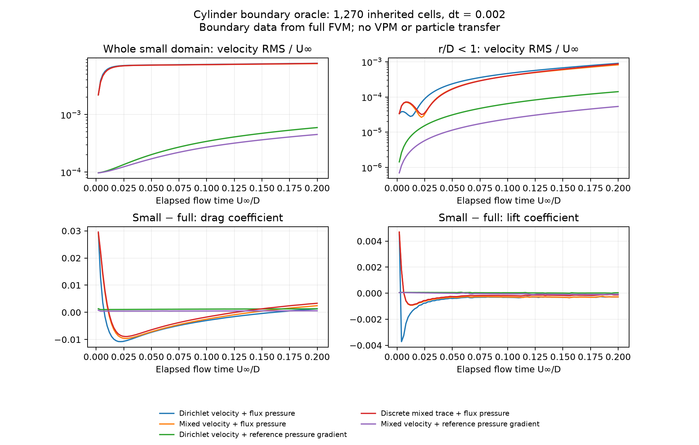
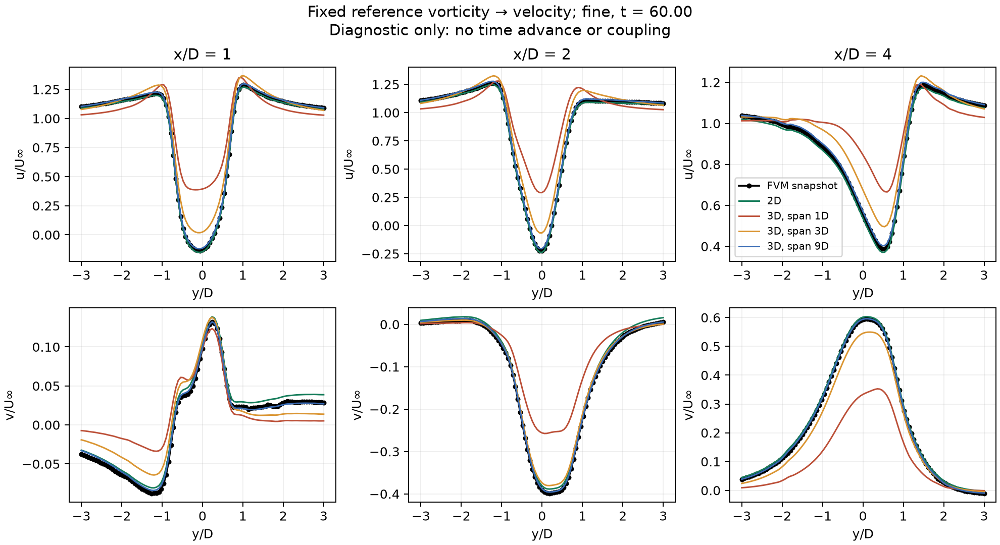

# Small-domain FVM–VPM accuracy investigation

This study separates transfer errors, boundary errors, and differences in the
physical problem. The production changes fix independently reproduced defects.
**The requested matched hybrid trajectory has not yet been demonstrated.**
Passing the component tests below must not be reported as achieving that result.

The [verified before/after curves and recorded runtimes](verified-progress-3d.md)
give a concise account of the demonstrated simulation improvements and the
performance evidence that is still missing.

**The required solver and acceptance benchmark are fully three-dimensional.**
The cylinder slices and span-integrated kernels below are historical component
diagnostics only. They are not candidate replacements for the 3D solver. The
cube now provides the main geometry for qualifying complete coupling, with a
fixed small FVM box `[-1.5, 1.5]^3` around the unit cube and identical native
cells in the comparison region.

The current [fully 3D cube findings](cube-3d-findings.md) contain the native
geometry correction, boundary-only experiment, direct induction audit, live
coupled comparisons, matched laminar/LES isolation, complete-stress component
qualification, mixed-boundary convection correction, and frozen-renewal tests.
They supersede the cylinder slices below as the route to complete solver qualification.

The latest [interface-iteration experiment](interface-iteration-3d.md), with
[promoted auxiliary panel queries](panel-derivative-precision-3d.md), completes
20 matched-medium intervals with **all 20 converged in three sweeps each**.
RMS relative drag error falls from 2.082% to 0.555%; final drag error changes
from −2.094% to +0.756%, with a 2.50% reduction in final near-body FVM velocity
error. Exact replay and independent force/field checks pass. The earlier native
query run converged only 12 intervals and reached the 12-sweep cap in eight.
This remains a scoped experiment, with substantial reference errors unresolved.
Production defaults remain unchanged.

The completed [time-resolution comparison](interface-time-resolution-3d.md)
keeps the same mesh and `dt_FVM=0.01`, reducing the exchange/VPM step from
`0.05` to `0.01`. All 100 iterated intervals converge. Drag-history RMS error
at common times decreases from 0.555% to 0.488%, but final whole-FVM velocity
error increases 13.49%. The denser history also exposes an 11.01% first-interval
drag error. Exact controls and 440 independent metric checks pass; the shorter
interval is not selected as a general accuracy improvement.

The [inviscid time-isolation comparison](inviscid-time-isolation-3d.md) now
refines RK2 alone to `0.01` while retaining the `0.05` diffusion, exchange and
renewal schedules. All 20 intervals converge. Drag-history RMS error changes
only from 0.555068% to 0.555463%, and final whole-FVM velocity error increases
0.0313% relative to baseline. The bitwise wrapper control, two component tests
and 140 independent scalar checks pass. Thus inviscid RK refinement alone
does not reproduce the much larger combined-cadence effect. A separate
[body-field audit](body-query-and-transport-3d.md) identifies that the selected
panel mode includes the body correction in queries but excludes it from
particle transport; its advancing effect is now measured below.

The completed [RK/GBD substep comparison](split-time-isolation-3d.md) now
refines both to `0.01` while retaining exchange/renewal at `0.05`. All 20
intervals converge, but drag-history RMS error increases to 0.583542%.
Final whole-FVM velocity error rises 1.079% relative to baseline; centreline
near-wake error rises from 1.102% to 1.308% of freestream speed. The off-axis
line improves slightly. A bitwise wrapper control, all 100 recorded GBD
recovery gates and 140 independent scalar checks pass. This is not an
accuracy fix. The four-schedule comparison retains the fine-exchange
startup pulse and does not assign additive causes to interacting errors.

An [actual body-stage probe](body-query-and-transport-3d.md) restores 28,441
accepted particles and verifies the omitted velocity/stretching contribution.
Independent surface quadrature exposes cancellation in the native body
gradient. A separate analytical gradient agrees with that reference to
1.37e−14 on 256 checked targets. The controlled 20-interval body-transport
comparison now reduces drag-history RMS error from 0.555068% to 0.521061%.
Final near-body FVM velocity error falls 6.121% relative to baseline;
centreline and off-axis near-wake errors both improve. All intervals converge
and 141 independent scalar checks pass. Maximum instantaneous drag error
increases slightly. This is a short-run improvement, with developed-wake
agreement still unproven. Its extended 40-interval prefix is now verified
through time 2.5: drag-history RMS error falls from 0.803030% to 0.730295%,
and centreline near-wake error falls from 2.064% to 1.813% of freestream.
Eighteen force reconstructions and 276 scalar checks pass. The body-enabled
run continues toward time 4.0.

The [particle-stage induction audit](particle-stage-induction-3d.md) separates
the FMM's hierarchical stage path from its direct point-query fallback.
On the saved state, stretching-rate errors are 0.449% near the body and
1.105% in the sampled near wake. A stricter geometric separation factor
reduces them substantially at increased computational cost; its default
control and repeated stages replay bitwise. Its 20-interval advancing
comparison is now complete: drag-history RMS error changes from 0.555068%
to 0.555345%, and whole-FVM velocity error increases 0.05365% relative to
baseline. The off-axis wake line improves slightly. The bitwise wrapper
control and 141 independent scalar checks pass. This stricter setting is
not selected as a coupled accuracy improvement over the tested short window.

A [stretching-consistency audit](particle-stretching-consistency-3d.md)
finds that the Gaussian vorticity sum differs from the curl of induced
velocity by 4.13% near the body and 15.23% in the sampled wake. Direct and
transposed strength rates also differ materially on this same state, even
with the qualified direct Jacobian. This is a representation/formulation
contrast, not a measured error against the FVM trajectory. The existing
guarded correction was rejected by its residual target with both three
and six allowed sweeps, retaining the same final acceptance limits. A
separate direct/transposed stretching comparison is now advancing after
its instrumented transposed control passed bitwise state/history checks.

The [profile observer](profile-validation-3d.md) now supplies matched centreline
and off-axis profiles, including exterior points. Its three-interval advancing
control is bitwise unchanged by observation. It separately measures the FVM
sampling-stencil difference at the cut boundary. Reference samples are also
currently present in the tutorial, but their meshes differ from this study.

The selected variant is now in a [longer 3D wake comparison](long-wake-comparison-3d.md),
advancing from physical time `0.5` to `20.5` with the same small domain and
matched medium mesh. Canonical checkpoints of both FVMs accompany every
profile frame; the checkpoint observer and eight independent force checks
pass their short qualification. The [first 70 exchanges are now independently
verified](long-wake-prefix-through-four-3d.md), through time `4.0`: relative
drag-history RMS error is 0.759%, but centreline and off-axis near-wake
velocity errors reach 2.846% and 2.444% of freestream speed. Thirty wall-force
reconstructions and 480 scalar checks pass. Direct source evaluation leaves
the wake mismatch essentially unchanged. The parent run remains in progress;
the requested force/profile agreement is still unmet.

The [velocity-projection and mass-flux audit](velocity-projection-and-mass-flux-3d.md)
recovers the reference's face flux with bitwise velocity/pressure replay.
Conserved FVM flux differs from the flux of interpolated cell velocity in both
the reference and hybrid. Matching native circulation does not determine that
flux. The reconstruction's velocity projection also improves its unprojected
counterfactual in both meshes, ruling out that proposed shortcut.

The [face-flux moment study](flux-moment-compatibility-3d.md) now measures a
further requirement for preserving cell velocity. Exact triangle integration
removes a false constant-field discrepancy, but ordinary affine face traces
remain incompatible with the stored means. A hard moment fit needs roughly
`0.25 U∞` RMS normal-flow changes on identical shared faces in both full and
hybrid states, despite tiny constraint residuals. Five component tests,
independent surface quadrature and mapped-face checks qualify this rejection;
it is not a production transfer improvement.

The [continuous-curl reconstruction comparison](continuous-curl-reconstruction-3d.md)
holds cell circulation and first moments fixed while changing local source
structure. Both completed mesh comparisons remove the correction's exterior
curl defect but worsen near-body accuracy, with small and inconsistent
boundary changes. The requested advancing agreement remains unachieved.

## Findings that change the diagnosis

| Finding | Consequence | Implemented response |
| --- | --- | --- |
| Mixed-boundary convection treated a cell-dependent tangential face value as fully prescribed. | The momentum matrix omitted its tangential dependence, including the diagonal used by pressure correction. | Retain the tangential diagonal implicitly; verify finite velocity changes on arbitrary 3D faces and backward-Euler momentum balance. The boundary-only cube improves, while live coupling still needs separate work. |
| FVM uses the complete viscous stress; variable-viscosity GBD uses componentwise vorticity diffusion. | Matching SGS constants does not align the equations, but similar errors also persist in a matched laminar cube. | Qualify the missing stress/curl source in a 3D component study; keep it outside production until its representation and wall treatment are validated. |
| Buffered renewal used distance to the nearest FVM cell centre as confidence, on a scale set by particle spacing. | Coarse or anisotropic fluid cells could lose almost all their authority even with an exact velocity field. | Determine domain membership separately from interpolation and solid geometry. |
| The represented Gaussian used a normalized discrete image filter. | Its kernel differed from the physical Gaussian used by VPM. | Sample the physical kernel with unnormalized separable convolution. |
| Generic body-fitted wall geometry was unavailable to transfer. A thin extruded cylinder could also pass a centre-only box test. | Solid classification could be absent or geometrically wrong. | Export oriented native wall triangles collectively; classify curved walls using their signed distance. Require normals and all six faces for the box shortcut. |
| Invariant recovery skipped residuals below an absolute `1e-14`. | Small but resolved circulation budgets could be ignored; the skip threshold could exceed the production conservation gate. | Use dimensionally separate, scale-aware circulation/impulse thresholds and iterative refinement. The acceptance gate is unchanged. |
| A small cylinder domain differs from the full solve even with FVM-supplied velocity and vorticity boundary data. Supplying its pressure gradient substantially reduces the short-run error. | The pressure boundary treatment is a separate accuracy limit. Changing the vorticity injection alone cannot remove it. | Add an opt-in `vorticity_mixed_pressure_gradient` mode and qualify it with independent boundary data. Keep the cylinder default pending VPM pressure validation. |
| The coupled STL spans 12 diameters, but its force normalization used a length of 4. | Reported coefficients used one third of the actual projected area. | Normalize by the actual projected area, `D * L = 12`. This does not make it equivalent to the quasi-2D reference. |
| `allplot.sh` did not compare either velocity profiles or forces with the reference. | Plots could look plausible without exposing a quantitative mismatch. | Add common-time overlays and numerical differences, with no phase shift or fitted scale. |

The tutorial selects `buffered_m4_renewal`. This path does **not** simply inject
each FVM cell's `omega * volume`. It reconstructs FVM velocity at the six faces
of a particle control volume, takes a discrete curl, blends with represented
particle vorticity, applies a bounded correction, prunes, and recovers budgets.
Those operations introduce distinct errors even when the integrated circulation
is conserved. The nearest-cell confidence was applied to both authority and the
target field; it was not merely a harmless interpolation diagnostic.

## Independent operator checks

Run from the repository root using the OpenONDA Python environment:

```sh
PYTHONPATH=. python studies/coupler_accuracy/reproduce_transfer_defects.py
```

An exact rigid rotation has vorticity `(0, 0, 1)`. Use FVM cell spacings
`(0.25, 0.5, 0.5)`, particle spacing `0.0625`, and 12,167 strictly interior
evaluation nodes. This deliberately exercises the intended anisotropic use case.

| Quantity | Removed formula | Current implementation |
| --- | ---: | ---: |
| Fraction of interior nodes with zero mesh confidence | 90.532% | 0% |
| Mean target spanwise vorticity | 0.0500243 | 1.0 |
| Maximum constant-vorticity error | — | `2.66e-15` |
| Gaussian self-value relative error, `sigma / h = 1` | `-3.10e-4` | `-1.11e-16` |

These are manufactured-field results, not measured percentages of cylinder error.
The legacy calculation explicitly reproduces the removed formulas; it is not a
second complete solver run. See [operator-audit.json](results/operator-audit.json)
for parameters and source hashes. Separate tests compare multiple sources and
boundary nodes against a direct Gaussian sum at `sigma / h = 0.5, 1, 1.7`.
Invariant tests span strength scales `1e-18`, `1`, and `1e18`.

The Gaussian convention is

\[
\omega(x)=\sum_p \Gamma_p\frac{\exp(-|x-x_p|^2/\sigma^2)}{\pi^{3/2}\sigma^3}.
\]

Samples of this continuous kernel need not sum to one on a discrete lattice.
Renormalizing them changes the function that a particle represents. The new
convolution truncates beyond six core radii. This fixes kernel consistency; it
does not eliminate regularization error or solve the full deconvolution problem.

## Boundary condition without VPM or transfer error

```sh
PYTHONPATH=. python studies/coupler_accuracy/boundary_oracle.py \
  --output studies/coupler_accuracy/results/boundary-oracle-combined
```

The real FVM solver advances an analytically advected, viscously decaying
Taylor–Green field on a small box. Exact velocity and gradient data are supplied
at every FVM endpoint through the production coupling boundary API. The test uses
20 steps of `dt = 0.0025`, BDF2 after startup, and direct linear solves.

| Cells per in-plane direction | Dirichlet velocity RMS error | Mixed velocity RMS error | Mixed + prescribed pressure-gradient RMS error |
| ---: | ---: | ---: | ---: |
| 8 | 0.0532691 | 0.0528561 | 0.0404581 |
| 16 | 0.0151405 | 0.0150117 | 0.0124320 |
| 32 | 0.00415618 | 0.00410343 | 0.00321400 |

Errors are normalized by unit freestream velocity. Observed refinement orders
are approximately 1.81–1.87 for the original two choices and 1.70–1.95 for the
new combined mode. The mixed boundary condition is
therefore worth retaining while representation and benchmark consistency are
repaired. This experiment includes FVM spatial, temporal, pressure-projection,
and boundary errors. It has no cylinder wall, VPM, or macro-step interpolation;
it does not establish the accuracy or temporal order of the complete coupler.
Results: [boundary-oracle.json](results/boundary-oracle-combined/boundary-oracle.json).

## Cylinder boundary oracle on inherited medium cells

The medium reference completed while this investigation was running. Its native
mesh and a fixed checkpoint generation at `t ≈ 60` now support a direct test
around the cylinder. The study extracts one midspan layer with slip ends and
then cuts a small domain out of it, preserving native cell volumes, centroids,
wall faces and cut-face orientation. It uses **1,270 cells** in the small domain
and **9,612 cells** in the full-domain slice. The actual small bounds are about
`[-1.657, 2] × [-1.651, 1.651]` diameters; the span is `1/7` diameter.

Both solves start with identical checkpoint cell velocities and pressures;
their initial cylinder force coefficients are identical. Both rebuild their
initial face fluxes and time histories, so this is a new short initial-value
experiment rather than an exact continuation of the archived parallel run.
Both use implicit Euler, identical native convection/gradient schemes, direct
linear solves and three PIMPLE outer iterations. The full FVM provides fresh
boundary data at every small-FVM step. Normal velocity comes from its conservative
native cut-face flux. There is no VPM, transfer or macro-step interpolation.

At elapsed flow time `0.2`, with `dt = 0.002`:

| Boundary data | Whole small-domain velocity RMS / Uinf | Velocity RMS within r/D < 1 / Uinf | Drag coefficient difference |
| --- | ---: | ---: | ---: |
| Dirichlet velocity + native flux pressure | `7.77e-3` | `9.01e-4` | `1.30e-3` |
| Mixed velocity + native flux pressure | `7.68e-3` | `8.16e-4` | `2.45e-3` |
| Dirichlet velocity + reference pressure gradient | `5.94e-4` | `1.41e-4` | `1.31e-3` |
| Mixed velocity + reference pressure gradient | `4.51e-4` | `5.38e-5` | `5.74e-4` |

The last combination reduces velocity RMS about **17 times** relative to the
current mixed treatment in this experiment. It is available through
`CouplerSetup(boundary_condition_mode="vorticity_mixed_pressure_gradient")`.
Its velocity and pressure histories are independently interpolated, saved and
restored. The new mode also includes the VPM viscous pressure contribution.



Halving the time step left the original mixed error near `7.81e-3`, the
Dirichlet-with-pressure-gradient error near `5.99e-4`, and the combined mixed
and pressure-gradient error near `4.54e-4`. A discrete mixed trace
constructed from the reference owner-to-face velocity difference did not remove
the error of the native flux-pressure treatment. These checks identify pressure
boundary consistency as a promising direction; they do not establish exact
discrete equivalence or prove that VPM can yet supply sufficiently accurate
pressure data.

This is specifically a **short boundary experiment**, not a complete hybrid
shedding validation. Pressure is supplied by the reference solver here. The
actual VPM pressure calculation still needs tests for its temporal acceleration,
viscous term, body contribution, precision, and changes during particle renewal.
The coupled cylinder's default boundary mode has therefore not been changed.

```sh
PYTHONPATH=. python studies/coupler_accuracy/cylinder_boundary_oracle.py \
  --steps 100 --output studies/coupler_accuracy/results/cylinder-oracle-production
PYTHONPATH=. python studies/coupler_accuracy/cylinder_boundary_oracle.py \
  --dt 0.001 --steps 200 \
  --output studies/coupler_accuracy/results/cylinder-oracle-production-half-dt
```

The [production-wrapper report](results/cylinder-oracle-production/cylinder-boundary-oracle.json)
and [half-time-step report](results/cylinder-oracle-production-half-dt/cylinder-boundary-oracle.json)
contain histories and checkpoint hashes. Assertions check shared-cell geometry
and independent mutable boundary state. Initial harness runs accidentally reused
native mesh boundary dictionaries between variants; their reports are explicitly
marked `valid_for_comparison: false` and are superseded by these independent runs.

## What `omega * volume` induces in the saved cylinder field

```sh
PYTHONPATH=. python studies/coupler_accuracy/snapshot_induction.py --reference fine
```

The completed **fine** reference at `t = 60` provides a fixed vorticity snapshot.
The study evaluates all 303 native transverse-profile points at `x/D = 1, 2, 4`
using an independent float64 direct Gaussian Biot–Savart sum with `sigma = 1/16`.
It includes the full saved wake and freestream, with no time advance, treecode,
transfer, pruning, or panels. The same span is repeated to expose span effects;
a separate 2D kernel integrates the span exactly.

| Induction model | Velocity vector RMS difference from FVM / Uinf | Maximum difference / Uinf |
| --- | ---: | ---: |
| 2D Gaussian | 0.0175770 | 0.0309538 |
| 3D Gaussian, 1D span | 0.218010 | 0.532859 |
| 3D Gaussian, 3D span | 0.0798433 | 0.160837 |
| 3D Gaussian, 9D span | 0.0120385 | 0.0200511 |



The 9D case being closer than the 2D result is evidence of possible cancellation
between errors, not proof that a finite wake better represents a quasi-2D problem.
Free-space induction differs from the reference's finite outer boundaries.
The experiment also includes core and quadrature errors and uses VTK parametric
cell centres, which approximate the native volume centroids. Native FVM volumes
and global cell IDs determine strengths. The field and source-file hashes are
recorded in [snapshot-induction.json](results/snapshot-induction.json); pointwise
values are in [snapshot-induction.csv](results/snapshot-induction.csv).

There is a simple physical check: a straight vortex filament of length `L`,
observed at its midspan a distance `r` away, induces the infinite-filament velocity
multiplied by `(L/2) / sqrt(r^2 + (L/2)^2)`. With `L = 3`, the factors at
`r = 1, 2, 4` are `0.832`, `0.600`, and `0.351`. Increasing precision or conserving
net circulation cannot repair this difference in the represented problem.

Truncating a nominally spanwise-invariant vorticity field also cuts vortex lines.
In general `curl(BiotSavart(omega))` recovers the solenoidal part of `omega`.
Conservation of the vector sum of strengths alone does not ensure that the
prescribed vorticity has a consistent velocity field.

## The current cylinder cases are not a matched benchmark

| Choice | Coupled tutorial | Fully meshed reference |
| --- | --- | --- |
| Geometry | Finite 12D cylinder, including caps | Quasi-2D cylinder, 1D extruded span, slip ends |
| FVM domain | `[-3,4.5] × [-3.5,3.5] × [-6.25,6.25]` | `[-8,24] × [-10,10] × [-0.5,0.5]` |
| Transfer span | `[-1.5,1.5]`, with taper | Spanwise-invariant exterior intended |
| Requested wall cell size | `0.03125` | Medium launcher requests `0.04` |
| Other mesh choices | Background `0.5` | Background `8*dx`; near-body and wake refinement boxes |
| FVM time advancement | BDF2, fixed `0.002` | Implicit Euler default, adaptive up to `0.004` |
| VPM advancement | RK2, `0.05`, Gaussian core and GBD diffusion | No VPM approximation |
| Exterior boundary | Finite particle domain, free-space induction and panels | Finite inlet/outlet and slip outer walls |
| Arithmetic | FVM float64; VPM and panels float32 | FVM float64 |

The medium reference was actively advancing during this investigation. Its
metadata's local cell count must not be compared with the backup's global count:
the medium mesh has 67,284 global cells. The completed fine snapshot was used for
the offline experiment to avoid treating a changing output as an immutable result.
No reference results were overwritten.

The available resolutions also start with different small lift perturbations
and do not demonstrate identical shedding onset. An unstable symmetric wake can
amplify roundoff and mesh asymmetry into different phases. A phase shift must be
reported explicitly, not removed silently to make curves agree. A complete run
to `t = 60` does not by itself prove stationary shedding or grid convergence.

## Meaning of a machine-precision target

Machine-level agreement is useful for exact polynomial interpolation, kernel
identities, discrete circulation budgets, and restart identity. Those targets
are exercised above. A continuous FVM-to-particle representation with a different
kernel, spatial operator, time method, and exterior boundary does not generally
reproduce the full FVM's discrete trajectory to roundoff, even with the same
nominal near-wall resolution.

For exact reproduction of a fixed full-domain discrete solve, elimination of
exterior unknowns produces an interior operator such as
`A_ii - A_io A_oo^-1 A_oi`, together with the exterior right-hand-side and time
history. Reproducing that exterior response is a different requirement from
approximating the same continuum flow with particles. Pressure, normal flux,
and gradient stencils all participate. The practical hybrid target should be
an explicit error budget below the reference's discretization uncertainty;
operator identities can still have roundoff-level tolerances.

## Validation order for the next solver changes

1. **Use the fully 3D cube as the matched benchmark.** Keep the small FVM box
   fixed at `[-1.5, 1.5]^3`; extract its cells from the full native reference
   mesh. Match force area, time scheme, step sizes, SGS model and initial
   perturbation. Record actual cell geometry, not just resolution labels.
   The current coupled wall request is `1/64`, whereas the current reference
   `fine` wall request is `1/32`; their defaults are not a matched pair.
2. **Preserve all three spatial directions.** Every artificial face of the
   cube exchanges boundary data. The finite 3D geometry, wall and wake must be
   represented by both solvers. Empty directions, extruded slices and 2D kernels
   are excluded from acceptance runs.
3. **Qualify the cube boundary closure.** Use full-FVM data on the inherited
   small-domain faces to measure closure error without VPM or transfer error.
   Extend across reference resolutions and longer intervals, then replace
   the reference pressure trace with independently validated VPM pressure data.
   Exact discrete matching additionally needs compatible normal flux and face
   stencils. The earlier cylinder result is a hypothesis to test in 3D, not
   evidence that the same improvement factor holds for the cube.
4. **Freeze the flow and qualify transfer.** Compare the cell-vorticity and
   velocity-trace paths against independent induced velocities and curls at
   held-out points. Measure wall-normal flux, solenoidal consistency, pruning
   loss, invariants, and repeated-renewal drift. The current fluid-side velocity
   taper and bounded Gaussian correction remain approximations to investigate.
5. **Measure coupled temporal order.** Use an advected vortex with macro-step
   refinement at fixed FVM resolution. The current algorithm predicts VPM from
   previous FVM data, samples its endpoint, interpolates FVM boundary substeps,
   and transfers the new FVM field at the end. RK2 and BDF2 labels alone do not
   establish coupled second order. If necessary, introduce a common-stage
   predictor/corrector or interface iteration with complete rollback of state
   and clocks.
6. **Run the matched shedding benchmark.** Report same-time profiles and force
   histories, then stationary mean drag, lift amplitude/RMS and Strouhal number.
   Refine particle spacing/core, induction tolerance, coupling time step and
   pruning independently. Report phase and reference-grid uncertainty. Passing
   by expanding the small FVM domain would violate the intended constraint.

The overlap, circulation, and boundary-exchange structure is consistent with the
issues studied by [Palha et al., *A hybrid Eulerian–Lagrangian flow solver*
(2015)](https://arxiv.org/abs/1505.03368). Their 2D examples motivate separate
qualification of Eulerian boundary data, particle replacement and circulation
correction. They do not validate this implementation's finite-span 3D setup or
establish machine-precision trajectory agreement.

## Reproduction and regression evidence

The archived combined run passed **192 tests** covering all coupler tests, mixed
FVM boundaries, matrix workspace boundary layout, the now-retired VLM observer,
and the reference-comparison tests. The maintained regression command below
uses the physical VLM production-contract tests instead. The archived run
included the new mode's unsteady field
convergence, combined history/restart/subcycling, worker initialization, and
rejection of incomplete pressure data before changing FVM boundary state.

```sh
python -m pytest tests/coupler \
  tests/fvm/test_mixed_velocity_boundary.py \
  tests/fvm/test_matrix_workspace_boundary_layout.py \
  tests/vpm/test_vlm_production_contract.py \
  tests/tutorials/test_cylinder_reference_comparison.py -m 'not gpu'

PYTHONPATH=. mpiexec -n 2 python studies/coupler_accuracy/mpi_wall_geometry.py
```

The actual two-rank test collected 384 correctly oriented wall triangles with
total area 6 on root, and no triangles on the worker. Signed-distance geometry
assumes static, consistently oriented body-fitted wall faces. It supports an
open extruded wall only inside its FVM box; it is not a moving-surface repair
algorithm. See [final-tests.log](results/final-tests.log),
[final-qualification.json](results/final-qualification.json), and
[mpi-wall-geometry.log](results/mpi-wall-geometry.log). Intermediate failed logs
are retained as diagnostic history and are superseded by these successful runs.

A pre-existing postponed-annotation import made Taichi vector annotations strings
and prevented test collection. Only that import was removed from the already
modified VLM collision file; other existing workspace changes were preserved.

To compare a completed hybrid run from the cylinder tutorial directory:

```sh
REFERENCE_GRID=medium ./allplot.sh
```

For a short run that has not reached the postprocessor's shedding criteria:

```sh
python assets/compare_reference.py --reference medium
```

The comparator writes `solution/cylinder_reference_comparison.json` and force
and profile overlays. Force histories use their common physical interval without
extrapolation. Profiles use the latest physical time shared by the available
curves, interpolate only across common sampled positions, and report missing
curves. No coupled velocity or force agreement is claimed in this study before
those actual histories have been produced and examined.
