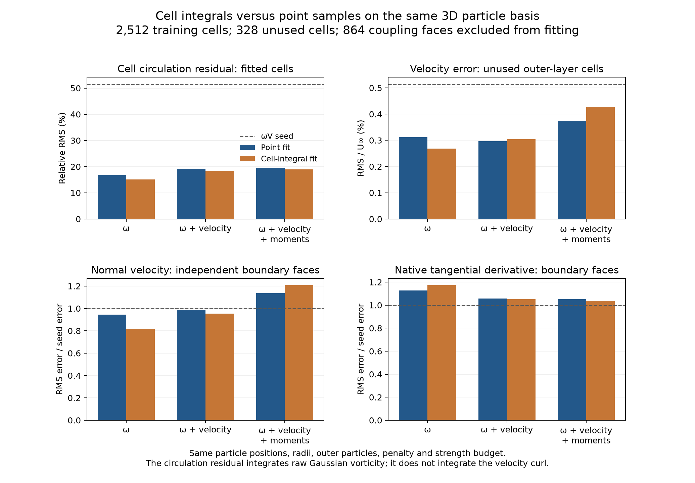

# Cell-integrated transfer in the fully 3D cube

Cell-integrated raw Gaussian observations improve some reconstruction errors,
but the tested fits do not improve both boundary quantities relative to the
original `ωV` seed. The joint integral fit improves both boundary errors relative
to the matched point fit; its native tangential-derivative error remains 5.25%
above the seed. This qualifies an observation component, not a production renewal
method. The requested hybrid/reference agreement remains unachieved.

The experiment holds the real three-dimensional coarse cube state at physical
time 0.5. It retains the same 2,138 renewable source positions and radii,
68 preserved outer particles, and 108-panel body response. The nominal particle
spacing and Gaussian radius are 0.125. The actual warped FVM cells are integrated;
they are not replaced by cubes of that nominal size. The cropped and full FVM
use exactly the same retained cells. The small domain is approximately
`[-1.5, 1.5]^3` around the unit cube.

All 2,512 original donor/verification cells are training data. The 328 unused
outer-layer cells and the 864 actual coupling faces remain outside fitting.
Those outer cells have weak target vorticity, with RMS 0.0010693. They do not
provide the same test as the previously interleaved interior verification set.
There is no FVM advance, particle advection/diffusion, force fitting or phase
alignment in this experiment. It is not a developed-wake or medium-tutorial
validation.



## What changed in the observation

The FVM diagnostic computes a volume-normalized discrete face circulation:

```text
ω_c V_c = Σ_faces Sf × u_face .
```

The previous raw Gaussian fit observes `Σ_p ζ_p(x_c) Γ_p` at a cell centre.
The new fit instead uses

```text
B_cp = ∫_(native fan cell c) ζ_p(x) dV
Σ_p B_cp Γ_p = ω_c V_c .
```

Both sides are divided by the **original stored FVM volume** for the weighted
least-squares objective. The fixed outer particles are integrated and subtracted
in the same way. There is no filter normalization, row normalization, change of
particle positions, additional source, radius tuning or relaxed acceptance gate.
The velocity maps, donor penalty 0.05, strength-magnitude bound `Σ|Γ| ≤ 2×donor`,
and optional velocity weight 5 are identical to the point-control experiment.
The optional moment constraint preserves the same raw particle sums `ΣΓ` and
`½Σ(x×Γ)`.

The integral is of the **raw Gaussian vector sum**. It is not the cell integral
of the curl of the induced velocity. The distinction established in the
[earlier reconstruction study](reconstruction-followup-3d.md) remains necessary
in 3D; integration does not make a general vector Gaussian sum divergence free.
Independent velocity, continuous point-curl and boundary measurements remain
part of the assessment.

## Geometry and quadrature qualification

Each native polygonal face is split about its arithmetic vertex centre, using
the same triangle fan as the FVM's face-geometry calculation. The cell centre
and oriented face triangles form signed tetrahedra. A Duffy-mapped tensor
Gauss–Jacobi rule integrates the Gaussian in each tetrahedron. The calculation
keeps the triangulated volume separate from the FVM's aggregate-face volume.

On the 2,840 retained cells, the maximum relative difference between those
volumes is **0.067232%**, and the RMS difference is **0.012198%**. The largest
centroid displacement is 0.00097239. There are no negative tetrahedra in this
dataset. Warped polygonal faces with hanging vertices can produce this volume
difference; a warped quadrilateral alone does not necessarily do so. This is a
measured difference between geometric conventions, not evidence that it causes
the observed hybrid force error.

The stored volumes are deliberately retained in the target. Replacing them by
the fan volumes would change the supplied FVM circulation and mix two changes
in one experiment. Over the entire retained region, the two volume sums agree
to roundoff: 26.043877762589. The outer surface is slightly bowed, with vertex
coordinates differing from the nominal cut planes by up to about 0.00129, so its
fluid volume is not exactly `3³ − 1 = 26`.

The matrix has 1,758,126 nonzero entries for 2,840 cells and 2,206 sources.
The adaptive volume rules accepted orders 6, 8 and 10 on 72, 972 and 1,796
cells respectively. The requested successive-entry tolerance is `1e-9` after
division by FVM volume. This is a refinement estimate, not a rigorous error bound.
Gaussian sources farther than eight radii from a cell's bounding box are
omitted; the largest omitted pointwise kernel bound is `1.5e-26`.

A stricter run uses 27 deterministically selected cells, including large cells,
large geometry differences and large adaptive remainders. It increases the
quadrature order, tightens the tolerance to `1e-11` and expands the cutoff to
ten radii. Its maximum volume-normalized matrix difference is **1.70e-13**.

An independent check integrates a Gaussian antiderivative through the actual
closed outer surface, then subtracts the analytic Gaussian integral inside the
unit cube. This uses a two-dimensional triangle rule and the divergence theorem,
independently of the volume tetrahedron rule. Across all 2,206 sources:

| Check | Maximum absolute difference in integrated Gaussian fraction |
| --- | ---: |
| Surface orders 8 versus 10 | 5.00e-11 |
| Alternative antiderivative coordinate axis, 32 sources | 2.98e-14 |
| Sum of cell integrals versus order-10 surface integral minus solid | 3.99e-14 |

This is a successful near-roundoff **component identity**, not near-roundoff
agreement between the hybrid and full FVM solutions.

## What the independent measurements say

The point control reproduces every saved field from the previous all-donor
experiment **bit for bit**. The new pair also has identical baseline fields,
particle inputs and boundary targets. All six constrained fits converged with
the stated budget; the final relative gradient-mapping measures are below
`1e-8`.

| Observation and fit | Boundary normal-velocity RMS / U∞ | Interpolated tangential-derivative RMS (U∞/D) | Native diffusive tangential-derivative RMS (U∞/D) |
| --- | ---: | ---: | ---: |
| Donor `ωV` seed | 0.004500 | 0.016362 | 0.020936 |
| Point, ω | 0.004248 | 0.019487 | 0.023577 |
| Integral, ω | 0.003677 | 0.019782 | 0.024552 |
| Point, ω + velocity | 0.004442 | 0.018188 | 0.022148 |
| Integral, ω + velocity | 0.004285 | 0.017591 | 0.022035 |
| Point, ω + velocity + moments | 0.005121 | 0.018338 | 0.022046 |
| Integral, ω + velocity + moments | 0.005434 | 0.017783 | 0.021691 |

The vorticity-only integral fit reduces normal-velocity error by 18.28% relative
to the seed, while its native derivative error increases by 17.27%. Its unused
cell-velocity RMS is 0.002685 U∞, compared with 0.003117 for the point fit and
0.005146 for the seed. However, its independent continuous point-curl relative
error increases from 1.0814 for the point fit to 1.5037.

Adding velocity data gives smaller boundary errors than the matched point fit:
3.54% smaller normal-velocity error, 3.28% smaller interpolated-derivative error,
and 0.51% smaller native-derivative error. Its unused cell-velocity RMS instead
increases from 0.002967 to 0.003044 U∞. It does not provide a uniform improvement.

Moment conservation retains particle strength sum and impulse to approximately
`9.1e-14` and `2.0e-13`, but increases normal-velocity error relative to both the
point fit and the seed. These full-space particle sums are not the fluid-region
circulation or the complete hybrid impulse.

The integral-only fit's circulation residual on training cells is 15.11%, versus
16.74% when the point-only fit is evaluated with the same integral observation.
Those errors are results for the tested constrained objective. They are not
lower bounds for every possible particle representation or regularization.
The roughly 100% raw-vorticity errors in the unused weak-vorticity layer remain
about 0.00107 in absolute units.

The new native derivative target uses the actual unit-viscosity momentum
diffusion kernel on the corresponding full-mesh faces. It differs from the
interpolated cell-gradient target by RMS 0.016005 on this coarse state. These are
two discrete consistency targets, not independently known continuum derivatives.
The original metric is retained unchanged for comparison with earlier work.
On warped faces its historical `Sf / sum(triangle areas)` direction has a norm
defect up to `1.10e-8`; the new native metric uses `Sf / |Sf|`. Candidate derivatives
are obtained from the complete f64 particle/panel velocity. The finite-difference
step check differs by `1.19e-9` relatively, and replay of the native FVM curl
agrees to `3.0e-15`.

## Interpreting a blob's circulation near a solid

For the renewable donor seed, the sum of individual Gaussian envelopes weighted
by `|Γ_p|` places **13.090% inside the solid cube**, **86.855% in the cropped fluid
region**, and **0.055% beyond the cut**. The solid fraction uses the analytic
three-dimensional Gaussian box integral; the outer fraction uses the actual
surface integral described above.

These fractions are `Σ |Γ_p| f_p / Σ |Γ_p|`. They are not integrals of the
magnitude of the summed vector field, and they do not measure physical
circulation lost by the velocity field. They demonstrate why a blob's full-space
`Γ` cannot automatically be identified with its contribution to circulation in
one fluid cell or in the fluid region. Multiplying every strength by a scalar
correction would not establish correct induction, wall conditions or exchange.

The next representation component should integrate the **continuous induced
velocity curl** over the same native cells, with an independent Stokes check,
and distinguish the body contribution from the raw Gaussian envelope. The
existing native discrete-curl and point-curl experiments do not supply that
volume observation. Any fit using it still needs unused velocity and boundary
checks, then a fresh fully 3D live comparison. The separate FVM boundary and SGS
issues documented in the [main findings](cube-3d-findings.md) remain active.

The [continuous-curl and body-panel follow-up](continuous-curl-and-panels-3d.md)
now carries out that volume observation and separately refines the source panels.
Its independent identities pass, while the frozen coupling mismatch remains.

## Reproduction and evidence

The changes in this follow-up are confined to study and component-test files.
Production transfer, boundary policies, precision and acceptance gates are
unchanged. The focused regression passes **25 tests**, including six new
integration checks. They cover affine volume/centroid/covariance, a warped
polygon, analytic Gaussian box integrals under rigid motion, integration across
shared faces, and a uniform Gaussian lattice without filter normalization.
The Gaussian box checks also exercise all three surface-antiderivative axes.

Use the OpenONDA Python environment with `PYTHONPATH=.` and single-threaded BLAS.
Choose new output directories:

```sh
python studies/coupler_accuracy/native_reconstruction_3d.py \
  --fit-family raw --fit-data all_donor --raw-observation cell_integral \
  --output /private/tmp/cube-cell-integral
python studies/coupler_accuracy/native_reconstruction_3d.py \
  --fit-family raw --fit-data all_donor --raw-observation point \
  --cell-integrals /private/tmp/cube-cell-integral \
  --output /private/tmp/cube-point-control
python studies/coupler_accuracy/native_curl_3d.py \
  --study /private/tmp/cube-cell-integral --output /private/tmp/cube-integral-boundary
python studies/coupler_accuracy/native_curl_3d.py \
  --study /private/tmp/cube-point-control --output /private/tmp/cube-point-boundary
python studies/coupler_accuracy/cell_integral_region_audit_3d.py \
  --integrals /private/tmp/cube-cell-integral --output /private/tmp/cube-region-audit
```

Completed source-backed records:

- [Integral fit and quadrature audit](results/cube-3d-cell-integral-reconstruction/native-reconstruction-3d.json)
  and [boundary audit](results/cube-3d-cell-integral-reconstruction-boundary/native-curl-3d.json).
- [Point control](results/cube-3d-cell-integral-point-control/native-reconstruction-3d.json)
  and [boundary audit](results/cube-3d-cell-integral-point-control-boundary/native-curl-3d.json).
- [Independent surface/region check](results/cube-3d-cell-integral-region-audit/cell-integral-region-audit-3d.json).
- [Paired-field and repeat verification](results/cell-integral-comparison-verification.json).
- [Regression record](results/3d-cell-integral-reconstruction-regression.xml).
- [Source and plot provenance verification](results/cell-integral-source-verification.json).

Each calculation archives its study source and hashes its inputs. The first
boundary-audit attempts stopped at a geometry-convention assertion before any
candidate measurement; their separate `initial-attempt` directories are not
completed results. The shared integral matrix, per-cell quadrature orders,
refinement checks, fitted strengths and independent boundary fields are retained.
