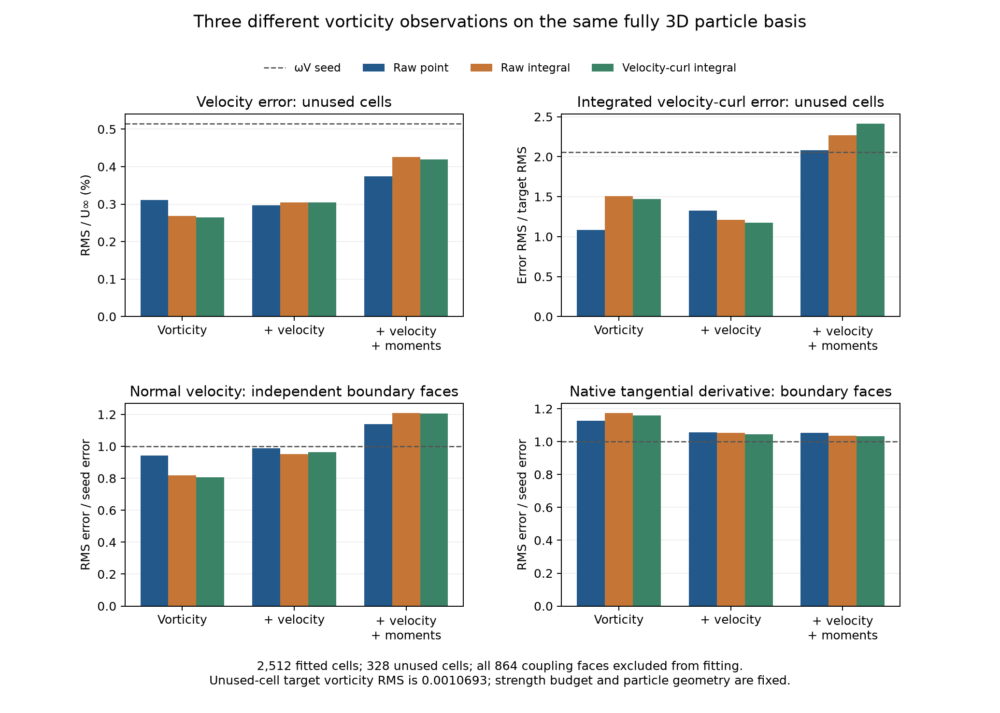
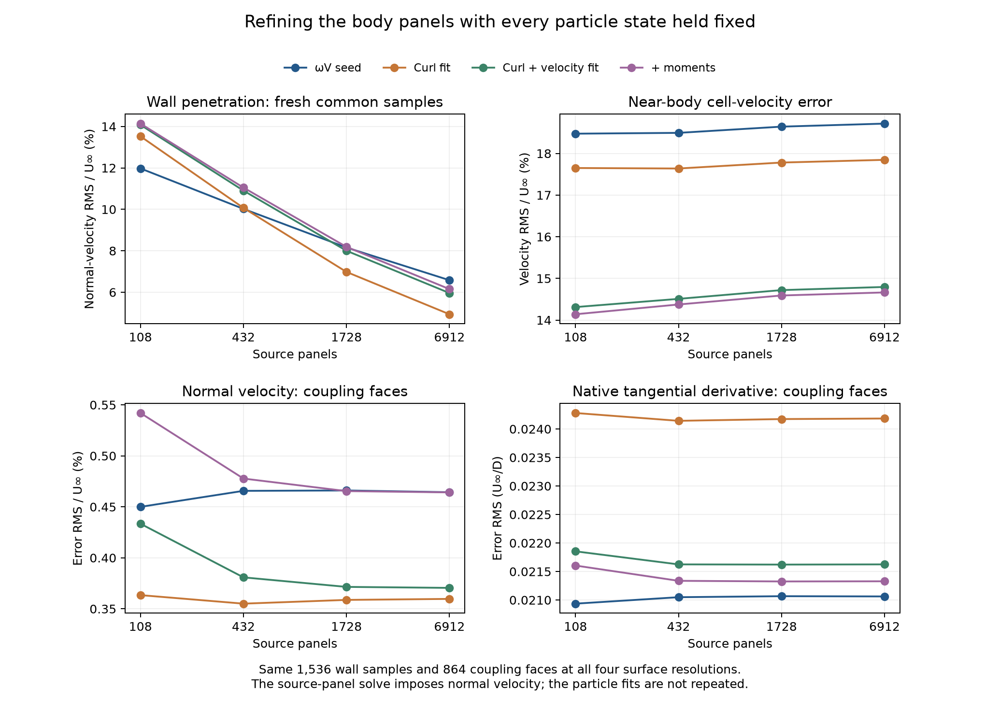

# Continuous velocity-curl integrals and body-panel resolution

The new continuous-curl observation passes independent 3D volume and Stokes
checks, but its fitted particle states still do not improve both coupling
boundary quantities relative to the original `ωV` seed. Refining the body source
panels separately reduces wall penetration while leaving substantial velocity
and boundary errors. These results qualify two more components and reject two
single-component explanations of the full mismatch. The requested hybrid/reference
agreement remains unachieved.

The subsequent [native-volume and overlap study](native-volume-and-overlap-3d.md)
has now performed the forward-induction comparison proposed below. It finds a
velocity benefit within the small FVM domain constraint and a sharp-interface
derivative ambiguity that must be removed before interpreting that benefit.

These are frozen coarse-cube experiments at physical time 0.5. The full and
cropped FVM retain the same actual cells, with the small domain approximately
`[-1.5, 1.5]^3`. All kernels and linear solves here use f64 and fully 3D fields.
There is no time advance, force correction or phase alignment. The earlier
[matched live medium run](outflow-convection-followup-3d.md) remains the latest
live comparison; this follow-up does not replace it with a new trajectory.

## A different volume observation

For a Gaussian vortex source, write its velocity as `u = Γ × r f(r)`. The
raw Gaussian vector sum and `curl(u)` differ for general three-component
strengths. The [preceding study](cell-integral-followup-3d.md) integrated the raw
Gaussian. This study instead builds the complete 3-by-3 coefficient block

```text
C_cp Γ_p = ∫_cell curl(u_p) dV = ∮_cell n × u_p dA
C_cp    = ∮_cell [(n·r) I − r nᵀ] f(r) dA .
```

Every shared native face is evaluated once, using its actual oriented fan
triangles, then added with opposite signs to its adjacent cells. The matrix is
dense: the physical curl of an individual vector blob has an algebraic tail.
No source is removed on the basis of a Gaussian cutoff. A stable Taylor series
handles the finite core limit, while the far-field enclosed Gaussian fraction
is set to its f64 limiting value only where its difference from one is below
roundoff. The algebraic field remains present there.

The observations are divided by the original stored FVM cell volumes and
compared with the same FVM vorticity target. Raw particle circulation sums,
continuous velocity curl, and the FVM's discrete curl applied to sampled velocity
remain separate measurements. Neither symmetry nor a raw-vorticity trace
identity is imposed on the completed matrix.

The source-panel response and uniform freestream have zero continuous curl in
the fluid interior. They still enter every velocity and boundary measurement.
A component test differentiates the **actual constrained f64 cube panel solve**
at fluid points to check this assumption against the implementation.

## Qualification before fitting

The matrix covers 2,840 cells, 2,206 sources and 9,576 distinct native faces.
It took approximately 429 seconds to construct and qualify in the recorded
single-threaded run. Surface orders 6, 8 and 10 were accepted on 30, 3,815 and
5,731 faces respectively. The per-face remainder estimates are apportioned by
adjacent cell volume and face count; the largest summed estimate per cell is
`5.01e-10` after division by stored FVM volume.

Independent volume integration uses the analytical point-curl tensor and the
previously qualified tetrahedral rules. It checks 27 selected cells, with nearby
and distributed sources in each selection. All of the following differences
are divided by the stored FVM volume:

| Check | Maximum absolute coefficient difference |
| --- | ---: |
| Volume orders 10 versus 12 | 1.59e-13 |
| Stokes integral versus order-12 volume integral | 1.62e-13 |
| Tensor symmetry, across the full matrix | 1.59e-13 |
| Tensor trace versus twice the independently integrated raw Gaussian | 4.99e-13 |

The last identity is `trace(C_cp) = 2 B_cp`, where `B` is the raw integral from
the preceding experiment. In a symmetric cubic cell containing one centred
Gaussian, the tensor is `(2/3) B I`. The tests also cover displaced sources and
all components on an oblique cell partition. This is not a justification for
rescaling every particle by 2/3; the general tensor has spatially varying
off-diagonal and long-range terms.

The focused regression passes **29 tests**, including four new checks of the
radial velocity factor, symmetric-cell identity, oblique Stokes/volume agreement
with long-range sources, and actual source-panel curl in the fluid.

## The same reconstruction comparison

The fit keeps the 2,138 renewable particle positions, radii and donor anchor,
68 outer particles, 108 body panels, donor penalty 0.05 and magnitude budget
`Σ|Γ| ≤ 2×donor`. The nominal particle spacing and core radius are 0.125.
There are 2,512 training cells; 328 unused outer-layer cells and all 864 coupling
faces remain outside the fits. Velocity weight is 5 when present. The optional
moment equalities preserve the same raw full-space particle sums.



Old point and raw-integral strengths are measured with the new observation
without refitting. Their stored geometry, radii, donor baseline and FVM targets
are checked against the new calculation. The unused layer has target-vorticity
RMS 0.0010693; relative curl errors above one there correspond to small absolute
vorticity values and do not describe the near-body layer.

| Fit, with 108 body panels | Boundary normal-velocity RMS / U∞ | Interpolated tangential-derivative RMS (U∞/D) | Native diffusive tangential-derivative RMS (U∞/D) |
| --- | ---: | ---: | ---: |
| Original `ωV` seed | 0.004500 | 0.016362 | 0.020936 |
| Integrated velocity curl | 0.003634 | 0.019459 | 0.024280 |
| Integrated velocity curl + velocity | 0.004334 | 0.017436 | 0.021854 |
| Integrated velocity curl + velocity + moments | 0.005420 | 0.017693 | 0.021604 |

The curl-only fit reduces boundary normal-velocity error by 19.24% relative to
the seed, while increasing native derivative error by 15.97%. Its unused
cell-velocity RMS is 0.002642 U∞, compared with 0.002685 for the raw-integral fit.
The joint fit has slightly lower derivative error than the raw-integral joint
fit, but slightly higher normal-velocity error. Adding moments again increases
normal-velocity error relative to the seed.

All three constrained solves converged, with relative gradient-mapping measures
below `1e-8`. The training integral-curl residuals are 16.10%, 19.06% and 19.57%.
These are results for this constrained objective and fixed basis, not lower
bounds for every representation. The moment fit preserves `ΣΓ` and `½Σ(x×Γ)` to
approximately `1.8e-14` and `4.6e-13` respectively. Those sums still do not
establish conservation of the complete hybrid's physical impulse.

## Isolating the body boundary representation

The original three-barycentric-point wall check reveals normal-velocity RMS
0.112 U∞ for the curl-only fit. To investigate it, a separate experiment freezes
all particle states and subdivides every original source triangle into four,
giving 108, 432, 1,728 and 6,912 panels. The actual panel solver is used at every
level; the source strength is solved again for the same incident particle field.
The surface area remains 6, enclosed volume 1 and cube bounds exactly ±0.5.

The old 324 wall points **would become collocation points after subdivision**,
so they are unsuitable for this refinement test. Instead, all four levels use
the same 1,536 scrambled Sobol samples on the six cube faces, just outside the
surface. Their minimum separation from any panel collocation point remains
greater than 0.0012 at the finest level. The 864 coupling faces are also unchanged.
The 108-panel direct solve reproduces the earlier held-cell velocities to within
`1e-12`; the particle positions, radii and all four strength arrays are unchanged
throughout the sweep.



| Fixed particle state | Panels | Fresh wall normal-velocity RMS / U∞ | Boundary normal-velocity RMS / U∞ | Native derivative RMS (U∞/D) |
| --- | ---: | ---: | ---: | ---: |
| `ωV` seed | 108 | 0.119752 | 0.004500 | 0.020936 |
| `ωV` seed | 432 | 0.100219 | 0.004657 | 0.021049 |
| `ωV` seed | 1,728 | 0.081572 | 0.004660 | 0.021067 |
| `ωV` seed | 6,912 | 0.065807 | 0.004643 | 0.021062 |
| Curl + velocity fit | 108 | 0.140775 | 0.004334 | 0.021854 |
| Curl + velocity fit | 432 | 0.109039 | 0.003808 | 0.021625 |
| Curl + velocity fit | 1,728 | 0.080018 | 0.003715 | 0.021621 |
| Curl + velocity fit | 6,912 | 0.059610 | 0.003705 | 0.021625 |

The curl-only state's fresh wall normal error decreases from 0.135248 to
0.049368 U∞. The near-body cell-velocity error does not follow that improvement:
on 1,328 native fluid cells with `max(|x|,|y|,|z|) < 0.8`, it increases from
0.176500 to 0.178461 U∞. The joint fit increases from 0.143111 to 0.147943 U∞
on that same set. Tangential wall velocity is measured separately; the source
solve prescribes only normal velocity and does not enforce no slip by itself.

From 1,728 to 6,912 panels, the largest change in coupling normal-velocity error
across the four fixed particle states is 0.37%, and the largest change in native
derivative error is 0.040%. These particular outer measurements are settling
much faster than wall penetration. This does not prove convergence of the wall
field or show that every panel error is negligible. It does show that simply
refining these panels does not remove the observed outer mismatch.

The constrained panel solve retains zero net source flux to about `3.4e-15` in
these runs. Its discrete collocation residual need not be zero: exact per-body
source-flux compatibility and finite-resolution collocation are enforced through
constrained least squares. The field at unused surface points must therefore be
measured independently of both linear-solver optimality and collocation residual.

## Consequences and remaining work

The raw/physical-curl distinction matters mathematically and is now measurable
over the native cells. Correcting that observation alone does not solve the
frozen reconstruction problem. Refining the body normal-velocity representation
also fails to eliminate the velocity and coupling errors. The decreasing wall
error alongside increasing near-body velocity error demonstrates that different
components can have compensating errors.

The next useful discriminator is forward induction from the actual FVM cell
field before assigning Gaussian blobs. Comparing a native polyhedral volume
source with `ωV` point/blob quadrature can isolate source integration and kernel
regularization from the kinematic content of the stored FVM field. The native
cell divergence versus conservative face-flux distinction and the bounded-domain
completion terms must stay explicit in that comparison. More tuning of the same
fit weights would not resolve those questions.

The separate FVM boundary-operator, temporal and SGS issues in the
[main findings](cube-3d-findings.md) also remain. No production transfer, boundary
policy, precision, acceptance gate or tutorial asset was changed in this follow-up.
The refined body meshes are study artifacts. A new live fully 3D comparison is
still required before adopting a different reconstruction or panel policy.

## Reproduction and records

Use the OpenONDA Python environment, `PYTHONPATH=.` and single-threaded BLAS.
Output directories must be new. The defaults use the saved coarse FVM state and
the previously qualified raw integral matrix.

```sh
python studies/coupler_accuracy/build_native_velocity_curl_integrals_3d.py \
  --output /private/tmp/cube-curl-integrals
python studies/coupler_accuracy/native_reconstruction_3d.py \
  --fit-family curl_integral --fit-data all_donor \
  --cell-integrals studies/coupler_accuracy/results/cube-3d-cell-integral-reconstruction \
  --velocity-curl-integrals /private/tmp/cube-curl-integrals \
  --output /private/tmp/cube-curl-fit
python studies/coupler_accuracy/native_curl_3d.py \
  --study /private/tmp/cube-curl-fit --output /private/tmp/cube-curl-boundary
python studies/coupler_accuracy/cube_panel_resolution_3d.py \
  --study /private/tmp/cube-curl-fit --boundary /private/tmp/cube-curl-boundary \
  --subdivisions 2 --output /private/tmp/cube-1728-panels
```

Repeat the final command with subdivisions 0, 1 and 3 for the other panel counts.
`compare_integrated_velocity_curl_3d.py` evaluates saved point/raw-integral fits
using the new held-cell curl observation. The plotting script accepts
`--plots integrated_velocity_curl panel_resolution` for the recorded result names.

- [Integrated-curl matrix qualification](results/cube-3d-native-velocity-curl-integrals/velocity-curl-integral-audit.json).
- [Fit measurements](results/cube-3d-integrated-velocity-curl-reconstruction/native-reconstruction-3d.json)
  and [independent boundary audit](results/cube-3d-integrated-velocity-curl-reconstruction-boundary/native-curl-3d.json).
- [Common-observation comparison](results/cube-3d-integrated-velocity-curl-comparison/integrated-velocity-curl-comparison.json).
- Panel records: [108](results/cube-3d-panel-resolution-108/cube-panel-resolution-3d.json),
  [432](results/cube-3d-panel-resolution-432/cube-panel-resolution-3d.json),
  [1,728](results/cube-3d-panel-resolution-1728/cube-panel-resolution-3d.json),
  [6,912](results/cube-3d-panel-resolution-6912/cube-panel-resolution-3d.json).
- [29-test regression record](results/3d-continuous-curl-integral-regression.xml).
- [Source, shared-field and plot verification](results/continuous-curl-and-panels-verification.json).

The source snapshots, input hashes, matrix and complete candidate fields are
retained alongside the measurements. The source and paired-field verification
record documents the supplemental helper provenance for the panel sweep.
