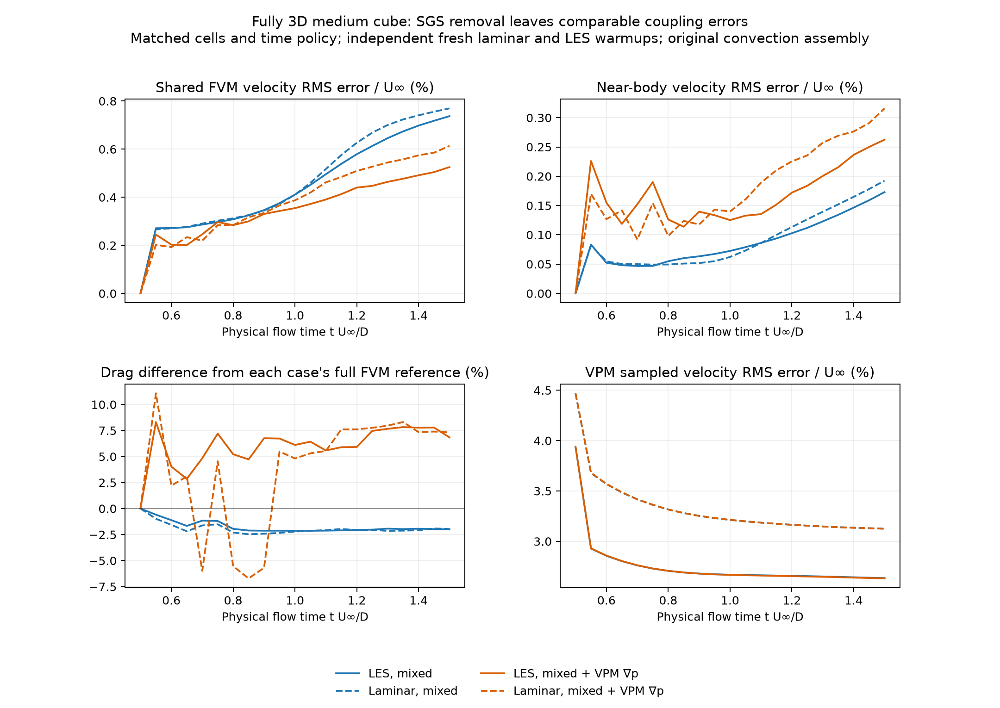
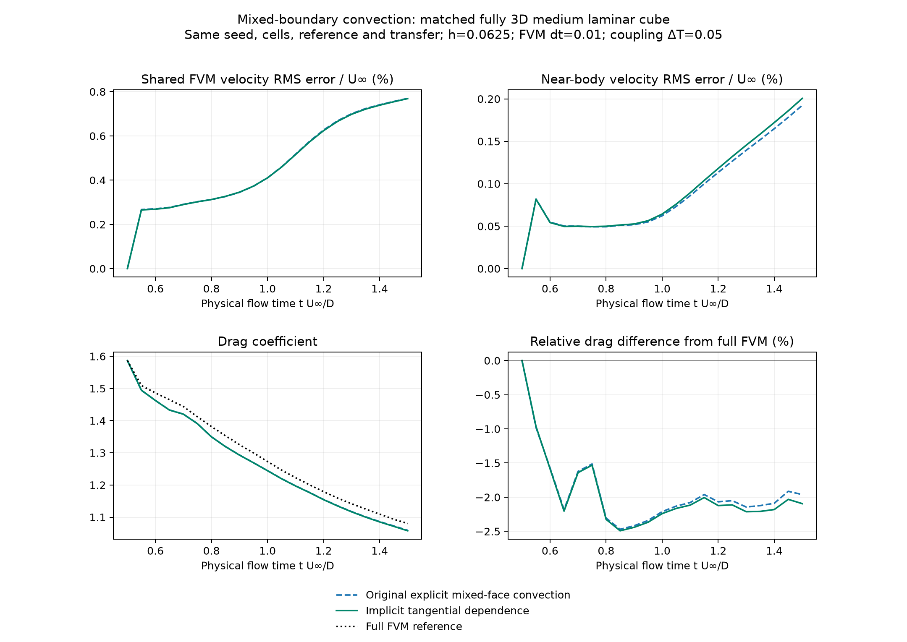
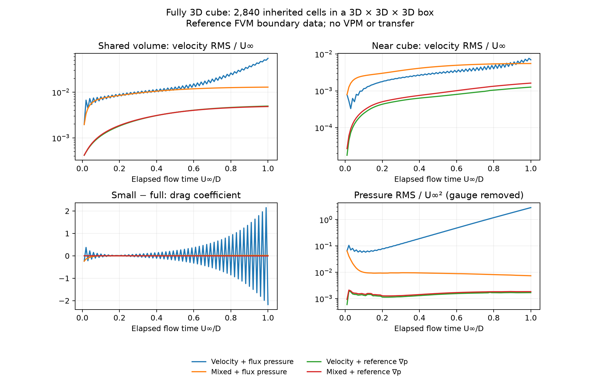
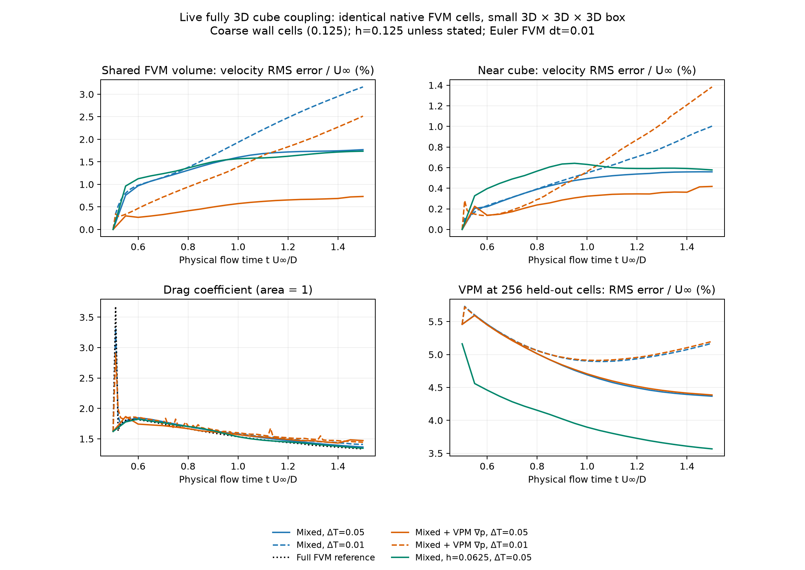
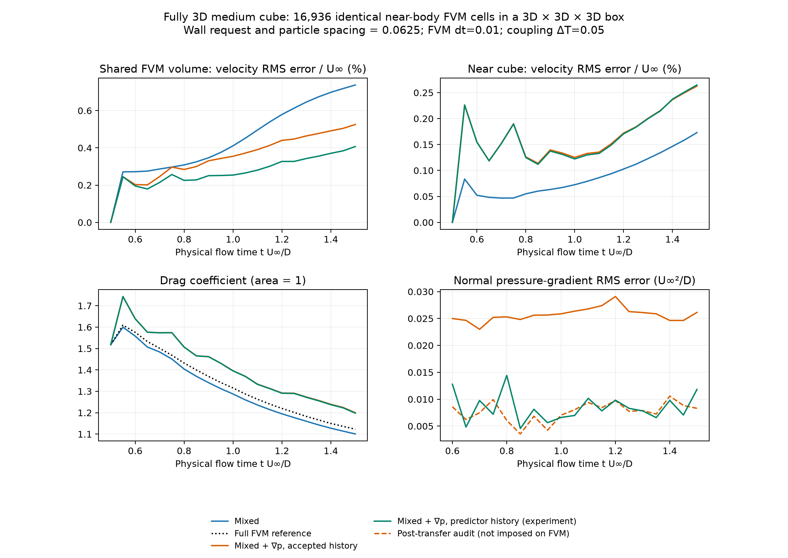
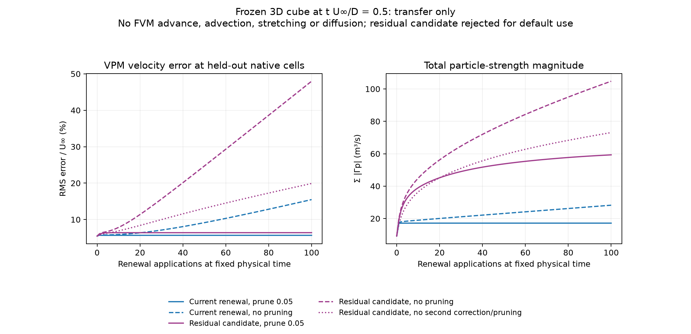
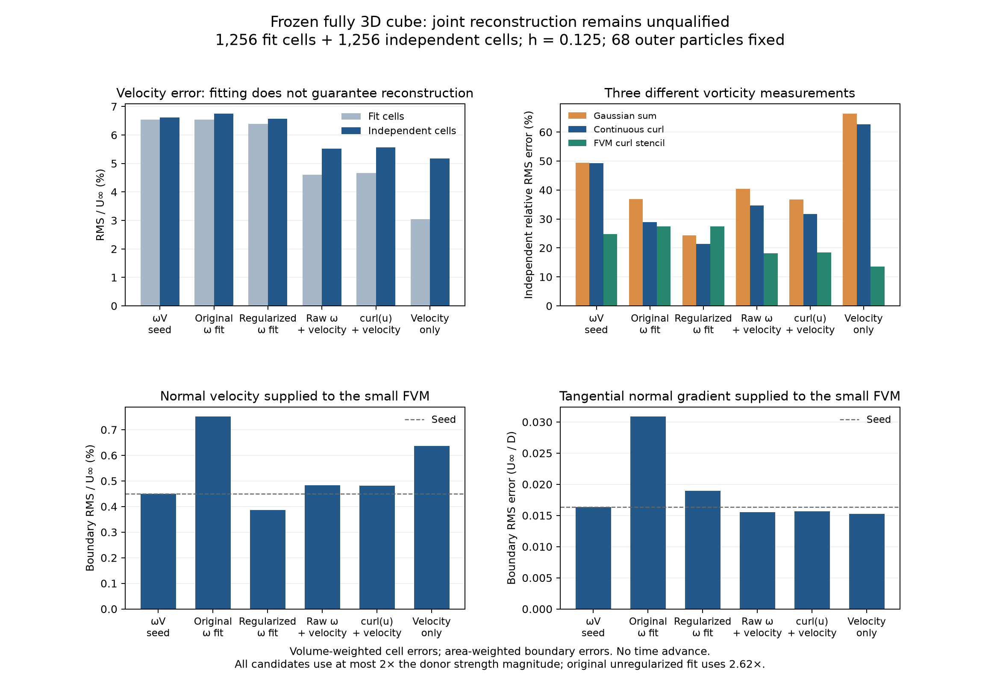

# Fully 3D cube coupling investigation

The required result has **not yet been achieved**. The experiments below isolate
several independent errors using a unit cube, a small near-body FVM box of about
`[-1.5, 1.5]^3`, and the real three-dimensional solvers. No slip-ended slice,
span replication, two-dimensional kernel, fitted force scale, or phase shift is
used here. The short runs are component and coupling diagnostics, not validation
of a statistically developed Re=1000 wake.

The latest [interface-iteration experiment](/Users/flaviomartins/OpenONDA/studies/coupler_accuracy/interface-iteration-3d.md)
completes 20 matched-medium intervals. RMS relative drag error falls from
2.082% to 0.555%, and final drag error changes from −2.096% to +0.756%.
Final near-body FVM velocity error falls 2.50%, while whole-domain error falls
only 0.30%. Twelve intervals converge and eight reach the fixed 12-sweep cap.
Independent wall-force, field and map-replay checks pass. The final replacement
jump is nearly removed, but substantial reference boundary errors remain.
This is promising short-run progress; the requested developed-wake
force/profile agreement is still unachieved.

The [velocity-projection and mass-flux audit](/Users/flaviomartins/OpenONDA/studies/coupler_accuracy/velocity-projection-and-mass-flux-3d.md)
reproduces the fully meshed reference velocity and pressure bitwise and recovers
its conservative face flux. Both accepted reference and hybrid fluxes conserve
mass to roundoff, while interpolation of cell velocity gives substantial
discrete divergence in both. A purely normal face correction recovers flux
without changing native circulation. A separate decomposition shows that
removing the reconstruction's velocity projection would worsen near-body error
in all four mesh/input cases. These results narrow the diagnosis; they do not
qualify a new advancing transfer or explain the remaining drag difference.
Rechecking the eight medium shared-trace reconstructions against accepted
reference flux retains the earlier rejection: both shared-trace updates worsen
the native normal error, and damping still cannot improve both boundary errors.
The advancing endpoint audit also measures a fixed-time boundary change after
particle replacement: `0.0007143 U∞` in normal velocity and `0.0043508 U∞/D`
in the derivative for the control. This motivated the fixed-predictor
interface-iteration study above.

The [continuous-curl reconstruction study](/Users/flaviomartins/OpenONDA/studies/coupler_accuracy/continuous-curl-reconstruction-3d.md)
qualifies a locally solenoidal source on both physical meshes. Retaining its
exact curl removes the exterior curl defect but worsens near-body error in
all four mesh/input pairs. Boundary improvements are small and inconsistent;
the medium point pair worsens both boundary errors. Five component tests and
316 independent checks pass. Both physical comparisons are complete; these
results do not justify advancing transfer with the new reconstruction.

The preceding [shared-face reconstruction study](/Users/flaviomartins/OpenONDA/studies/coupler_accuracy/shared-trace-reconstruction-3d.md)
qualifies circulation and impulse budgets on both physical meshes. Both coarse
and medium physical comparisons improve near-body reconstruction while
worsening both native boundary measurements relative to their moment baselines.
The medium mean update gives −11.32% near-body error, +4.34% normal-velocity
error and +2.60% derivative error. Four component tests pass and independent
field checks confirm the tradeoff. Positive damping cannot improve either
native boundary error for these update directions. A separate continuous-curl
diagnostic measures nonzero curl outside the compact raw correction, exposing
a local solenoidality limitation. This is not yet a cause-and-cure result for
drag; advancing emission remains unvalidated.

The preceding [native sampling of the same induced field](/Users/flaviomartins/OpenONDA/studies/coupler_accuracy/sampled-native-face-followup-3d.md)
improves both frozen boundary measurements in 15 source/body comparisons, then
tests two variants in the advancing matched-medium 3D coupler. Changing only
the derivative barely improves drag (−2.0955% to −2.0769%). Changing both
measurements lowers final small-FVM velocity errors by about 3% but worsens
drag to −2.2373%. Seven new tests pass, and the final hybrid forces replay
exactly from saved FVM states. Both variants remain scoped experiments.

The preceding [reconstruction using prescribed wall data](/Users/flaviomartins/OpenONDA/studies/coupler_accuracy/boundary-informed-reconstruction-3d.md)
lowers the medium manufactured thin-field error by 35.5% with point inputs.
On the frozen physical cube at 6,912 body panels, updating both circulation and
moments improves near-body velocity by 13.0% and both coupling errors by about
2% relative to the previous linear-face moment source. Derivative error remains
slightly above the constant-volume control, and the circulation change is
material. Five new tests pass; an advancing transfer remains unvalidated.

The preceding [body-resolution and quadratic-reconstruction follow-up](/Users/flaviomartins/OpenONDA/studies/coupler_accuracy/moment-panels-and-quadratic-3d.md)
holds the volume sources fixed while refining from 108 to 6,912 body panels.
Penetration falls, but substantial coupling errors persist. A separately tested
quadratic velocity reconstruction lowers medium-mesh near-body induction error
by 64.5% in the broad manufactured field, while worsening the thin field by
5.8% with point inputs. Five new consistency tests pass; this remains an
isolated reconstruction candidate, not a validated production transfer.

The preceding [moment-reconstruction follow-up](reconstructed-moments-followup-3d.md)
obtains first vorticity moments from the small FVM mesh's velocity data. With
cell circulations and exterior particles fixed, it lowers frozen near-body
induction error by 33.8% and boundary normal-velocity error by 5.5%, but worsens
the tangential derivative by 4.1% and wall penetration at independent samples.
This is a qualified component tradeoff; production transfer and advancing
force/profile agreement remain unvalidated.

The current SGS diffusion operators are **not the same continuum model** when
eddy viscosity varies. A matched laminar experiment now shows that removing
SGS leaves comparable cube errors, so an SGS correction alone cannot be assumed
to fix this short trajectory. Particle reconstruction, boundary
pressure and discrete boundary assembly need separate treatment. Correcting
only the injected integrated vorticity cannot remove all of these differences.

The [native-face follow-up](native-face-boundary-followup-3d.md) compares actual
momentum/pressure face derivatives with the interpolated oracle traces on the
medium 3D mesh. Native derivatives improve one oracle force bias but do not
remove the trajectory error. A corrected frozen audit isolates an outflow
convection-stencil difference. Two mixed-boundary state bugs are fixed and
covered by reproducing tests; their 100-step effect is at roundoff. This does
not promote a new production boundary or transfer method.
The resulting [outflow convection candidate](outflow-convection-followup-3d.md)
was then tested in advancing oracles and a matched live 3D pair. It slightly
improves live near-body velocity but worsens drag from −2.0955% to −2.2266%.
It is retained only as a scoped experiment.

The [cell-integral follow-up](cell-integral-followup-3d.md) now separates the FVM's
volume-normalized circulation from point-sampled Gaussian vorticity. Its native
cell integrals pass an independent surface identity to about `4e-14`. The joint
integral fit slightly improves both boundary errors relative to a matched point
fit, but still worsens the tangential derivative relative to the donor `ωV` seed.
It qualifies a new measurement component without promoting a production transfer.

The [continuous-curl and panel follow-up](continuous-curl-and-panels-3d.md) adds
Stokes/volume-qualified observations of the induced velocity curl and then varies
body resolution from 108 to 6,912 panels with particles fixed. Wall penetration
decreases, but substantial velocity and coupling-boundary errors persist. The
new observations and surface refinement do not yet qualify a production change.

The [native-volume and overlap follow-up](native-volume-and-overlap-3d.md)
integrates the actual FVM cells before replacing them by Gaussian particles.
An overlap inside the same small FVM domain lowers frozen boundary
normal-velocity error by about 14%, while tangential-derivative error remains
essentially unchanged. A larger apparent derivative improvement at a sharp
volume cutoff was trace-dependent; actual face-triangle jump checks expose
that ambiguity. This is a qualified frozen representation study, not an
advancing solver or force validation.

The [manufactured circulation and moment study](manufactured-circulation-and-moments-3d.md)
now isolates native curl error from the loss of variation within a cell. In
fully 3D fields with exact no slip on the cube, native medium-mesh circulation
errors remain 12.2% and 27.1% when given exact point velocity. Preserving exact
first vorticity moments as well as exact circulation reduces source-induced
near-body error by 90.7% and 85.3% relative to uniform native cells on the same
mesh. This establishes the value of richer cell data; acquiring those moments
from the physical FVM solution and validating an advancing transfer remain open.

## The SGS operators differ before discretization

For incompressible velocity `u`, strain `S`, and `ω=curl(u)`, the current FVM
momentum assembler uses the complete deviatoric stress. Its vorticity source is

```
curl(div(2 ν_eff S)).
```

The variable-viscosity GBD kernel instead uses

```
div(ν_eff grad(ω)).
```

These agree for constant viscosity. With spatially varying viscosity, curl does
not commute with that diffusion operator; derivatives of viscosity and the
transpose-stress contribution matter. FVM implements that transpose term in
`compute_dev2_stress_source`. GBD's componentwise conservative face flux does
not include its vorticity counterpart.

The [3D variable-viscosity audit](results/variable-viscosity-3d-qualified.json)
uses an incompressible ABC field on a triply periodic cube with nonzero variation
and velocity/vorticity components in every direction. Both operators receive
**exactly the same viscosity field**. Spectral differentiation separates model
equivalence from FVM/VPM numerical discretization. A closed-form commutator also
independently checks the smooth-variable-viscosity case.

| Shared viscosity model | Relative source difference, 16³ | 32³ | 64³ |
| --- | ---: | ---: | ---: |
| Constant | 8.4e-15 | 3.7e-14 | 1.8e-13 |
| Smooth spatially varying coefficient | 20.3186% | 20.3186% | 20.3186% |
| Equilibrium Smagorinsky, same constants and fixed filter width | 14.9354% | 14.9453% | 14.9452% |

These are relative **vorticity-source differences in a manufactured 3D field**,
not percentages of cube velocity or drag error. Their persistence under
refinement proves that matching model constants alone does not align the
equations. A compatible stress/curl formulation and matched filter definition
are required before demanding near-roundoff equivalence under LES. No production
SGS model has been replaced speculatively in this investigation.
An exact solenoidal projection of the GBD source still leaves a 12.58% difference
for the Smagorinsky case at 64³, so this is not resolved by removing vorticity
divergence alone. The smooth-coefficient result agrees with the analytical
commutator to `1.1e-15` in absolute source units.

### A qualified component candidate, with explicit limits

The [stress/curl experiment](results/stress-curl-3d-qualified.json) now executes
the **actual f32 variable-viscosity GBD kernel** on an interior 3D stencil with
a periodic halo. It confirms the preceding continuum diagnosis independently
of particle time integration. The measured kernel increment agrees with an
independent arithmetic-face heat stencil to about `1e-4` relative; that small
difference includes f32 subtraction of the pre-step field.

An isolated candidate instead differentiates the complete deviatoric stress
using a matched centered strain/divergence/curl operator. With the same smooth
variable viscosity and the same ABC velocity:

| Grid | Real GBD source error | Complete-stress candidate error |
| --- | ---: | ---: |
| 16³ | 20.6218% | 9.3004% |
| 32³ | 20.3866% | 2.4313% |
| 64³ | 20.3350% | 0.6148% |

The candidate converges at second order while the GBD model difference
persists. For the fixed-filter Smagorinsky field at 64³, the corresponding
errors are 15.0106% and 0.7319%. The candidate's source divergence is below
`8e-18` in these fields. Its periodic velocity work equals minus the
deviatoric-strain dissipation to rounding error, including a separate test
with arbitrary three-component velocity and positive viscosity.

The representation also matters. In a **band-limited periodic Gaussian**
experiment, adding a physical stress source directly to coefficients smooths
it again and gives a 1.892% relative source error on a 31³ grid with σ/h=1.
Mapping the source through the inverse representation reduces that identity
error to `6.6e-16`. The resulting coefficient step agrees with the velocity
step's curl to `3.3e-15`; 100 explicit viscous velocity steps decrease kinetic
energy monotonically. These are exact finite-dimensional identities, not
free-space particle accuracy claims.

This candidate remains in `stress_curl_3d.py`, **outside production GBD**.
Centered differences have checkerboard null modes. The Gaussian experiment
does not include discrete particle scatter, a body mask, free-space boundaries
or regularized inverse fitting. Its Gaussian condition number is about 1,025;
an uncontrolled inverse is unsuitable near a sharply cut wall. A production
version requires a compatible grid layout, body-complete velocity, bounded
coefficient mapping and a validated wall treatment. Seven component tests
pass, but they do not certify those missing pieces.

### Removing SGS does not remove the cube discrepancy

A fresh medium-mesh laminar warmup reaches physical time 0.5, then both full
and small FVMs restart the same diagnostic initial-value problem and advance
to 1.5. Molecular viscosity remains 0.001, all three directions remain active,
and every other numerical setting and shared cell is unchanged. This is a
clean laminar comparison, rather than switching SGS off for one step from an
LES seed. The full laminar reference has `Cd=1.08039534`.

| Laminar boundary-only case | Shared velocity RMS / U∞ | Near-body RMS / U∞ | Small minus full Cd |
| --- | ---: | ---: | ---: |
| Mixed + flux pressure | 0.00542528 | 0.000798753 | +0.00532136 |
| Mixed + reference pressure gradient | 0.00140892 | 0.000815845 | −0.00452619 |

The independent live hybrid then uses this same laminar seed, h=0.0625,
FVM dt=0.01 and coupling ΔT=0.05, with no SGS closure in either solver:

| Live case | Shared velocity RMS / U∞ | Near-body RMS / U∞ | Relative Cd difference |
| --- | ---: | ---: | ---: |
| LES, existing mixed | 0.00737305 | 0.00172926 | −1.9928% |
| Laminar, existing mixed | 0.00769653 | 0.00192438 | −1.9620% |
| LES, mixed + VPM pressure gradient | 0.00525384 | 0.00262453 | +6.8382% |
| Laminar, mixed + VPM pressure gradient | 0.00613703 | 0.00315884 | +7.317% |

The pressure-history problem also survives with no SGS: the laminar imposed
normal pressure-gradient RMS error is `0.0325846`, whereas the observational
accepted-to-accepted derivative gives `0.00895928`, in U∞²/D units. The latter
is not imposed on the FVM. SGS alignment remains necessary for model
equivalence, but it is insufficient to fix the errors measured here.

Data: [laminar boundary oracle](results/cube-3d-medium-laminar-oracle/cube-boundary-oracle.json),
[laminar live mixed](results/cube-3d-medium-laminar-coupled-mixed/cube-coupled-trial.json),
[laminar live pressure-gradient mode](results/cube-3d-medium-laminar-coupled-pressure/cube-coupled-trial.json).



## Correcting the mixed-boundary convection matrix

The mixed boundary reconstructs

```
U_b = (I - n nᵀ) U_owner + n U_n + d g_t.
```

The original convection assembler treated the complete `U_b` as a prescribed
Dirichlet value. That evaluated the current flux correctly, but omitted its
cell dependence from the momentum matrix. A backward-Euler momentum step then
contained a lagged tangential outflow contribution, and the pressure correction
received the corresponding incomplete momentum diagonal.

For component `i` and signed volumetric flux `Φ`, the assembler now retains
`Φ (1 - n_i²)` on the owner diagonal and subtracts that same contribution
from the explicit boundary term. The flux at the assembly state is unchanged.
Cross-component terms remain explicit and converge through the existing outer
iterations; there is no new velocity or pressure boundary mode. Normal-value
components retain their prescribed-value behavior. The full reference has no
mixed patch, so its trajectory is unchanged.

Independent tests change cell velocities by finite amounts on arbitrarily
oriented 3D faces, including inflow and outflow, then compare the assembled
flux with the reconstructed physical boundary condition. A transient control
volume also reproduces backward-Euler tangential momentum balance without
relying on another outer iteration.

At physical time 1.5, the matched **laminar boundary-only** experiment gives:

| Boundary / assembly | Shared RMS / U∞ | Near-body RMS / U∞ | Small minus full Cd |
| --- | ---: | ---: | ---: |
| Mixed + flux pressure, original | 0.00542528 | 0.000798753 | +0.00532136 |
| Mixed + flux pressure, implicit tangential convection | 0.00542398 | 0.000632535 | +0.00388762 |
| Mixed + reference ∇p, original | 0.00140892 | 0.000815845 | −0.00452619 |
| Mixed + reference ∇p, implicit tangential convection | 0.00128384 | 0.000807285 | −0.00452668 |

The existing mixed mode improves near-body velocity error by 20.8% and drag
error by 26.9% in this isolation test, with almost unchanged whole-volume
velocity error. With prescribed reference pressure gradient, whole-volume
velocity improves by 8.88%, but drag is effectively unchanged.

The **live laminar hybrid** is different: whole-volume velocity changes from
`0.00769653` to `0.00768679`, near-body error from `0.00192438` to `0.00200547`,
and relative drag error from −1.9620% to −2.0946%. The corrected assembly is
retained because it represents the specified boundary's cell dependence and
passes the independent transient/operator checks. It is **not claimed as an
improvement of the live hybrid drag match**. The differing outcomes reinforce
the need to qualify the particle trace independently; accepting a defect
because it partially cancels another error would not establish accuracy.

The completed **LES** check gives the same conclusion: shared velocity RMS
is `0.00737986`, near-body RMS `0.00182967`, and `Cd=1.09943823` against the
unchanged full reference `1.12307055`, a −2.1043% difference. The original
assembly gave −1.9928%. Both laminar and LES remain stable through this short
test, but neither result meets the requested agreement.

Data: [corrected boundary oracle](results/cube-3d-medium-laminar-implicit-convection-oracle/cube-boundary-oracle.json),
[corrected live laminar hybrid](results/cube-3d-medium-laminar-implicit-convection-mixed/cube-coupled-trial.json),
[corrected live LES hybrid](results/cube-3d-medium-implicit-convection-mixed/cube-coupled-trial.json).
The oracle's assembly-file hashes are recorded in a
[provenance sidecar](results/cube-3d-medium-laminar-implicit-convection-oracle/assembly-provenance.json)
created during that run; its original source list omitted those files. They
were unchanged after launch. The paired live trial captures both before
simulation, and future oracle runs now do so as well.



## Geometry and a valid comparison

The cube reference's `samples/` and `solution/` were not found in accessible Git
history, project archives, or installed tutorial copies. The surviving sample
archive contains coupled results. macOS privacy restrictions prevented inspection
of Trash and the Time Machine directory. No deleted reference data have been
recovered or reconstructed from figures.

The checked-in configurations do not currently describe matching resolutions:
the coupled wall request is `0.015625`, whereas the reference's coarse, medium,
and fine requests are `0.125`, `0.0625`, and `0.03125`. The time policies also
differ. Reusing their labels or old figures would not establish equivalence.

The new experiment builds a full 3D native reference mesh, then extracts the
small domain **without remeshing its cells**. Assertions compare every shared
cell centre and volume, wall geometry, and cut-face orientation. Normal velocity
for the boundary-only experiment comes from the reference's conservative native
face flux. All six sides exchange flow; the body has six no-slip faces.

This exposed a production meshing defect. Independently projecting vertices to
the closest STL triangle could leave an edge vertex on just one of its incident
cube planes. The vertices lay on the STL but some complete faces cut through the
cube. In the coarse full mesh:

| Geometry check | Before correction | After correction |
| --- | ---: | ---: |
| Cube wall area | 5.995971201463314 | 6.0 |
| Enclosed cube volume | 0.9998796227821437 | 1.0 |
| Wall-face centres inside the cube | 116 / 600 | 0 / 600 |
| Maximum inward face-centre displacement | 0.00108128 | 0 |

`_constrain_cfmesh_wall_points` now enforces **all incident Cartesian wall-plane
constraints** at recognized box edges and corners. Its existing geometry
validation and transaction remain in place. This fixes the shape, rather than
renormalizing measured forces. General and curved STL projection is unchanged.

The coarse reference contains 17,592 cells and the extracted small domain 2,840.
The native optimizer slightly moves the cut's interior planes; the actual small
bounds are approximately `[-1.501208, 1.500001] × [-1.501289, 1.501289]^2`.
Snapping only the small mesh to nominal planes would invalidate shared-cell
identity, so the experiment records and retains the native geometry.

## Boundary closure without particle errors

Both real FVM solvers start from the same saved cell state at physical time
`t U∞/D = 0.5`, rebuild initial face fluxes consistently, then advance to `1.5`.
They use `dt=0.01`, implicit Euler, Gauss gradients, linear-upwind convection,
three PIMPLE outer correctors, two pressure correctors, absolute linear
tolerances `1e-11`, and the same equilibrium Smagorinsky constants. This is an
explicitly defined diagnostic initial-value problem, rather than a continuation
of the tutorial's BDF2/adaptive-time history.

The full FVM supplies fresh boundary values at **every** small-FVM endpoint.
There is no VPM, particle transfer, or macro-step interpolation. At elapsed time
1.0, with `U∞=1`, the volume-weighted vector errors are:

| Small-FVM boundary data | Velocity RMS / U∞ | Near-body RMS / U∞ | Small minus full Cd |
| --- | ---: | ---: | ---: |
| Dirichlet velocity, native flux pressure | 0.0550277 | 0.00695691 | -2.17442 |
| Mixed velocity, native flux pressure | 0.0128853 | 0.00551681 | +0.0183460 |
| Dirichlet velocity, reference pressure gradient | 0.00495448 | 0.00126024 | -0.0000778 |
| Mixed velocity, reference pressure gradient | 0.00484346 | 0.00161938 | -0.00645803 |

“Near body” means shared fluid cells with `max(|x|,|y|,|z|) < 1`. The native
Dirichlet/flux-pressure combination develops pressure oscillations; the mixed
combination remains substantially better behaved. Supplying the reference
pressure gradient reduces the mixed velocity error about 2.66 times at the
final time. It does **not** establish that VPM can supply that gradient accurately.



Raw results and geometry provenance:
[cube-boundary-oracle.json](results/cube-3d-oracle/cube-boundary-oracle.json),
[geometry audit](results/cube-3d-oracle/native-cube-geometry-audit.json).

Repeating the same 3D boundary experiment with the reference tutorial's
**medium wall request, 0.0625**, gives 53,752 full cells and 16,936 inherited
small-domain cells. Every exchange side has 576 faces; the cube area remains 6.
At the same physical time 1.5:

| Medium boundary data | Velocity RMS / U∞ | Near-body RMS / U∞ | Small minus full Cd |
| --- | ---: | ---: | ---: |
| Mixed velocity, native flux pressure | 0.00541099 | 0.000790846 | +0.00549768 |
| Mixed velocity, reference pressure gradient | 0.00125147 | 0.000802421 | -0.00454168 |

The pressure-gradient trace reduces whole-domain velocity error about 4.32 times,
but the near-body errors are almost equal at this endpoint. This is further
evidence to measure forces and near-body velocity separately. The medium full
reference's `Cd=1.12307055` also differs substantially from the coarse reference;
neither resolution has been claimed converged to the continuum solution.
See [medium boundary results](results/cube-3d-medium-oracle/cube-boundary-oracle.json).

## What Γ = Vcell ωcell reproduces

An independent float64 direct three-dimensional Gaussian Biot–Savart sum uses
every native reference cell at the final state. There is no tree approximation,
pruning, renewal, time advance, or panel correction. Comparison points are 768
held-out native cell centres, stratified among the near body, outer small domain,
and wake. Vorticity rebuilt from the saved FVM state matches the saved vorticity
exactly.

| Gaussian core radius | Near-body velocity RMS / U∞ | Outer small-domain RMS / U∞ | Wake RMS / U∞ |
| --- | ---: | ---: | ---: |
| 0.0625 | 0.0910821 | 0.0142732 | 0.00701567 |
| 0.125 | 0.107668 | 0.0145093 | 0.00712053 |
| 0.25 | 0.159925 | 0.0203089 | 0.00931051 |
| Native cell volume^(1/3) | 0.104432 | 0.0201597 | 0.00931761 |

These errors already exist **before** any evolving coupling. Integrated
circulation is an appropriate quantity to transfer, but cell quadrature,
discrete curl and Gaussian regularization do not make the represented particle
velocity the exact inverse of the FVM velocity field.

A separate bounded-domain Helmholtz reconstruction includes the reference's
finite outer-boundary contribution; its RMS correction at these points is
`0.00181549 U∞`. It is too small to explain the main near-body discrepancy in
this snapshot. The calculation is independently checked with a constant vector
field on a spherical boundary. Finite-domain decomposition generally requires
boundary information; see
[Schoder, Roppert & Kaltenbacher (2020)](https://link.springer.com/article/10.1007/s42985-020-00044-w).
The measured contribution here is this study's numerical result, not a value
taken from that paper.

The reported cell-gradient divergence (`0.0238792 s^-1` RMS) must not be confused
with conservative face-flux continuity, which is near linear-solver tolerance.
They use different discrete operators.

Raw data: [cube-snapshot-induction.json](results/cube-3d-induction/cube-snapshot-induction.json).

## Live coupling against an independent full FVM

The reference now advances only for measurement and supplies **no evolving
boundary data** to the hybrid. The hybrid starts with the same FVM cells and
pressure/velocity state; the initial particle cloud uses the full seed's `ω V`.
The seed cutoff of `0.02 s^-1` retains 1,955 particles and discards 3.920% of the
sum of strength magnitudes. Both initial FVM force coefficients are identical;
the particle velocity is already approximate.

The particle solver uses the real 3D FMM, RK2, GBD, f32 storage, equilibrium
Smagorinsky model, and the cube's 108-triangle panel body. The panel count is
confirmed in the saved VPM run logs; an earlier draft incorrectly stated 12.
Buffered M4 renewal
uses the box `[-1.25,1.25]^3`, an authority ramp of 0.375, transfer cutoff 0.05,
and amplification setting 1.8. The FVM consistency band is disabled to isolate
boundary closure. These are diagnostic settings, **not an unchanged tutorial
preset**.

At physical time 1.5, the shared full-FVM drag coefficient is
`Cd = 1.335350422685458`:

| VPM boundary mode | VPM/coupling ΔT | FVM velocity RMS / U∞ | Near-body RMS / U∞ | Relative Cd difference |
| --- | ---: | ---: | ---: | ---: |
| Existing mixed | 0.05 | 0.0177028 | 0.00559260 | +2.288% |
| Mixed + VPM pressure gradient | 0.05 | 0.00731335 | 0.00417433 | +10.229% |
| Existing mixed | 0.01 | 0.0316261 | 0.0100337 | +5.515% |
| Mixed + VPM pressure gradient | 0.01 | 0.0251459 | 0.0138355 | +8.060% |

The new pressure-gradient mode improves velocity in the first pair but worsens
drag. It remains opt-in. Reducing ΔT also increases renewal and GBD frequency,
so this table is **not a clean temporal-order study**. It demonstrates that
smaller coupling intervals alone do not remove the discrepancy.

Holding the coarse FVM meshes and ΔT=0.05 fixed while halving particle spacing to
`h=0.0625` gives FVM velocity RMS `0.0173598 U∞`, near-body RMS `0.00577643 U∞`,
and `Cd=1.34584412` (a **+0.786%** difference). The held-out VPM velocity RMS drops
from `0.0436720` to `0.0356669 U∞`, with 39,739 final particles. This improves drag
more than FVM velocity; it is a resolution experiment, not sufficient grounds
to declare the hybrid matched.



Each `cube-3d-coupled-*` result directory contains source/mesh hashes, the full
same-time history, sampled final fields, logs and paired coupled backups.

### Live medium resolution and pressure history

With **both** the native FVM wall request and particle spacing set to `0.0625`,
the independent full reference ends at `Cd=1.1230705500264375`. All rows use the
same initial medium FVM state, small domain, `dt=0.01`, and ΔT=0.05:

| Medium coupling | FVM velocity RMS / U∞ | Near-body RMS / U∞ | Hybrid Cd | Relative Cd difference |
| --- | ---: | ---: | ---: | ---: |
| Existing mixed mode | 0.00737305 | 0.00172926 | 1.10069011 | -1.993% |
| Mixed + VPM pressure gradient | 0.00525384 | 0.00262453 | 1.19986793 | +6.838% |
| Experimental predictor pressure history | 0.00406868 | 0.00264677 | 1.19793773 | +6.666% |

The current pressure calculation differences a new **predicted** velocity
against the previous **accepted, post-transfer** velocity. An observational
audit instead differences successive accepted fields, without imposing its
result on FVM. At the final medium endpoint the normal pressure-gradient RMS
errors are `0.0261308` for the imposed prediction and `0.00830362 U∞²/D` for the
accepted-field audit, versus a reference normal-gradient RMS of `0.0401873`.

A separate study flag preserves successive pre-transfer predictions in the
pressure history. This reduces the imposed gradient error to `0.0118159 U∞²/D`
and improves whole-domain velocity, but barely changes drag and slightly worsens
near-body velocity. On the coarse mesh its final drag difference is still
about 9.86%. It is retained **only as an experiment**. Neither this history
change nor the pressure-gradient mode has been promoted to the tutorial default.
The post-transfer pressure diagnostic also omits SGS stresses; it is not a
complete replacement boundary closure.



Raw histories:
[mixed](results/cube-3d-medium-coupled-mixed/cube-coupled-trial.json),
[mixed with pressure gradient](results/cube-3d-medium-coupled-mixed-pressure/cube-coupled-trial.json),
[experimental predictor history](results/cube-3d-medium-pressure-predicted-history/cube-coupled-trial.json).

## Frozen renewal and a rejected correction

Freeze the full 3D seed velocity **and its full-domain gradients**, and repeatedly
apply only the production transfer. Both FVM clocks and the particle clock stay
at zero elapsed time. There is no pressure solve, advection, stretching, or GBD.
The panel field is refreshed solely to measure the new particle field.

The current pruned method settles after the first few replacements. Removing
pruning causes drift, even though the FVM target is fixed:

| Transfer operation | After 1 renewal: VPM velocity RMS / U∞ | After 100 | Sum of particle-strength magnitudes after 100 |
| --- | ---: | ---: | ---: |
| Current, cutoff 0.05 | 0.0569012 | 0.0566556 | 17.1542 |
| Current, no pruning | 0.0579147 | 0.154752 | 28.2219 |
| Residual candidate, cutoff 0.05 | 0.0586501 | 0.0639420 | 59.3042 |
| Residual candidate, no pruning | 0.0603291 | 0.479743 | 104.761 |

The original blend mixes particle coefficients with physical vorticity samples.
Writing `G` for the Gaussian evaluation operator and `A` for authority, it starts
with `(I-A)g + A f`, although `f` is a target for `Gg`. Consequently even `f=Gg`
is generally not a fixed point. Four independently constructed 3D algebraic
tests reproduce this failure.

An experimental update instead starts from `g + A(f-Gg)` and approximately
deconvolves its increment. It passes the algebraic fixed-point tests, but the
frozen cube test worsens and its coefficient magnitude grows markedly. This
experiment is **rejected for default use**. The production blend was restored;
the candidate lives only in `experimental_residual_blend.py` and requires an
explicit study flag. Its behavior supports further investigation of bounded,
regularized representation, wall support and divergence compatibility; it does
not by itself prove which of those causes the cube failure.

Conservation tolerances were not relaxed to accept it. Algebraic identities and
integrated circulation alone are insufficient qualification for a new transfer.

The existing `projected_renewal` path was also exercised on the frozen 3D state,
with its required hard authority and a smaller transfer box `[-1,1]^3` to fit
the 0.375 guard inside the same small FVM domain. After adding 251 support
particles, its fit error was `2.705435e-4`, but independent vorticity error was
`2.199016e-1`, exceeding the `5e-3` gate. It correctly refused the replacement.
The [failure oracle](results/cube-3d-frozen-projected-guard/hybrid/renewal_projection_failure_oracle.npz)
preserves fit and held-out data for a future reconstruction change. A small
collocation residual is not evidence of an accurate transferred field.



## Joint reconstruction, derivative compatibility and boundary data

The saved failure now has a separate, reproducible
[joint reconstruction experiment](joint_reconstruction_3d.py). It preserves
all 68 outer particles and uses the failed renewal's fixed 2,138-particle basis
(1,887 retained particles plus 251 births). The donor anchor is immutable.
The original 1,256 fit cells and 1,256 independent cells remain disjoint;
the final experiment fits velocity at every fit cell. All calculations use
direct f64 3D kernels and the actual 108-panel constrained Neumann response.
The full and small FVM donor values are checked for equality before fitting.

Three different fields must be distinguished:

- **Gaussian sum:** `ωG = Σ Γp ζp`, which the renewal currently fits.
- **Continuous velocity curl:** `ωBS = curl(uBS)`, evaluated analytically.
- **Native FVM curl:** the FVM's face-interpolation/Gauss stencil applied to
  sampled particle velocity, including its prescribed zero wall-face values.

A general Gaussian particle sum need not be solenoidal. Its Biot–Savart
velocity has a solenoidal curl; a gradient part of the original sum contributes
no velocity. This distinction and the corresponding regularized curl formula
are documented by [Winckelmans (1989), §3.2, equations 3.37–3.40](https://thesis.caltech.edu/697/5/winckelmans-gs_1989.pdf).
The experiment independently differentiates the Gaussian kernel. For
`u = Γ × r f(r)`, its curl operator is
`(ζ − f) I + (3f − ζ) rrᵀ / r²`; at a particle centre the finite limit is
`(2/3) ζ(0) I`. Independent finite differences, including self and near-self
points, verify the implementation and its zero divergence.

The current mixed FVM boundary already uses the **velocity Jacobian** to
obtain its tangential normal derivative. The Gaussian-sum distinction chiefly
affects the renewal fit and the meaning of its vorticity error; it is not a
reason to replace the mixed boundary's Jacobian with raw Gaussian vorticity.

The candidates minimize nondimensional, volume-weighted residuals with a donor
penalty of 0.05, velocity weight 5, and a bound
`Σ |Γp| ≤ 2 Σ |Γprior,p|`. A monotone accelerated projected-gradient solve
enforces this group-norm bound directly. It is checked against an independent
SLSQP solution and reports a projected-gradient stationarity measure. All four
constrained fits below converged below `1e-8` on that measure. Merely shortening
the unconstrained correction was also tested; it did not resolve the errors.

| Frozen representation | Fit velocity RMS / U∞ | Independent velocity RMS / U∞ | Independent Gaussian-sum error | Independent continuous-curl error |
| --- | ---: | ---: | ---: | ---: |
| Donor `ω V` | 0.065483 | 0.066169 | 49.47% | 49.30% |
| Original unregularized ω fit | 0.065360 | 0.067579 | 36.89% | 28.89% |
| Bounded, regularized ω fit | 0.063873 | 0.065736 | 24.27% | 21.32% |
| Bounded raw ω + velocity fit | 0.045998 | 0.055280 | 40.39% | 34.64% |
| Bounded continuous curl + velocity fit | 0.046658 | 0.055725 | 36.68% | 31.70% |
| Bounded velocity-only fit | 0.030431 | 0.051701 | 66.44% | 62.63% |

Vorticity columns compare against the stored **discrete FVM curl**, not an
independent continuum solution. They use cell-volume weighting. The existing
production gate uses an unweighted norm: its original error is reproduced as
`0.219901633844`, so its earlier 21.99% and this table's 36.89% are different
norms of the same field. The original fit uses 2.623 times the donor strength
magnitude; all new fits stay within twice the donor value. No circulation or
impulse equality constraints have yet been imposed. These are development
verification cells reused across experiments, not a blind final acceptance set.
See [the complete numerical record](results/cube-3d-joint-reconstruction-full-velocity-fit/joint-reconstruction-3d.json).

An [independent native-curl and boundary audit](native_curl_3d.py) reconstructs
the FVM stencil to `7.1e-15` on the saved donor and verifies analytical rigid
rotation on anisotropic 3D cells. It also evaluates all 864 actual coupling
faces. Reference normal velocity comes from the full FVM face flux; reference
tangential normal gradient uses the same trace as the earlier boundary oracle.
The production flux correction and its rejection threshold are retained.
Particle derivatives use centred differences of complete f64 velocity; halving
the step changes the checked derivative operator by `1.2e-9` relatively.

| Frozen representation | Boundary normal-velocity RMS error / U∞ | Boundary tangential normal-gradient RMS error (U∞/D) |
| --- | ---: | ---: |
| Donor `ω V` | 0.004500 | 0.016362 |
| Original unregularized ω fit | 0.007516 | 0.030878 |
| Bounded, regularized ω fit | 0.003856 | 0.018945 |
| Bounded raw ω + velocity fit | 0.004836 | 0.015540 |
| Bounded continuous curl + velocity fit | 0.004816 | 0.015644 |
| Bounded velocity-only fit | 0.006367 | 0.015290 |

The original vorticity fit worsens both data supplied to the small FVM. The
bounded fits trade their errors; improvement in interior velocity alone does
not establish better coupling. None is accepted as a production replacement.

The native-curl comparison reveals a further limitation. The velocity-only
candidate has 13.58% native-curl error but 62.63% continuous-curl error. Its
particle field still has a tangential wall-velocity RMS of `0.5014 U∞` at the
panel evaluation points. The native stencil's imposed zero wall values can
therefore hide a large mismatch in the continuous field. The donor itself has
`0.3600 U∞` tangential wall RMS. This does not imply FVM wall slip: the FVM
enforces its own no-slip condition. It limits the interpretation of a particle
reconstruction, and makes wall support and derivative compatibility separate
qualification requirements. See [the boundary audit data](results/cube-3d-native-curl-and-boundary/native-curl-3d.json).



Further [native-curl, wall, particle-moment and sampling ablations](reconstruction-followup-3d.md)
also fail to improve both boundary quantities on the same 864 coupling faces.
The native-curl-only fit improves independent interior velocity but changes
particle impulse and worsens the boundary data. An overlap-only fit strongly
overfits between its sample locations. Using all 2,512 original donor/verification
values makes the raw fit overdetermined, but still trades normal-velocity error
against tangential-gradient error. That last family treats the old verification
points as training data and uses 328 unused outer-layer cells plus the unchanged
boundary faces for verification. None of these candidates is promoted.

## Acceptance work that remains

1. **Qualify reconstruction on frozen 3D data.** The matched laminar comparison
   demonstrates substantial error without an SGS mismatch. The bounded joint
   fits and their native-curl/moment ablations remain inadequate. Test
   cell-integrated particle vorticity and continuous curl against the FVM's
   volume-normalized face circulation, with the native geometry;
   fit/verify the velocity and derivative data needed at the interface. Preserve
   the outer wake, bound coefficients, and enforce circulation/impulse before
   integration. Separate one-step representation error from repeated renewal
   drift. A small fit residual or native-curl residual alone is insufficient.
2. **Measure each evolving operator.** Separate GBD diffusion/pruning from
   transfer frequency, then vary particle spacing and core width. Compare
   molecular diffusion and SGS stresses under matched filter widths; identical
   model constants do not guarantee identical filters on different volumes.
3. **Qualify VPM pressure data before using it by default.** Compare temporal,
   convective, viscous/SGS and body contributions at native coupling faces.
   Check the independent FVM oracle's interpolated gradient targets against its
   actual native face diffusive and pressure fluxes as a separate component.
   Resolve pre-transfer versus accepted post-transfer histories and interface
   iteration separately. The live force result currently rejects default use.
4. **Integrate a compatible complete-stress source.** The periodic 3D candidate
   qualifies the PDE and energy identity, but production integration still needs
   a bounded coefficient map, a suitable grid layout, body-complete velocity,
   wall treatment and a matched filter definition.
5. **Extend the matched medium and finer 3D trajectories.** Keep the small FVM
   domain fixed, retain identical native near-body cells, and compare complete
   force and velocity histories at common physical times through the developed
   wake. No fitted time or force alignment should count as agreement.

Machine precision is a useful target for exact operator identities, geometric
mapping, conservation reductions and a discrete replay of the same problem.
The present hybrid and full FVM use different spatial inverses, regularization,
time integrators, far-boundary conditions and arithmetic. Equal near-wall cell
sizes do not make those discrete systems identical. Matching their complete
solutions to roundoff would require reproducing the full discretized exterior's
boundary response (or changing the reference to the same discrete equations).
This investigation continues to measure instantaneous differences; it does not
substitute statistical agreement for the requested trajectory agreement.

The literature also distinguishes proof of concept from the present goal.
[Martins, van Zuijlen & von Terzi (2026)](https://doi.org/10.1088/1742-6596/3224/4/042069)
demonstrates fully 3D cube coupling at Re=100 using core spreading and RK4, with
particle regularization and improved long-time coupling explicitly deferred.
Those results cannot qualify the present Re=1000, FMM/GBD/RK2 configuration.

## Verification of retained changes

The selected suite passed **203 tests** after the convection correction:
all coupler tests, box-wall geometry tests, mixed FVM boundary and convection
tests, matrix-workspace boundary-layout tests, and reference-comparison tests.
Five tests check the rejected residual update's algebra and seven qualify only
the periodic stress/curl component. They do not qualify either experimental
candidate for production integration.
See [that test record](results/3d-implicit-convection-regression.xml).
The previous 192-test result is retained in
[the earlier test record](results/3d-final-regression.xml).

The new offline reconstruction and native-curl components pass **12 focused
tests**, including independent kernel differentiation, the real panel solve,
an independent constrained optimizer, analytic 3D rotation and native stencil
replay. These additional tests qualify the experimental measurements and
optimization, not a production transfer. See
[the focused test record](results/3d-joint-reconstruction-regression.xml).
The subsequent suite passes **16 focused tests**, including four new checks of
moment/budget projection and the complete constrained fit against independent
SLSQP solutions. See [the updated focused record](results/3d-native-moment-regression.xml).

The native-face follow-up passes **35 selected regression tests**, including
three reproductions of the mixed-boundary initialization/cache defects and
three native face-operator checks. Existing restart, mixed convection and
non-orthogonal pressure tests pass. See
[the state/face regression record](results/3d-mixed-boundary-state-regression.xml).
The subsequent broader suite passes **240 tests**, including all coupler tests
and the selected FVM state, mixed convection, pressure and restart tests:
[latest regression record](results/3d-face-state-outflow-regression.xml).

The pressure-observer smoke check reproduces the unaudited trajectory within
`1.4e-7` in Cd and `1.9e-9 U∞` in the reported FVM velocity RMS. The observer
stores comparison data and refreshes derived VPM fields; it never sends the
reference pressure or velocity to the hybrid.
Nine focused study tests pass after the final harness changes. A separate
laminar smoke run verifies that the harness selects no SGS closure in **both**
solvers and supports output directories outside the repository. The live trial
captures source hashes before simulation; study-only numerical hooks are restored after
the run, including on exceptions.

## Reproduction

From the repository root, using the OpenONDA Python environment:

```sh
export PYTHONPATH=.
export OMP_NUM_THREADS=1
export OPENBLAS_NUM_THREADS=1
python studies/coupler_accuracy/cube_boundary_oracle.py \
  --dx 0.125 --steps 100 --warmup-steps 50 --output /private/tmp/cube-3d-oracle
python studies/coupler_accuracy/cube_snapshot_induction.py \
  --oracle /private/tmp/cube-3d-oracle --output /private/tmp/cube-3d-induction
python studies/coupler_accuracy/cube_coupled_trial.py \
  --oracle /private/tmp/cube-3d-oracle --steps 20 --output /private/tmp/cube-3d-live
python studies/coupler_accuracy/cube_coupled_trial.py \
  --oracle /private/tmp/cube-3d-oracle --frozen-renewals 100 \
  --transfer-cutoff 0 --output /private/tmp/cube-3d-frozen
python studies/coupler_accuracy/cube_coupled_trial.py \
  --oracle /private/tmp/cube-3d-oracle --frozen-renewals 100 \
  --transfer-cutoff 0 --experimental-residual-blend \
  --output /private/tmp/cube-3d-frozen-rejected-candidate
python studies/coupler_accuracy/variable_viscosity_3d.py \
  --output /private/tmp/variable-viscosity-3d.json
python studies/coupler_accuracy/stress_curl_3d.py \
  --output /private/tmp/stress-curl-3d.json
python studies/coupler_accuracy/joint_reconstruction_3d.py \
  --budget-method projected --velocity-points 1256 --include-velocity-only \
  --output /private/tmp/cube-3d-joint
python studies/coupler_accuracy/native_curl_3d.py \
  --study /private/tmp/cube-3d-joint --output /private/tmp/cube-3d-native-curl
python studies/coupler_accuracy/plot_cube_3d_study.py
```

Output directories must be new. For the other live rows, use
`--boundary-mode vorticity_mixed_pressure_gradient` and/or
`--substeps 1 --steps 100`. Reducing ΔT here leaves the FVM step unchanged.
Use `--dx 0.0625` for a new medium oracle and `--particle-spacing 0.0625` for its
live trial. `--audit-pressure` records pressure comparisons;
`--pressure-history predicted --boundary-mode vorticity_mixed_pressure_gradient`
selects the experimental history. The audit's first accepted step has no prior
accepted sample and is explicitly marked invalid for temporal comparison.
Use `--laminar` on a fresh oracle warmup to disable SGS consistently; the live
trial inherits that choice from the oracle. Source-recorded results before the
convection correction remain immutable baselines. New runs use the corrected
matrix, so their hybrid trajectory is expected to differ slightly. The SGS
isolation and convection figures are generated with
`plot_cube_3d_study.py --plots sgs mixed_convection` from the completed study data.
Use `--plots joint_reconstruction` for the frozen reconstruction and boundary
figure. The joint study defaults to the saved coarse failure and seed; its
final output also archives the study script used for that run.
The native/moment and sampling ablations have their own
[reproduction commands and data-role notes](reconstruction-followup-3d.md).
The subsequent [native face and state investigation](native-face-boundary-followup-3d.md)
has its own advancing and frozen-operator reproduction commands.
