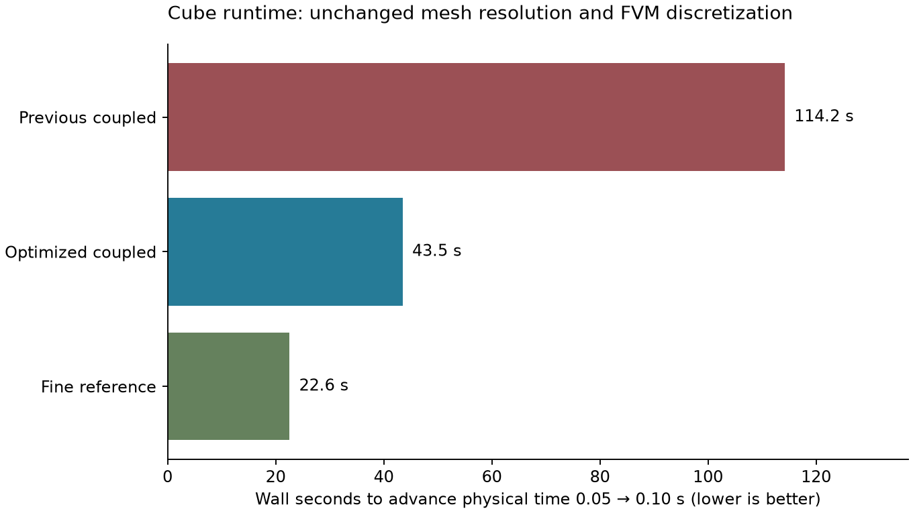

# Cube runtime audit — 14 September 2026

The retained changes reduce the measured coupled interval from **114.21 s to
43.51 s**, a **2.62× speedup (61.9% less wall time)**. The optimized coupled
solver still takes **1.93× the fine reference's 22.59 s** over the same physical
interval. The requested cost advantage over the reference is **not achieved**.



The user's coupled run was stopped at physical time 0.25. Its first scheduled
backup was at 0.5, explaining why there was no backup yet. Its five coupling
intervals took approximately 119–150 s each after the initial interval. The
running dense/coarse reference jobs and all existing tutorial outputs were
left intact. Every benchmark wrote into a new directory under
`/private/tmp/openonda-cube-performance-t8wa3h`.

## What is preserved

The tutorial still uses the fully three-dimensional cube, the FVM box
`[-1.5,1.5]^3`, transfer box `[-1.25,1.25]^3`, requested mesh spacing `0.06`,
and 303,264 FVM cells. The fine reference has 692,604 cells; its matching
near-body target is also `0.06` (the native mesher resolves both with
approximately `0.045` cells in that refinement level).

FVM retains `linearUpwind` convection, Gauss gradients, backward time
discretization, two PIMPLE outer correctors, two pressure correctors, one
nonorthogonal correction, relaxation factors, turbulence model, and the
existing linear/interface residual tolerances. Coupled timesteps remain
FVM `0.01` and VPM `0.05`. The reference retains its own maximum-Courant
controller (`0.9`); timings are therefore compared per equal physical interval,
not per differently sized step. VPM remains on Metal treecode with the same
particle spacing, precision, and capacity. `allplot.sh` and its plotters are unchanged.

## Diagnosed costs and retained fixes

Each coupling interval required three converged-interface sweeps. Each sweep
replays five FVM substeps: **15 PIMPLE solves for five accepted FVM steps**.
This remains the dominant structural cost.

* The shared PETSc workspace discarded its pressure multigrid setup when
  switching equations. `allrun.sh` now selects separate persistent workspaces.
  Relaxed and final outer iterations keep separate pressure workspaces.
* Preconditioners are reused only while every matrix row remains within the
  configured change threshold relative to the matrix that built the
  preconditioner. The actual equation matrix is always updated. Existing
  residual verification remains active; a failed reused preconditioner is
  rebuilt and retried once with the original tolerances. This follows
  [PETSc's documented reuse mechanism](https://petsc.org/main/manualpages/KSP/KSPSetReusePreconditioner/).
* The configured Numba backend now executes fused Gauss-gradient and diffusion
  face loops, preserving the original interpolation, nonorthogonal corrections,
  ghost handling, and halo exchanges.
* The analytic double-precision source-panel derivative reuses small work
  arrays instead of allocating temporary arrays for every panel/target pair.
* Particle replacement uploads the active prefix in bounded chunks on Metal
  and CPU, rather than staging the complete 1.5-million-particle allocation
  for each field. The existing Vulkan fallback is retained.

| Cost over physical time 0.05 → 0.10 | Original coupled | Optimized coupled |
| --- | ---: | ---: |
| FVM | 84.36 s | 34.33 s |
| Particle advancement | 5.30 s | 1.12 s |
| Initial boundary evaluation | 4.79 s | 0.82 s |
| Transfer and interface refresh | 19.76 s | 7.25 s |
| Total | **114.21 s** | **43.51 s** |

## Numerical and execution checks

Decoded four-rank checkpoints at physical time `0.1` preserve the previous
coupled solution closely. These metrics include processor halos:

| Field | Maximum absolute difference | Relative L2 difference |
| --- | ---: | ---: |
| Velocity | 1.259e-7 | 5.494e-9 |
| Kinematic pressure | 1.888e-7 | 1.370e-7 |
| Volumetric face flux | 2.576e-10 | 4.583e-9 |
| Eddy viscosity | 1.042e-10 | 2.991e-8 |

The largest drag-coefficient difference at the two sampled endpoints is
`7.74e-8`. All interface sweeps satisfy the unchanged `1e-6` RMS criteria.
The optimized MPI/Metal run completed and wrote a full coupled backup plus
VPM HDF5/XDMF output. Focused checks cover compiled operators on skewed 3D
meshes, updated matrix solves with reused preconditioners, rebuild/retry,
source-panel derivatives, and particle replacement. The replacement check
also passed on actual Metal across chunk boundaries, growth, shrinkage,
and an empty state, preserving all 11 supplied fields exactly.

These are preservation checks, **not validation of agreement with the full
reference flow**. At `t=0.1`, optimized coupled drag is `2.722133`, while the
reference is `2.393392`. Earlier coupled/reference discrepancies remain.

The reference timing run also uses the optimized FVM kernels and separate
PETSc workspaces. All measured cases use four MPI ranks on the same machine,
with other reference jobs running and cProfile enabled. The first interval
contains compilation costs and is excluded from the headline comparison.
This is a short startup benchmark, not a developed-wake throughput claim.
Summed rank peak RSS was 3.04 GB before and 3.19 GB after; persistent solver
workspaces trade some process memory for speed. These values exclude a complete
accounting of Metal allocations. Total-memory reduction is not claimed.

A smaller-domain trial at unchanged resolution worsened the short-time force
comparison and was rejected. Polynomial prediction did not reliably remove a
sweep. Bounded Anderson acceleration still required three sweeps in all four
tested intervals and was removed. None of those experiments remains enabled.

## Evidence and reproduction

[Machine-readable measurements](results/cube-runtime-2026-09-14/measurements.json)
retain interval timings, convergence residuals, force samples, and checkpoint
differences. Baseline source was commit
`ebe9382414e450abf2bcd0bae8c7c2fc45ac0825`. Compact original profiler records
are saved beside the measurements; full isolated outputs remain in the
temporary benchmark directory.

From the repository root, with the OpenONDA environment active, use a new
output directory for each bounded check:

```sh
env FVM_PROFILE=1 python studies/coupler_accuracy/profile_cube_runtime.py \
    --output /private/tmp/cube-runtime-new --steps 2 --profile
```

Add `--reference` with a different output directory for the existing fine
reference mesh and its own time controller. The helper refuses to reuse an
existing output directory and does not run the tutorial's cleanup scripts.
The [summarizer](summarize_cube_runtime.py) regenerates the measurements and plot
from those isolated directories.

## Runtime ownership follow-up

The thread limits and separate PETSc workspaces used above are now internal
library defaults. `create_coupler` also accepts `FVMSetup` and `VPMCase`, creates
VPM only on the owning MPI rank, and closes factory-created solvers through
the driver's context manager. The cube launcher contains no runtime exports;
its setup contains no MPI launch call or rank checks. This does not constitute
a new cube timing measurement, especially after the later VPM timestep change.

The OpenONDA Python environment now has `threadpoolctl` installed so the FVM
runtime can resize already-loaded BLAS pools. To preserve files used by the
active dense reference and VPM runs, no installed OpenONDA tree was removed.
Instead, the development checkout was registered for new processes in
`/opt/anaconda3/envs/OpenONDA/lib/python3.11/site-packages/openonda_checkout.pth`.
That file prepends `/Users/flaviomartins/OpenONDA` to Python's module search
path; no shell environment setting is needed. A fresh isolated Python process
outside the repository was checked to resolve both `openonda` and `source`
to this checkout. This registration is specific to this development
environment; a clean installation uses the ordinary editable-install workflow.

The MPI smoke case has 64 cells and uses temporary output directories. It
tests plain-Python automatic launch, ownership, a real coupled timestep and
collective cleanup. Injected construction and accepted-state health failures
exercise propagation to the non-owner rank. This also exposed a missing
roundoff floor in the partitioned PETSc residual normalization; that path now
matches the existing serial/replicated normalization for uniform solutions.
