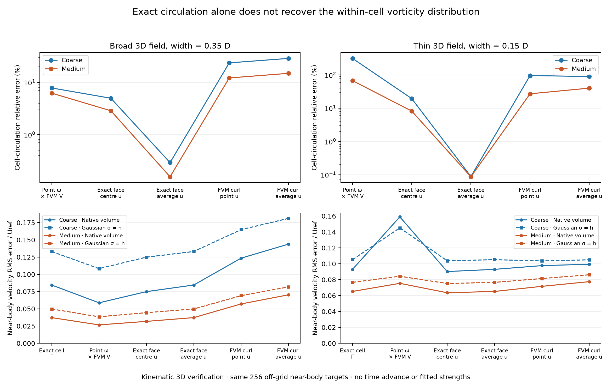
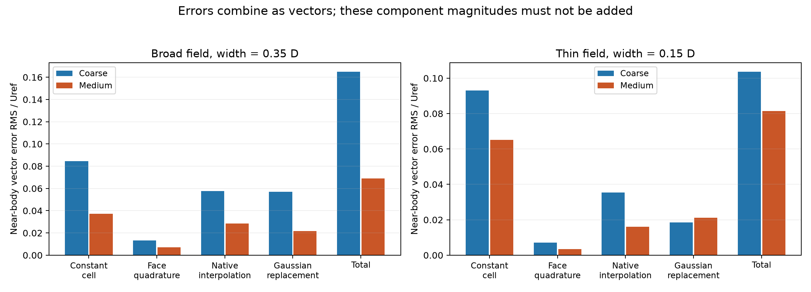
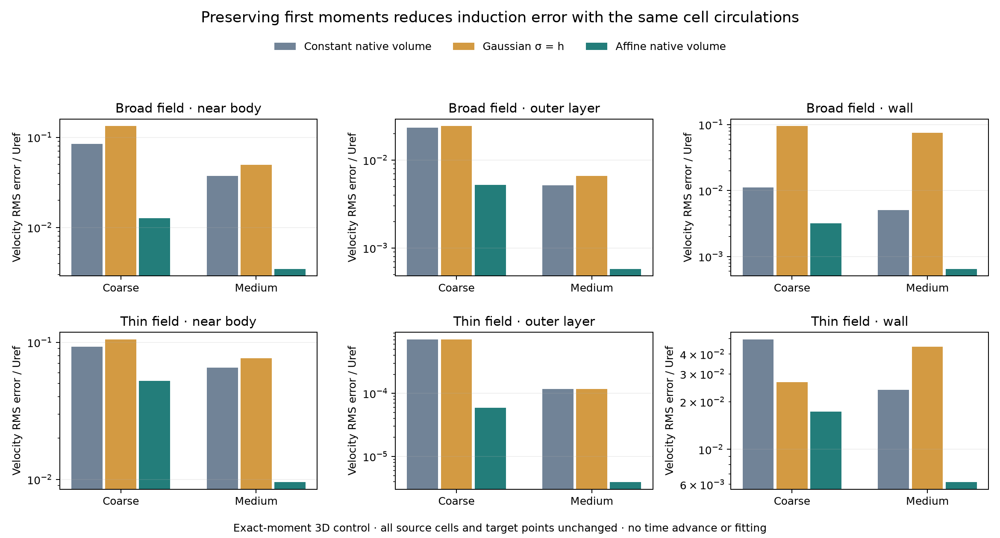

# Manufactured 3D circulation and source representation

Preserving a cell's first vorticity moments as well as its circulation reduces
manufactured near-body velocity error by **90.7% for a broad 3D field and 85.3%
for a thin 3D field** on the medium cube mesh. The cells, circulations and targets
are unchanged. This qualifies a richer source representation as a useful next
direction, but uses exact manufactured moments rather than a physical FVM export.

The native FVM curl and the replacement of a varying cell field by a uniform
source introduce distinct errors. Supplying exact
manufactured velocity at cell centres still leaves a near-body circulation
error of **12.17% for a broad field and 27.07% for a thin field**. Supplying
exact cell circulation removes that error, but uniform-vorticity native cells
still have velocity RMS errors of **0.03723 and 0.06520 Uref**, respectively.
Conserving `Γ = V ω` is necessary; it does not specify the distribution of
vorticity within a cell or preserve its induced velocity.

These are kinematic manufactured diagnostics with fully three-dimensional
velocity, vorticity and geometry. They are **not estimates of the physical
cube's force error**, an advancing hybrid result, or the requested final
reference agreement. The latest advancing medium result remains the
[outflow comparison](outflow-convection-followup-3d.md), with baseline drag
about 2.10% below its matched full-mesh trajectory. The preceding frozen
[volume/particle overlap](native-volume-and-overlap-3d.md) improved boundary
normal velocity but left tangential-derivative error essentially unchanged.

## A field with an independently known answer

For unit-cube half-width `a=0.5`, define

```text
f(t) = (t² − a²)² exp[−t²/(2w²)]
ψ(x,y,z) = amplitude f(x) f(y) f(z)
c = (1,2,3)/sqrt(14)
A = c ψ
u = curl(A) = grad(ψ) × c
ω = curl(u) = Hessian(ψ)c − c Laplacian(ψ).
```

All components and coordinate directions are active. Both `f` and its first
derivative vanish on each plane `xi=±a`, giving exact no slip on all six cube
faces. The field decays at infinity. The amplitude gives unit velocity magnitude
at `(a+w²/a, 0.2w, 0.35w)` separately for `w=0.35 D` and `w=0.15 D`; this is a
reference speed, not a statement that the maximum field speed equals one.
The thin field varies strongly within the cells closest to the body.

The [analytic implementation](manufactured_cube_field_3d.py) is checked with
independent complex-step curl and divergence, exact wall values, and direct
tetrahedral volume integration. Face quadrature uses anchored coordinates so
roundoff cannot move a point away from an exactly constant wall coordinate.

The two experiments use the existing qualified full 3D oracle meshes: 17,592
cells at nominal `h=0.125 D`, and 53,752 at `h=0.0625 D`. Actual cell shapes,
volumes and nonuniform refinement are retained. Each experiment compares source
representations on exactly the same mesh. Both meshes use the same 256 off-grid
fluid targets with `0.5<max|xi|<0.8`, 256 with `1.1<max|xi|<1.5`, and 1,536 wall
targets. No time stepping, fitting, particle pruning or f32 rounding is involved.

The entire full-mesh source field is used to isolate the representation error.
This is a diagnostic control, not a proposal to enlarge the coupled FVM domain.
There is no body-panel response or imposed freestream: the exact velocity is
zero at the body and at infinity. For the finite outer box, a product-factor
estimate bounds the omitted Helmholtz boundary contribution at these targets
by `3.63e-38 Uref` for the broad field and `1.25e-231 Uref` for the thin field.
These are evaluated floating-point estimates, not interval-arithmetic bounds.

## Separating the exported circulation

True cell integrals use the actual face-fan surface, with outward normal from
the fluid cell:

```text
∫cell u dV = ∮cell ψ (n × c) dA
Γexact = ∫cell ω dV = ∮cell n × u dA.
```

The order-6/order-8 maximum successive change in a cell integral, divided by
stored FVM volume, is `5.17e-10` on coarse and `4.56e-12` on medium. Independent
order-16 volume integrals on nine selected near-body cells agree with the
surface calculation to `5.72e-14` and `9.96e-14` on that scale. The selected cells
include a strongest-vorticity cell. Refinement checks are numerical qualification,
not a rigorous bound on every source-cell integral.

Six circulation definitions are compared. Native curl is obtained from the
actual FVM solver with exact Dirichlet velocity on all boundary patches. Its
face interpolation and Stokes sum are independently replayed and agree to
roundoff. Cell-average input uses the true polyhedral average. The aggregate
face-average control multiplies the average velocity by the aggregate face area
vector; on warped faces it is not exactly the vector-valued surface integral.

Near-body circulation errors below are volume-weighted L2 errors of cell
vorticity density `Γ/Vpoly`, relative to exact cell density, for cells whose
centres satisfy `max|xi|<0.8`.

| Circulation source | Broad coarse | Broad medium | Thin coarse | Thin medium |
| --- | ---: | ---: | ---: | ---: |
| Exact cell integral | 0 | 0 | 0 | 0 |
| Exact point ω × stored FVM volume | 7.83% | 6.23% | 314.22% | 67.26% |
| Exact face-centre velocity | 4.97% | 2.86% | 19.48% | 8.20% |
| Exact aggregate face-average velocity | 0.290% | 0.155% | 0.0880% | 0.0863% |
| Native curl of exact point velocity | 23.66% | 12.17% | 95.70% | 27.07% |
| Native curl of exact cell-average velocity | 28.83% | 14.91% | 89.68% | 40.08% |

This separates interpolation error from face quadrature. It also demonstrates
why replacing a native circulation with analytic point vorticity times volume
is not an exact-integration control. In the thin medium field, that point
approximation gives total circulation `(0.09074, 0.18149, 0.27223)`, whereas the
exact and face-based sums are zero to roundoff. Its outer-layer induced-velocity
error is `0.008903 Uref`, although the exact velocity RMS there is only `1.60e-8`.

## Separating the forward source representation

Each circulation state is induced with: constant density `Γ/Vpoly` integrated
over the actual native cells; Gaussian sources with `σ=h`; and Gaussian sources
with `σ=cbrt(VFVM)`. The Gaussian radii are different controls, not geometrically
equivalent replacements for an anisotropic polyhedron.



The main near-body velocity RMS measurements use the same off-grid points:

| Source and induction | Broad coarse | Broad medium | Thin coarse | Thin medium |
| --- | ---: | ---: | ---: | ---: |
| Exact Γ, native constant volume | 0.084495 | 0.037229 | 0.092985 | 0.065200 |
| Native point-u curl, native constant volume | 0.123445 | 0.057065 | 0.097683 | 0.071629 |
| Exact Γ, Gaussian σ=h | 0.133090 | 0.049764 | 0.105166 | 0.076622 |
| Native point-u curl, Gaussian σ=h | 0.164784 | 0.069099 | 0.103548 | 0.081429 |

All values are divided by the field's chosen `Uref`. They are not percentages
of the local velocity. In particular, the exact thin-field near-body velocity
RMS is only `0.11498 Uref`; even the medium exact-circulation constant-cell error
is about 57% of that norm. Two adaptive meshes do not establish a formal order
of convergence.

Some approximations compensate for others. For the broad medium field,
point-ω circulation gives a lower native-volume velocity RMS (`0.02666`) than
exact circulation (`0.03723`), despite its circulation error. That does not make
the point circulation more physically faithful. Neither circulation error
nor one velocity norm can be used alone to select the transfer.

## The error components add as vectors

Let `Bv` be native-volume induction, `Bg` Gaussian induction, `Γe` exact
circulation, `Γf` the exact-face-centre Stokes sum, and `Γn` native curl times
FVM volume. The saved target fields allow the exact decomposition

```text
Ecell   = Bv Γe − uexact
Eface   = Bv Γf − Bv Γe
Enative = Bv Γn − Bv Γf
Eblob   = Bg Γn − Bv Γn

Bg Γn − uexact = Ecell + Eface + Enative + Eblob.
```

The last identity holds to at most `1.11e-16` in the main point-input, nominal
Gaussian comparisons. The verifier also stores each component Gram matrix,
including cross terms. Individual RMS magnitudes are **not additive fractions
of the cause**. For the broad medium field, individual squared norms sum to
`0.002724`, and cross terms add `0.002051`, yielding total squared error
`0.004775`. Ignoring correlation would materially understate this error.



## Preserving variation within a cell

The next control retains the first central vorticity moment as well as Γ:

```text
Mij = ∫cell (y−c)i ωj dV
    = ∮cell (y−c)i (n × u)j dA − (ei × ∫cell u dV)j

S = ∫cell (y−c)(y−c)T dV
ΩP1(y) = Γ/V + (y−c) B,       B = S⁻¹ M.
```

Here `c` is the true polyhedral centroid. `S` is integrated analytically over
signed tetrahedra. This affine density preserves every cell circulation and
all nine first moments. It is not constrained to have zero raw vorticity
divergence; its velocity is the Biot–Savart projection of that density.

Integration by parts gives a direct 3D evaluator without replacing each cell
by a set of quadrature particles:

```text
4π ucell(p) = ∮cell ΩP1(y) × n / |p−y| dA
             + curl(ΩP1) ∫cell 1/|p−y| dV

∫cell 1/r dV = ½ Σtriangles htriangle ∫triangle 1/r dA.
```

The scalar and first-moment triangle potentials are analytic, including finite
vertex and edge limits. The linear volume kernel has independent checks for
oblique and warped cells, inside-source singular integration, shared-face
additivity, rigid transformations and reduction to the constant-volume kernel.
The manufactured first moments are checked independently against direct volume
integration. These exact moments test the value of additional information; they
are not assumed available from the current physical FVM export.



The completed affine-source experiments use all 224,192 coarse or 679,908 medium
native triangles and the same 2,048 targets as the constant-source experiments.
They took about 109 and 313 seconds with one computation thread. These are
unaccelerated direct evaluators, not performance comparisons with FMM.

| Field and mesh | Constant-cell near-body RMS / Uref | Affine-cell near-body RMS / Uref | Reduction | Affine outer-layer RMS / Uref | Affine wall RMS / Uref |
| --- | ---: | ---: | ---: | ---: | ---: |
| Broad coarse | 0.084495 | 0.012634 | 85.0% | 0.005238 | 0.003165 |
| Broad medium | 0.037229 | 0.003478 | 90.7% | 0.000579 | 0.000649 |
| Thin coarse | 0.092985 | 0.052435 | 43.6% | 0.0000590 | 0.017275 |
| Thin medium | 0.065200 | 0.009570 | 85.3% | 0.00000394 | 0.006213 |

The thin field remains demanding. Its largest sampled near-body error on medium
is `0.08665 Uref` near `(0.52084, −0.02854, −0.10519)`, close to the cube wall.
This is substantial progress in a source-information control, not near-machine
agreement or evidence that one affine source resolves every boundary layer.

First-moment surface refinement reaches order 10 on coarse and order 8 on medium.
Independent moment volume integrals on nine cells per mesh agree to `5.74e-14`
and `2.24e-14` after division by `Vpoly^(4/3)`. Independent volume induction at
inside and outside targets agrees to `1.63e-15` and `2.58e-15 Uref`. Cell moment
recovery by `S B` is within `2.04e-15` after division by `Vpoly^(4/3)`.
The raw affine vorticity divergence is nonzero: volume RMS values on medium are
`0.00958` and `0.11686` for the broad and thin fields. No claim of a globally
solenoidal raw vorticity representation is made.

Changing Γ back to native point-input curl while keeping exact first moments
provides another diagnostic without a new induction run. Linearity gives

```text
Blinear(Γnative, Mexact)
  = Blinear(Γexact, Mexact) + Bvolume(Γnative − Γexact).
```

On medium, the resulting near-body RMS errors are **0.02459** for the broad field
and **0.02029 Uref** for the thin field. Both exceed the full exact-moment control.
Thus a better source representation does not make native circulation accuracy
irrelevant. These controls still require exact moments and are not physical
solver predictions.

## The next implementation gate

The subsequent [native-data follow-up](reconstructed-moments-followup-3d.md)
has now tested both reconstruction routes below. Velocity-based moments improve
the frozen physical near-body and normal-boundary errors, while tangential
derivative and independent wall penetration expose remaining errors. Exact
manufactured moment benefits do not transfer unchanged to available FVM data.

Moment acquisition should be tested before changing production transfer. Two
concrete candidates are a linear reconstruction from neighbouring cell
circulations at true polyhedral centroids, and the weak-curl first-moment identity
using reconstructed FVM face velocity and cell velocity integrals. Both can be
tested with these exact manufactured Γ and M, first isolating the reconstruction
and then using native FVM curl. Exact affine-field recovery, constant-field
preservation, boundary-cell behaviour and the existing common velocity targets
provide independent checks.

An accepted reconstruction can then be evaluated on the frozen physical cube,
retaining volume support inside the existing small FVM box and keeping the
qualified overlap away from its coupling faces. Boundary normal velocity and
the actual tangential derivative must improve together before an advancing
matched-resolution force comparison is warranted. Exporting or evolving the
remaining moments in the exterior VPM is a separate numerical-design problem.

## Reproduction and verification

The [manufactured runner](cube_manufactured_induction_3d.py) archives its source
files before running. The [comparison verifier](compare_manufactured_induction_3d.py)
checks all 32 recorded source entries, exact equality of common targets across
resolutions, and 816 saved circulation and velocity metrics. All recomputed
metrics match their records exactly in this run. Its result is
[manufactured-induction-verification.json](results/manufactured-induction-verification.json).
The [first-moment runner](cube_manufactured_linear_induction_3d.py) separately
archives its inputs and code. Its [verification record](results/manufactured-linear-induction-verification.json)
checks 24 source entries, the identical circulation and target arrays, 24 velocity
metrics and both regression records. The largest recomputed metric difference
is `4.34e-19`. Post-run import wrapping leaves identical Python syntax trees;
the verifier checks that equivalence against the archived files.

Use the repository's OpenONDA Python environment, with `PYTHONPATH=.` and one
OpenMP/BLAS thread. For example, with a new output directory:

```sh
python studies/coupler_accuracy/cube_manufactured_induction_3d.py \
  --oracle studies/coupler_accuracy/results/cube-3d-oracle \
  --particle-spacing 0.125 \
  --output studies/coupler_accuracy/results/my-manufactured-coarse

python studies/coupler_accuracy/cube_manufactured_linear_induction_3d.py \
  --manufactured studies/coupler_accuracy/results/my-manufactured-coarse \
  --output studies/coupler_accuracy/results/my-manufactured-linear-coarse
```

For medium, use the qualified
`cube-3d-medium-laminar-native-flux-initialized-oracle` and nominal spacing
`0.0625`. All output directories must be new; successful experiment records
are not overwritten. The comparison script reads the recorded coarse/medium
directories in `studies/coupler_accuracy/results` and regenerates the figures.

The current focused regression has **44 passing tests** for the preceding
transfer, curl, cell integration and source-potential components plus the new
manufactured field, followed by **seven passing tests** for the affine source
and first-moment identities. Their records are
[3d-manufactured-regression.xml](results/3d-manufactured-regression.xml) and
[3d-linear-volume-regression.xml](results/3d-linear-volume-regression.xml).
No production source was changed in this manufactured investigation.
