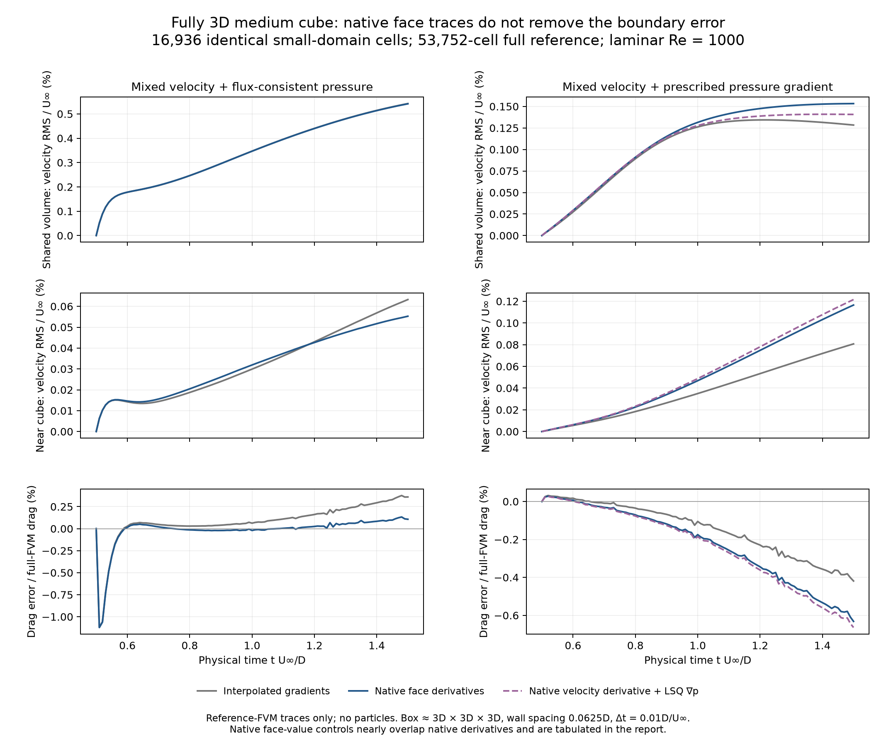

# Native face traces and the small-domain FVM error

The full-reference boundary data still do not reproduce the full FVM trajectory
on the cropped mesh. This follow-up identifies a convection-stencil difference,
qualifies native face-gradient observations, and fixes two mixed-boundary state
bugs. It does **not** establish a production hybrid accuracy improvement or the
requested near-machine-precision agreement.

Every comparison is fully three-dimensional: a unit cube at Re=1000, 53,752 full
FVM cells and 16,936 identical inherited cells in the approximately 3D × 3D × 3D
coupling box. The wall spacing is 0.0625D. All six outer sides exchange data.
These laminar diagnostics start from the same saved state at t=0.5 and run 100
implicit-Euler steps of 0.01 to t=1.5, with the previous tight linear tolerances
and three outer correctors. SGS is disabled consistently. They are short oracle
experiments, not the tutorial's developed LES wake or a live particle comparison.

## What the face-trace experiment measures

The original oracle uses the native conservative face flux for normal velocity,
but interpolates cell velocity gradients and LSQ cell pressure gradients onto
the cut. The FVM momentum and pressure operators instead use cell differences
and non-orthogonal face corrections. They also use different decompositions:
momentum diffusion is over-relaxed; the scalar Rhie–Chow pressure operator uses
a minimum-correction decomposition and its existing geometric regularizer.

[NativeFaceTrace](native_face_trace_3d.py) calls those actual operators with unit
scalar coefficients. It extracts the outward normal derivative as minus the
operator's integrated flux divided by face area. The velocity trace is then
projected tangentially. The reference pressure gradient supplied to the pressure
operator comes from the configured Gauss scheme. This is a diagnostic for the
scalar-diagonal full reference; variable SGS coefficients and component pressure
diagonals require additional matching.

A separate `native_value` control uses the native linearly interpolated face
value minus the full reference's cropped-owner value, divided by normal distance.
It recovers the boundary's discrete face-value reconstruction at equal owner
fields. On skew faces it is not the same quantity as a physical normal derivative.
Normal velocity always retains the same conservative full-FVM face flux.

At t=0.5, the area-weighted differences are:

| Trace comparison | Absolute RMS difference | Native derivative RMS |
| --- | ---: | ---: |
| Native tangential velocity derivative − interpolated cell gradient | 0.00369703 U∞/D | 0.0484732 U∞/D |
| Face-value velocity increment − native derivative | 0.0000340904 U∞/D | 0.0484732 U∞/D |
| Native pressure derivative − interpolated LSQ gradient | 0.00149008 U∞²/D | 0.0359074 U∞²/D |
| Face-value pressure increment − native derivative | 0.0000367188 U∞²/D | 0.0359074 U∞²/D |

The first discrepancy is about 7.6% of the native velocity-derivative RMS.
The cut's maximum tangential owner-to-face displacement divided by normal
distance is only 0.00225983. Its small skew correction is not the main trace
discrepancy. These are differences between discrete observations of the same
FVM field; neither observation is claimed to be the exact continuum derivative.

## Advancing comparisons

The full reference's final drag coefficient is 1.0803953399803108. Velocity RMS
uses native cell-volume weights; the near-body region is max(|x|,|y|,|z|) < 1.
Drag percentages below are signed differences divided by the full reference.

| Velocity trace | Pressure condition | Whole-volume velocity RMS / U∞ | Near-body velocity RMS / U∞ | Drag error at t=1.5 |
| --- | --- | ---: | ---: | ---: |
| Interpolated gradient | Flux-consistent | 0.00542398 | 0.000632535 | +0.3598% |
| Native face derivative | Flux-consistent | 0.00541457 | 0.000552615 | +0.1068% |
| Native face-value increment | Flux-consistent | 0.00541438 | 0.000552651 | +0.1068% |
| Interpolated gradient | Interpolated LSQ pressure gradient | 0.00128384 | 0.000807285 | −0.4190% |
| Native face derivative | Interpolated LSQ pressure gradient | 0.00140719 | 0.00121580 | −0.6640% |
| Native face derivative | Native pressure derivative | 0.00153328 | 0.00116523 | −0.6318% |
| Native face-value increment | Native pressure face-value increment | 0.00153329 | 0.00116505 | −0.6317% |



Changing the velocity derivative improves the final drag and near-body velocity
under flux-consistent pressure, while leaving the whole-volume velocity error
almost unchanged. Under prescribed pressure, replacing either or both traces
does not improve all metrics. A better match to one native operator is not a
sufficient qualification of the complete boundary treatment. No native reference
trace is made available to a live hybrid in this work.

The native face-value controls closely track the native-derivative results.
The initialized native-flux run's saved full-reference fields are bitwise equal
to the baseline full-reference fields. This checks that the new read-only trace
observations did not change the full solver's trajectory.

## Two retained state fixes

The frozen audit exposed a missing mixed-boundary branch in the core initializer.
`set_initial_state()` and `set_initial_velocity()` replaced owner-cell velocities
without reconstructing mixed face velocities. The initializer now calls the
shared reconstruction before building face fluxes and transient history.

The mixed-trace setter also changed face velocities without invalidating the
cached velocity gradient or publishing a state revision. It now performs both,
consistent with the other face-velocity setter. The new public-API tests cover
both initialization paths and a previously cached gradient on an oblique 3D mesh.
All three tests failed before the fixes and pass afterward.

The 100-step native-flux comparison was repeated after these changes. Final
cropped velocities changed by at most 5.11e-15 U∞ and drag changed by at most
1.47e-14 over the trajectory. The advancing harness already reapplied the mixed
trace before every solve. The fixes restore state coherence; they do not explain
the observed advancing accuracy floor.

The first frozen operator audit consumed the stale initialized face values and
is explicitly [invalidated](results/cube-3d-medium-boundary-operator-audit/invalidated.json).
Its numerical archive is retained but excluded from every result below.

## The consistent frozen momentum audit

[The corrected audit](boundary_operator_audit_3d.py) holds all interior velocity,
pressure and mapped face flux values identical in the full and cropped domains.
It measures each native momentum acceleration without a solve or time advance.
The results below use the corrected initializer and prescribed pressure traces.
They do not include pressure-correction matrices, nonlinear iteration or time
integration and should not be interpreted as accumulated flow errors.

| Trace pair | Convection | Laplacian | Transpose stress | Pressure | Total |
| --- | ---: | ---: | ---: | ---: | ---: |
| Interpolated velocity / LSQ pressure | 2.84448e-3 | 1.52069e-5 | 3.30664e-5 | 3.82469e-4 | 2.88634e-3 |
| Native velocity derivative / native pressure derivative | 3.18027e-3 | 1.45669e-7 | 3.21488e-5 | 9.37435e-6 | 3.19320e-3 |
| Native face-value increments | 3.18020e-3 | 2.02907e-7 | 3.21481e-5 | 3.65741e-17 | 3.19320e-3 |

Entries are volume-weighted RMS differences in U∞²/D. The total is the norm of
the summed vector differences, not the sum of the individual norms. The native
velocity derivative recovers the tangential diffusive cut flux to roundoff
(7.65e-19 RMS in flux-density units). Native pressure face-value increments
recover the Gauss pressure acceleration to roundoff. Convection still dominates
this frozen spatial difference.

At a full internal face, `linearUpwind` uses the upwind cell value plus its
gradient extrapolation to the face. The mixed boundary instead convects its
reconstructed face value. With native face-value data, 88.76% of the squared
cut-face convection discrepancy comes from faces with outward flux. An offline
substitution of the full solver's outflow extrapolation lowers the whole-volume
convection-acceleration discrepancy from 0.00318020 to 0.00106360 U∞²/D.
Replacing the entire cut's convective flux with the full reference reduces that
quantity to 4.52e-16. The latter is a discrete replay identity, not an implementable
particle boundary condition or an advancing accuracy result.

The next boundary candidate therefore needs a convection treatment consistent
with flow direction and the chosen interior scheme, with its owner dependence
represented in the momentum matrix. It must retain consistent normal flux,
diffusion and pressure correction, then pass both the advancing oracle and the
live 3D hybrid comparison. Merely replacing a face flux after assembly would not
qualify such a method. Cell-integrated particle transfer remains a separate
unfinished investigation; this oracle contains no particle reconstruction error.

The subsequent [outflow convection experiment](outflow-convection-followup-3d.md)
implements and tests the corresponding owner coefficient in actual momentum
assembly. It improves some oracle errors but worsens live hybrid drag agreement,
so it remains a study-only candidate.

## Evidence and reproduction

The selected regression suite passes **35 tests**, covering mixed reconstruction,
public state setters, convection, non-orthogonal pressure correction, restart and
diagnostics, native face traces and the inherited 3D oracle geometry. See
[test results](results/3d-mixed-boundary-state-regression.xml),
[the failing reproductions](results/3d-mixed-boundary-state-before.log), and
[repeat/full-reference verification](results/native-face-followup-verification.json).
The native face tests include an affine field with all components varying on a
skew 3D mesh and comparison with the full operators under varying scalar
coefficients. The pressure test retains the kernel's existing 1e-12 length
regularizer rather than hiding it in the observer.

Run from the repository root with the OpenONDA Python environment, PYTHONPATH=.
and single-threaded BLAS. Output directories must be new.

```sh
python studies/coupler_accuracy/cube_boundary_oracle.py \
  --mesh studies/coupler_accuracy/results/cube-3d-medium-laminar-oracle/full-native-mesh.npz \
  --seed studies/coupler_accuracy/results/cube-3d-medium-laminar-oracle/initial-cell-fields.npz \
  --dx 0.0625 --steps 100 --laminar \
  --modes vorticity_mixed vorticity_mixed_pressure_gradient \
  --velocity-trace native_flux --pressure-trace native_flux \
  --output /private/tmp/cube-native-face-oracle
python studies/coupler_accuracy/boundary_operator_audit_3d.py \
  --oracle studies/coupler_accuracy/results/cube-3d-medium-laminar-oracle \
  --traces /private/tmp/cube-native-face-oracle/initial-cut-traces.npz \
  --output /private/tmp/cube-native-face-operators
python studies/coupler_accuracy/plot_cube_3d_study.py --plots native_face_followup
```

Use `native_value` for both trace options for the face-value control. Use native
velocity and `--pressure-trace lsq` with the prescribed-pressure mode for the
single-factor control. Defaults remain `interpolated` velocity and `lsq` pressure.
The final command plots the saved study-result locations used above.

Completed source manifests and numerical records:

- [Native derivatives after state fixes](results/cube-3d-medium-laminar-native-flux-initialized-oracle/cube-boundary-oracle.json).
- [Face-value control](results/cube-3d-medium-laminar-native-value-oracle/cube-boundary-oracle.json).
- [Velocity-only trace change with LSQ pressure](results/cube-3d-medium-laminar-native-gradient-lsq-oracle/cube-boundary-oracle.json).
- [Corrected frozen operator audit and convection substitutions](results/cube-3d-medium-boundary-operator-audit-convection/boundary-operator-audit-3d.json).

These remain component diagnostics. Developed 3D velocity/force profiles at
matched tutorial resolution and the user's hybrid/reference target are outstanding.
