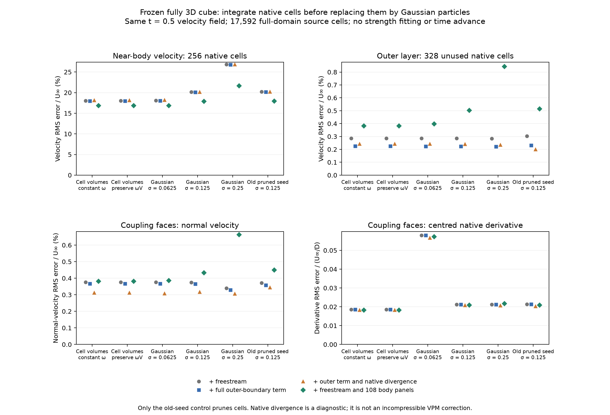
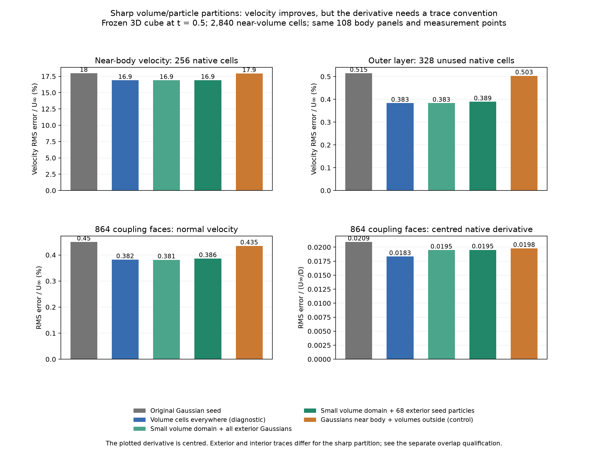
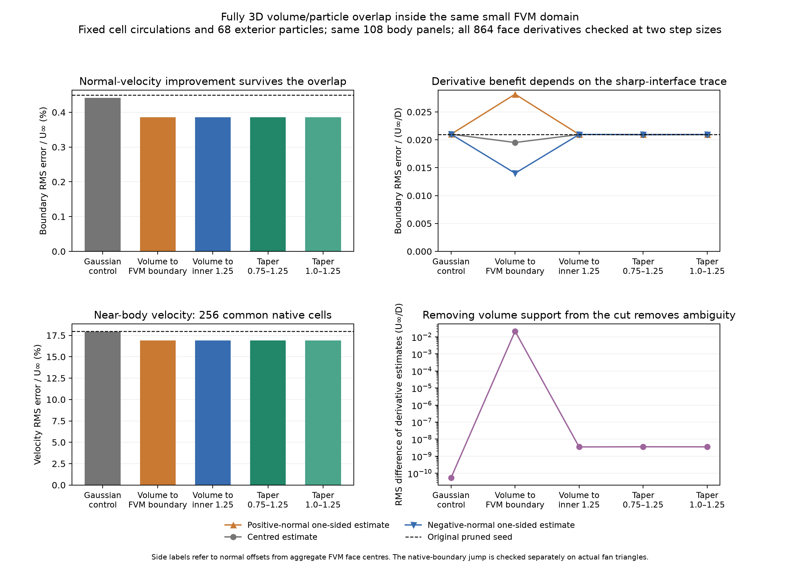

# Native volume induction and overlap inside the small FVM domain

Retaining the actual near-body FVM volumes improves reconstructed velocity in
the frozen 3D cube. A qualified overlap variant lowers coupling normal-velocity
RMS error from `0.004500` to `0.003857 U∞`, while tangential-derivative error is
essentially unchanged (`0.020936` to `0.020938 U∞/D`). The FVM domain remains
approximately `[-1.5, 1.5]^3`; its 2,840 cells are inherited unchanged from the
full mesh. These results support further investigation of volume/particle
induction, but **do not achieve the requested hybrid/reference agreement**.

An initially attractive derivative improvement did not survive qualification.
Ending volume sources sharply at the coupling boundary produces different
one-sided derivatives. Moving their support into the FVM interior removes that
ambiguity at the coupling faces, and also removes most of the apparent derivative
benefit. This distinction is central to interpreting the experiment.

All comparisons use the same frozen **initial full FVM field at physical time
0.5** as the preceding reconstruction studies. There is no time advance, force
correction, phase alignment or 2D approximation. The latest advancing medium
comparison remains the [outflow study](outflow-convection-followup-3d.md), where
the baseline drag difference was about −2.10%. The present velocity errors are
errors of the reconstructed induction field, not those of the evolving near-body
FVM solution in that earlier run.

The subsequent [manufactured 3D study](manufactured-circulation-and-moments-3d.md)
separates native-curl errors from variation lost within a source cell. Preserving
exact first moments reduces the medium manufactured induction error by about
85–91% relative to constant cells with the same exact circulation. Those moments
are still an oracle control, not a qualified physical transfer.

## Integrating the native source geometry

The [preceding follow-up](continuous-curl-and-panels-3d.md) qualified integrated
observations of Gaussian velocity curl. This experiment instead changes the
forward source representation. For target `p`, source coordinate `y`, and
`r = p − y`, the divergence theorem gives

```text
K_cell(p) = ∫_cell r / |r|³ dV_y
          = Σ_face ∫_face n_y / |p − y| dA_y

u_cell(p) = Ω_cell × K_cell(p) / (4π).
```

Each actual polygonal face is represented by its arithmetic-centre triangle
fan. The scalar triangle integral of `1/r` is analytical. An internal face
carries the owner-minus-neighbour vorticity jump, so it is evaluated once with
the appropriate triangle normal. There is no Gaussian radius, source pruning,
point-cell quadrature or fitted strength in this calculation. The direct
implementation streams targets to avoid storing a target-by-triangle matrix.

Two volume representations keep the geometry distinction explicit: constant
stored FVM vorticity `Ω`, and density `Ω V_FVM/V_polyhedron`, whose integral is
the original cell circulation `Ω V_FVM`. Over the full mesh, the largest local
fan/FVM volume difference is 0.06723%, and the largest centroid displacement is
0.0009724 D. The two volume representations differ by at most `1.97e-5 U∞` at
the sampled targets. The partition and overlap candidates preserve the original
cell circulations.

Independent qualification covers triangle surface quadrature and potential
gradients; finite potentials at a vertex, edge and panel interior; singular
volume integration inside a warped polyhedron; shared-face additivity; rigid
motion and a far-field limit; and the bounded Helmholtz identity for a fully
3D affine velocity with nonzero curl and divergence. On 15 actual full-mesh
cells, analytical induction and independent target-apex volume integration
agree to `1.05e-14` after division by cell length. The order-16/order-20 angular
quadrature difference is at most `2.46e-12` on that scale.

The implementation is in [native_volume_induction_3d.py](native_volume_induction_3d.py).
It remains an offline direct evaluator. Its cost is proportional to the number
of target/triangle pairs; these timings are not a comparison with accelerated
VPM induction.

## Full-domain source comparison

The first run uses all 17,592 full-domain cells, 224,192 triangles and 5,140
targets. It took about 263 seconds, including Gaussian controls and body-panel
solves. The targets contain 256 near-body cells with `max(|x|,|y|,|z|)<0.8`, the
same 328 unused outer-layer cells, 256 wake cells, 1,536 common wall samples,
all 864 coupling faces and derivative offsets, and the 108 body collocation
points. The 256-cell near-body sample differs from the preceding panel study's
complete 1,328-cell near-body set; comparisons within this report use identical
samples and volume weights.



The following rows include the same actual f64 108-panel Neumann response.
The old seed retains cells with `|ω|≥0.02` and its original f32 positions and
strengths; the unpruned Gaussian and volume controls use all full-mesh cells.

| Source representation | Near-body velocity RMS / U∞ | Unused-layer velocity RMS / U∞ | Boundary normal-velocity RMS / U∞ | Centred native derivative RMS (U∞/D) |
| --- | ---: | ---: | ---: | ---: |
| Original Gaussian seed, σ=0.125 | 0.179744 | 0.005146 | 0.004500 | 0.020936 |
| All-cell Gaussian, σ=0.125 | 0.179311 | 0.005032 | 0.004342 | 0.020978 |
| All-cell Gaussian, σ=0.0625 | 0.168581 | 0.003987 | 0.003867 | 0.057272 |
| All-cell Gaussian, σ=0.25 | 0.216594 | 0.008439 | 0.006639 | 0.021794 |
| Native volume, preserve ΩV | 0.168851 | 0.003834 | 0.003820 | 0.018331 |

Shrinking the Gaussian radius improves some velocity measurements but greatly
worsens the derivative. It does not reproduce integrating the actual cells.
Removing pruning and source rounding alone also does not account for the
volume-source velocity improvement.

Separate diagnostic completions use the actual full outer-boundary face
velocities and the native cell divergence. The native Gauss divergence RMS is
0.02913; it is a different operator from conservative face-flux continuity.
For native constant-vorticity volumes, adding the outer boundary term changes
near-body RMS from 0.180217 to 0.179485 U∞; adding native divergence changes it
to about 0.181262 U∞. These completions do not eliminate the near-body error.
The divergence term is diagnostic and is not proposed for incompressible VPM.

## Restricting volumes to the small FVM domain

A second run replaces only the 2,840 near-body cells by volume sources, using
38,808 triangles. The exterior remains Gaussian with σ=0.125, first retaining
all 14,752 exterior cells and then only the same 68 exterior seed particles.
The FVM domain is unchanged. An inverse partition, using Gaussians near the
body and volumes outside, is a diagnostic control. The two complementary
partitions sum to the all-volume plus all-Gaussian field to `2.22e-16`.



With 68 exterior particles, normal-velocity error is 0.003862 U∞, unused-layer
velocity error 0.003892 U∞, and sampled near-body error 0.168990 U∞. The apparent
centred derivative error is 0.019520 U∞/D. These initially suggested reductions
of 14.16% and 6.76% in the two boundary errors. **Only the velocity conclusion
survives without a derivative-trace qualification.**

## Why the sharp boundary gives misleading derivative comparisons

For a constant-vorticity volume ending at a smooth face, with outward normal
`n`, the Biot–Savart velocity is continuous, but its normal derivative obeys

```text
(∂n u)_outside − (∂n u)_inside = n × Ω_inside.
```

This follows from `Δu = −curl(ω)`: the sharp support boundary of the raw volume
vorticity supplies a distributional sheet. Smooth exterior Gaussian fields
do not cancel that jump. A dedicated 3D box test checks the identity directly.

The native coupling faces are all slightly warped. An aggregate FVM face
centre does not define a planar trace on the triangulated volume boundary.
The jump identity is therefore checked at the centre of a largest-area fan
triangle on **every one of the 864 coupling faces**, using that triangle's
actual outward normal. The maximum discrepancy from `n×Ω` is `1.59e-8`; halving
the finite-difference step changes the measured jump by at most `1.78e-8`.

Common boundary comparisons still use the original FVM face centres and unit
area-vector normals. Positive- and negative-normal one-sided estimates are
computed with second-order differences, at steps `1.25e-5 D` and `6.25e-6 D`,
on all 864 faces. For the sharp small-volume partition, their derivative RMS
errors are approximately **0.028188 and 0.014014 U∞/D**, while the centred value
is 0.019520. At these warped aggregate centres, “positive” and “negative” need
not be literal exterior/interior traces of the fan polyhedron. Their difference
RMS is 0.021393 U∞/D. Choosing the favourable side would not establish a correct
coupling boundary condition.

The first overlap attempt stopped after induction because it assumed some
aggregate faces would be planar to `1e-12`; none were. Its archived directory
is marked incomplete. The completed replacement uses the actual triangles
for the jump identity and retains the common FVM centres for comparisons.

## An overlap that keeps volume support away from the coupling faces

The third completed run compares five states with the **same underlying cell
circulations and 68 exterior particles**. For each near-body cell,

```text
volume density     = w_cell Ω_cell V_FVM / V_polyhedron
Gaussian strength  = (1 − w_cell) Ω_cell V_FVM,    0 ≤ w_cell ≤ 1.
```

The fixed Gaussian complements use σ=0.125. Thus each cell's raw circulation is
preserved without fitting or amplification. The control uses `w=0`; the sharp
full-domain state uses `w=1`. An inner cutoff uses `max|x_cell|<1.25`. Two cubic
tapers use `1−3s²+2s³`, with `s` clipped between zero and one over radii 0.75–1.25
or 1.0–1.25. These are geometric probes, not fitted optima or an emission rule.

The three inner-support states have 2,112 cells with positive volume weight.
Their source bounding box is at least **0.24948 D** from every coupling target.
The FVM still has 2,840 cells and its original domain. Gaussian complements
occupy the rim and any tapered cells.



| Representation, with the same 108 body panels | Boundary normal-velocity RMS / U∞ | Centred derivative RMS | Positive-normal derivative RMS | Negative-normal derivative RMS |
| --- | ---: | ---: | ---: | ---: |
| Same-circulation Gaussian control | 0.004413 | 0.021014 | 0.021014 | 0.021014 |
| Sharp volume support to FVM boundary | 0.003862 | 0.019520 | 0.028188 | 0.014014 |
| Volume support to inner radius 1.25 | 0.003856 | 0.020962 | 0.020962 | 0.020962 |
| Volume taper 0.75–1.25 | 0.003857 | 0.020938 | 0.020938 | 0.020938 |
| Volume taper 1.0–1.25 | 0.003856 | 0.020948 | 0.020948 | 0.020948 |

Derivative units are U∞/D. The table uses the halved step. The maximum change
under step halving for any side estimate in the inner-support states is about
`1.3e-8`; their positive-minus-negative derivative RMS is about `3.5e-9`.
The field is smooth across the coupling measurement locations at this accuracy.
The sharp state retains a large difference between the estimates.

The 0.75–1.25 taper lowers normal-velocity error by **14.30% relative to the old
seed**, and by about 12.6% relative to the same-circulation Gaussian control.
Its native derivative error is 0.0115% higher than the old seed, essentially
unchanged, and about 0.36% lower than the same-circulation control. Its sampled
near-body velocity RMS is still 0.168999 U∞ and its unused-layer RMS 0.0038925 U∞.
Wall normal/tangential RMS values are approximately 0.09250/0.19225 U∞. These
are substantial remaining reconstruction errors.

## A separate source-potential kernel defect

The existing [source-potential kernel](../../source/solvers/vpm/boundary_elements/panels/kernels/source_potential.py)
used an endpoint distance in place of the signed in-plane edge distance in its
logarithmic term. Three new tests failed before correction: f32 and f64 surface
integrals, and the potential-gradient/source-velocity identity. Its f64 value
at one far test point was −0.293635 instead of −0.0067424.

The corrected kernel computes `−∫1/r dA/(4π)`, handles the finite vertex/edge
potential limits and differentiates to the existing source velocity away from
the surface. Source search finds **no production callers** of that potential function.
The existing panel velocity kernel is unchanged. This defect therefore cannot
explain the running coupler's error or the improvement measured here; the
offline volume evaluator is separately implemented and independently qualified.

## Verification, evidence and remaining work

The focused regression passes **40 tests**, including the new potential,
polyhedral induction and derivative-jump checks. Source archives verify 86
records across the three completed experiments. Recomputing 200 recorded
metrics from saved fields changes them by at most `2.78e-17`. The old seed's
wall velocities match the preceding panel run to `1.78e-15`, and its native
derivatives to `2.36e-11`. All three figures were visually checked.

The completed artifacts are:

- [Full volume/Gaussian comparison](results/cube-3d-native-volume-induction/cube-native-volume-induction-3d.json),
  generated by [cube_native_volume_induction_3d.py](cube_native_volume_induction_3d.py).
- [Small-domain partition](results/cube-3d-partitioned-volume-induction/cube-partitioned-volume-induction-3d.json),
  generated by [cube_partitioned_volume_induction_3d.py](cube_partitioned_volume_induction_3d.py).
- [Overlap and actual-boundary jump qualification](results/cube-3d-volume-overlap/cube-volume-overlap-3d.json),
  generated by [cube_volume_overlap_3d.py](cube_volume_overlap_3d.py).
- [Recomputed metrics and source verification](results/native-volume-verification.json),
  generated by [verify_native_volume_3d.py](verify_native_volume_3d.py).
- [Focused regression](results/3d-native-volume-regression.xml) and
  [potential tests before correction](results/source-potential-before.xml).

These experiments identify source shape/core smoothing as a contributor to
velocity reconstruction error, and show why a sharp volume/particle interface
cannot be judged from one centred derivative alone. Retaining native volume
information and an overlap inside the small FVM domain is a concrete candidate
for further work. It has not qualified a complete evolving method.

The next discriminators are the accuracy of native discrete curl versus the
constant-cell vorticity representation in a manufactured fully 3D no-slip
field, and the accuracy of induction/derivatives in the Gaussian rim. An
advancing prototype must then define stage-consistent volume/particle ownership,
conservative emission and transport through the overlap, and accelerated volume
induction before testing matched forces and velocity profiles. The separate
FVM boundary-operator and SGS issues in the [main findings](cube-3d-findings.md)
also remain. This follow-up changes no production coupling policy, renewal
gate, timestep or tutorial mesh; only the unused potential kernel receives a
production-source correction.
