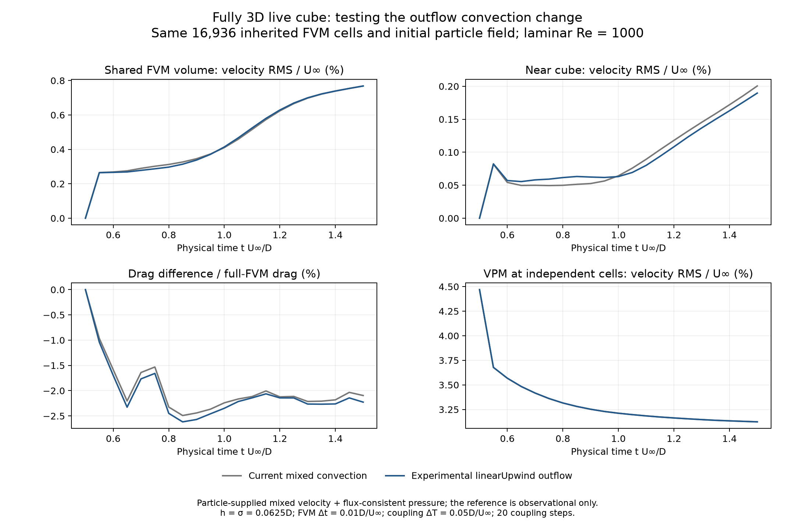

# Outflow convection: component, oracle and live 3D tests

The outflow experiment does not qualify as a production improvement. It reduces
a known frozen convection discrepancy and improves some oracle velocity errors,
but the matched live hybrid run has worse drag agreement. The two mixed-boundary
state fixes are retained; the convection experiment remains scoped to study runs.
The required hybrid/reference accuracy is still unachieved.

## Candidate and component qualification

The [native-face audit](native-face-boundary-followup-3d.md) found that the full
internal `linearUpwind` face uses its upwind cell's gradient extrapolation, while
the cropped mixed face convects its boundary reconstruction. Most of the frozen
cut-flux difference came from outward-flow faces.

[The scoped experiment](experimental_mixed_convection.py) uses the existing
owner-gradient extrapolation on mixed faces with positive advective flux Φ:

```
momentum convection flux = Φ [Uowner + grad(Uowner) · (xface − xowner)]
implicit owner coefficient = Φ
deferred correction = Φ grad(Uowner) · (xface − xowner)
```

This changes the actual component momentum matrix, including its diagonal used
in pressure correction. Inflow, the conservative advective flux, mixed ghost
reconstruction, diffusion and pressure policy retain their original contracts.
The change applies only to `linearUpwind` mixed outflow. It does not prescribe
reference convective fluxes to the hybrid.

Four tests cover affine extrapolation on a skew 3D mesh, the implicit owner
response, assembly with and without total-flux output, retained inflow/other
scheme behavior, and restoration of the original assembler after exceptions.
The implementation is a context manager under studies, not a production option.

## Advancing reference oracle

All rows use the same 53,752-cell full mesh, 16,936 identical small-domain cells,
wall spacing 0.0625D and laminar Re=1000 seed. The full and small solves advance
from t=0.5 to 1.5 with 100 steps of 0.01. The full reference's final fields are
bitwise unchanged by the experiment. RMS weights and near-body region are the
same as in the native-face report. Drag errors are signed percentages of the
same-time full-FVM drag.

With the original interpolated velocity-gradient and LSQ pressure traces:

| Pressure policy | Mixed convection | Whole-volume velocity RMS / U∞ | Near-body velocity RMS / U∞ | Final drag error |
| --- | --- | ---: | ---: | ---: |
| Flux-consistent | Current | 0.00542398 | 0.000632535 | +0.3598% |
| Flux-consistent | Outflow extrapolation | 0.00533286 | 0.000704673 | +0.2692% |
| Prescribed gradient | Current | 0.00128384 | 0.000807285 | −0.4190% |
| Prescribed gradient | Outflow extrapolation | 0.000680886 | 0.000797196 | −0.4302% |

The prescribed-pressure branch's whole-volume velocity error falls by about
47%, but its final force error does not improve. The flux-consistent branch
improves final drag and slightly improves whole-volume velocity while worsening
near-body velocity.

With native velocity/pressure face derivatives, outflow extrapolation gives
whole-volume errors 0.00532818 and 0.000896468 U∞ for flux-consistent and
prescribed pressure respectively. Their drag errors are +0.02141% and −0.63834%.
The small positive drag bias in the first case is not a complete accuracy result:
its whole-volume velocity mismatch remains 0.00533 U∞ and its near-body error is
larger than with the original convection and the same native derivative.

## Matched live hybrid comparison

Both live runs use the current source, the original medium laminar seed, real
FMM/RK2/GBD particles with h=σ=0.0625D, the physical cube panel solve, unchanged
buffered renewal and gates, FVM dt=0.01 and coupling dt=0.05. Twenty coupling
steps reach t=1.5. Particle-supplied mixed velocity and flux-consistent pressure
are used throughout. The reference advances only for observation; its evolving
fields are not supplied to the hybrid.

| Final metric | Current mixed convection | Experimental outflow |
| --- | ---: | ---: |
| Shared FVM volume: velocity RMS / U∞ | 0.00768622 | 0.00768358 |
| Near cube: velocity RMS / U∞ | 0.00200495 | 0.00189680 |
| VPM velocity RMS at 256 independent cells / U∞ | 0.0312453 | 0.0312362 |
| Drag coefficient | 1.05775515 | 1.05633936 |
| Drag difference from full reference | −2.09555% | −2.22659% |
| Final particle count | 28,459 | 28,463 |



The final near-body velocity error improves by about 5.4%, while the whole-volume
and particle errors barely change. Drag agreement worsens by 0.131 percentage
points. The candidate therefore does not meet the simultaneous velocity/force
criterion in this short 3D experiment and is not promoted to the coupler default.
This does not prove the current boundary stencil is optimal; it shows that fixing
one spatial discrepancy alone does not solve the complete coupling problem.

The fresh baseline matters. Relative to the earlier saved live baseline, its
maximum historical differences are 6.77e-7 U∞ in the reported whole-volume RMS
and 1.45e-5 in Cd. Those differences are recorded rather than attributing them to
one cause. The experiment is compared against the new baseline. The two live
runs have bitwise-identical reference times/drag histories and saved reference
velocities at shared cells; their initial comparison records are also identical.

## Verification and reproduction

The broader selected suite passes **240 tests**, including all coupler tests
and the relevant FVM state, mixed convection, pressure and restart tests. See
[the regression record](results/3d-face-state-outflow-regression.xml) and
[run-equivalence checks](results/outflow-convection-verification.json).
Source hashes and archived Python files accompany every new run. The scope
restores the original convection assembler after success or failure.

From the repository root, with the OpenONDA Python environment, PYTHONPATH=.
and single-threaded BLAS:

```sh
python studies/coupler_accuracy/cube_boundary_oracle.py \
  --mesh studies/coupler_accuracy/results/cube-3d-medium-laminar-oracle/full-native-mesh.npz \
  --seed studies/coupler_accuracy/results/cube-3d-medium-laminar-oracle/initial-cell-fields.npz \
  --dx 0.0625 --steps 100 --laminar \
  --modes vorticity_mixed vorticity_mixed_pressure_gradient \
  --mixed-convection outflow_linear_upwind --output /private/tmp/cube-outflow-oracle
python studies/coupler_accuracy/cube_coupled_trial.py \
  --oracle studies/coupler_accuracy/results/cube-3d-medium-laminar-oracle \
  --particle-spacing 0.0625 --steps 20 --substeps 5 \
  --mixed-convection outflow_linear_upwind --output /private/tmp/cube-outflow-live
python studies/coupler_accuracy/plot_cube_3d_study.py --plots outflow_convection
```

Output folders must be new. Use `--mixed-convection native` for the current
boundary behavior. The plot command uses the completed result locations below.

- [Oracle with original gradient traces](results/cube-3d-medium-laminar-outflow-linear-upwind-oracle/cube-boundary-oracle.json).
- [Oracle with native face derivatives](results/cube-3d-medium-laminar-native-flux-outflow-oracle/cube-boundary-oracle.json).
- [Current live baseline](results/cube-3d-medium-laminar-mixed-state-baseline/cube-coupled-trial.json).
- [Live outflow experiment](results/cube-3d-medium-laminar-mixed-outflow/cube-coupled-trial.json).

These short laminar comparisons do not qualify developed tutorial force/profile
agreement, LES model consistency or machine-precision hybrid equivalence. The
particle volume/point representation, repeated transfer and pressure completion
remain separate unresolved components. Cell-integrated transfer is still to be
tested on the actual native geometry.
