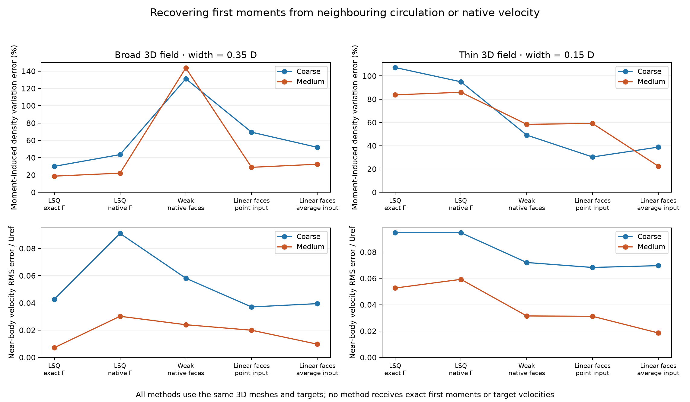
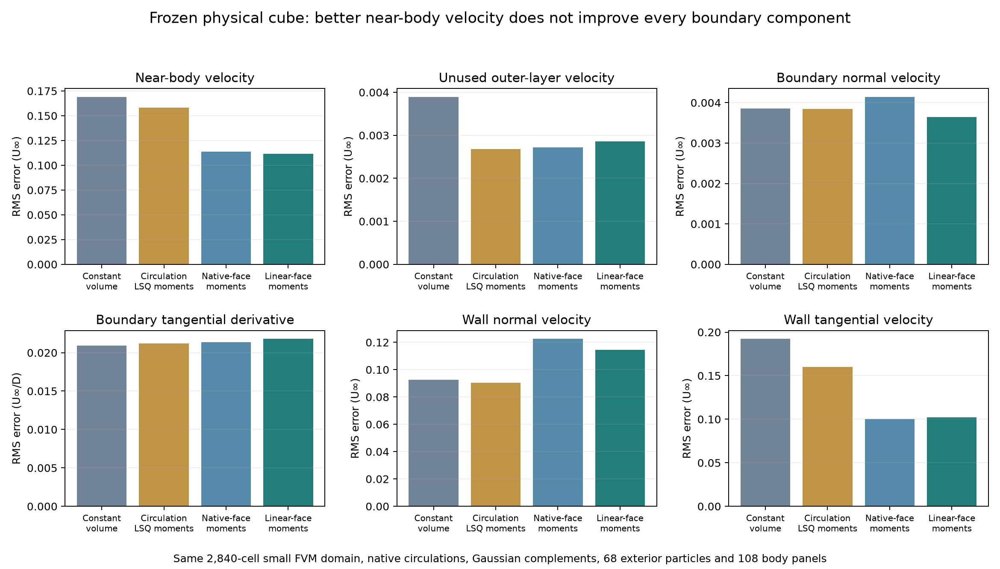

# Recovering first moments from FVM data

The subsequent [body-resolution and quadratic-reconstruction study](/Users/flaviomartins/OpenONDA/studies/coupler_accuracy/moment-panels-and-quadratic-3d.md)
tests the body-resolution dependence of these physical moment sources and
qualifies a quadratic velocity reconstruction on both manufactured meshes.

First vorticity moments recovered from velocity data improve the reconstructed
field of the frozen physical cube, without changing its cell circulations or
small FVM domain. Using linearly reconstructed face velocity reduces sampled
near-body induction RMS from **0.16900 to 0.11181 U∞**, a 33.8% reduction, and
coupling normal-velocity RMS from **0.003857 to 0.003644 U∞**, a 5.5% reduction.
However, tangential-derivative RMS increases by **4.1%**, and independent wall
penetration samples worsen. This is a measured tradeoff, not a production
transfer or the requested hybrid/reference agreement.

The experiment follows the [exact-moment manufactured study](manufactured-circulation-and-moments-3d.md).
That study established the value of extra cell information with oracle moments.
The methods here obtain moments from neighbouring circulations or velocity data;
**none receives exact first moments or target velocities**. One manufactured
control starts from exact cell circulation to isolate reconstruction from curl
error. The physical experiment uses only the small FVM mesh's own velocity and
circulation values. All meshes, fields, kernels and stencils are fully 3D.

## Two ways to acquire moments

The affine source has the previously qualified form

```text
Ω(y) = Γ/Vpoly + (y−c) B
M = ∫cell (y−c) Ωᵀ dV = S B
S = ∫cell (y−c)(y−c)ᵀ dV.
```

The first method fits a linear gradient of `Γ/Vpoly` from face-neighbouring
cells at their true polyhedral centroids. The least-squares weight is inverse
squared centre distance. A full three-dimensional stencil is required; rank
deficiency is rejected rather than treated as a 2D approximation. The maximum
normal-matrix condition numbers on the full coarse and medium meshes are about
3.013 and 3.025, respectively. Poor results here cannot be attributed to an
ill-conditioned solve.

The second method uses the weak-curl identity

```text
Γ = ∮cell n × u dA
Mij = ∮cell (y−c)i (n × u)j dA − (ei × ∫cell u dV)j.
```

The native-face variant keeps velocity constant over each actual face fan,
using the FVM's own owner/neighbour interpolation. Its Γ replays native curl
times stored FVM volume to at most `1.33e-14` after division by true cell volume.
The reconstructed-face variant extrapolates a cell least-squares velocity
polynomial to each face and takes the same weighted mean of the owner and
neighbour traces. It retains a shared linear velocity trace, including the
triangle's second area moment when integrating M. This variant also changes Γ
through its shared Stokes sum in the manufactured tests.

Point and average input are kept distinct. For point input, the estimated cell
velocity integral is

```text
∫cell u dV ≈ Vpoly [u(CFVM) + (cpoly−CFVM) · grad_LSQ(u)].
```

For the manufactured average-input control, the exact cell-average velocity is
supplied at the true polyhedral centroid. No assumption is made that a computed
physical FVM value equals either exact analytic quantity at finite resolution.
The centroid correction ensures affine consistency but does not recover
curvature within a cell.

The generic weak operator passes affine velocity/curl recovery on warped cells,
constant preservation, and the global shared-trace identities. With zero outer
and body traces, these give

```text
Σcell Γ = 0
Σcell [M + c ⊗ Γ] = −[ei × Σcell ∫cell u]i.
```

For the present manufactured cube, the body trace is exactly zero and the outer
analytic velocity is negligible. The helper explicitly treats prescribed
boundary velocity as constant over each face. It does not claim to reconstruct
general spatially varying VPM boundary data.

## Manufactured results on both existing meshes

The same coarse 17,592-cell and medium 53,752-cell meshes, 256 near-body off-grid
targets, 256 outer-layer targets and 1,536 wall targets are retained. All cells
are included; there is no pruning, radius fitting or source-amplitude tuning.
The two completed runs took about 112 and 340 seconds with one computation
thread each.



Near-body velocity RMS, normalized by the manufactured reference speed:

| Source method | Broad coarse | Broad medium | Thin coarse | Thin medium |
| --- | ---: | ---: | ---: | ---: |
| Previous native Γ, constant volume | 0.123445 | 0.057065 | 0.097683 | 0.071629 |
| Neighbour gradient of exact Γ/V | 0.042660 | 0.007111 | 0.094634 | 0.052651 |
| Neighbour gradient of native Γ/V | 0.091013 | 0.030186 | 0.094635 | 0.059243 |
| Weak native faces, point input | 0.058124 | 0.023989 | 0.072034 | 0.031469 |
| Weak linear faces, point input | 0.037038 | 0.019943 | 0.068270 | 0.031198 |
| Weak linear faces, average input | 0.039468 | 0.009704 | 0.069642 | 0.018555 |
| Previous exact Γ and exact M control | 0.012634 | 0.003478 | 0.052435 | 0.009570 |

The first and last rows use the same prior saved targets and are controls, not
new reconstruction runs. The average-input row has different supplied data from
the point-input rows; it is not an improvement obtainable merely by relabelling
the same cell values.

Neighbour differentiation of exact circulation leaves 83.7% relative error in
the thin medium field's affine vorticity variation. It performs worse than the
velocity-based methods despite starting with exact Γ. The relative moment error
uses the actual cell covariance:

```text
error² = Σcell trace[(B−Bexact)ᵀ S (B−Bexact)] / Σcell V.
```

This measures the L2 error of the source's affine variation. It is not an RMS
velocity error. In the broad medium field, weak native-face moments have 143.6%
relative variation error yet induce a smaller velocity error than the gradient
of native circulation, whose variation error is 22.1%. As in the preceding
decomposition, correlated errors and Biot–Savart projection matter. A favourable
velocity norm alone does not prove a faithful raw vorticity representation or
correct particle evolution.

## Applying the recovered moments to the physical small-domain overlap

The physical test uses the same frozen full-oracle initial state at `t=0.5` as
the [qualified overlap](native-volume-and-overlap-3d.md). The small FVM domain is
still approximately `[-1.5,1.5]^3`, with 2,840 unchanged cells. It retains the
same Gaussian complements, 68 exterior seed particles, 108 body source panels
and all 8,596 velocity/derivative target positions.

All four states retain **every original cell circulation**. Only first moments
are added, using the existing geometric taper from radius 0.75 to 1.25. The
2,112 active cells lie at least `0.249480 D` from every coupling target. The
near-cell affine correction has zero circulation, so the prior constant-volume
and Gaussian induction can be retained exactly. Body source strengths are
recomputed for the changed incident field.

The reconstruction uses only cells and neighbour relations in the small mesh.
Outer-boundary placeholders cannot enter active cell traces; that topology
condition is checked. The cube trace is zero. On active cells, the native-face
Stokes sum reproduces the original physical Γ to `9.34e-15` after division by
volume. In particular, the linear-face moment variant below retains native Γ;
it does **not** adopt the changed Γ from its reconstructed face trace.



| Moment source | Near-body velocity RMS / U∞ | Unused-layer RMS / U∞ | Coupling normal velocity RMS / U∞ | Tangential derivative RMS (U∞/D) |
| --- | ---: | ---: | ---: | ---: |
| None: previous constant-volume overlap | 0.168999 | 0.003892 | 0.00385652 | 0.02093832 |
| Neighbour circulation gradient | 0.158326 | 0.002681 | 0.00384310 | 0.02117800 |
| Weak native-face velocity | 0.113788 | 0.002719 | 0.00414237 | 0.02136066 |
| Weak linear-face velocity | 0.111809 | 0.002861 | 0.00364411 | 0.02179311 |

For linear-face moments, near-body error falls by 33.8% and normal boundary
error by 5.5%, while the tangential derivative worsens by 4.1%. Wall-normal
velocity RMS rises from `0.09250` to `0.11442 U∞`, whereas wall-tangential RMS
falls from `0.19225` to `0.10221 U∞`. The changed source field therefore also
changes the demands on the body-panel approximation. The same 108-panel
Neumann solve does not enforce no penetration at every independent wall sample.

These are errors of reconstructed induction, not errors of the advancing
near-body FVM solution. No drag calculation or time advance was performed in
this experiment. The latest advancing medium baseline remains about −2.10% in
drag in the [outflow study](outflow-convection-followup-3d.md).

## Derivative qualification and the discarded first attempt

The first physical attempt contained a sign typo in the newly written
half-step interior derivative. It used `−u(−h)` where the second-order formula
requires `+u(−h)`. That attempt is retained in a separately named directory with
an explicit failed-validation record; none of its measurements is used for the
qualified comparison.

The corrected helper is independently tested on fully 3D quadratic and cubic
vector fields: all six formulas are exact for the quadratic and exhibit the
expected second-order refinement for the cubic. The entire physical experiment
was rerun. Its zero-moment velocity matches the previous qualified overlap
exactly, and every derivative estimate reproduces that baseline. An independent
coefficient-based stencil evaluation also agrees exactly with the saved arrays.

In the corrected physical run, the maximum all-face step-halving difference is
`1.00e-7 U∞/D`, and the largest one-sided difference RMS is `3.52e-8 U∞/D`.
The derivative worsening of roughly `8.55e-4 U∞/D` for linear-face moments is
therefore far larger than this numerical trace uncertainty. Keeping support
inside the domain avoids the sharp interface ambiguity of the earlier volume
partition; it does not remove the observed boundary error.

## What this changes next

The exact-moment benefit can be recovered partially from available FVM data,
especially directly from velocity. Differentiating already averaged circulation
with a single neighbour layer is inadequate for the thinner field. This argues
for testing a reconstruction that retains velocity curvature and its consistent
cell averages, with quadratic-field reproduction before applying it to the
physical case. Its circulation and moments must be checked together against the
known manufactured answers.

Body resolution should also be rechecked with the new incident field. Earlier
panel refinement used different source representations; it does not settle the
larger wall-normal residual observed here. Holding moments and all volume/
particle sources fixed while varying only the body response can isolate that
effect. Neither change should be credited as a solver improvement without
checking the resulting boundary data and then the matched advancing forces and
profiles. Raw source moment conservation alone does not qualify induced curl,
diffusion or transport across the overlap.

## Code and reproducibility

The new reconstruction library is [native_moment_reconstruction_3d.py](native_moment_reconstruction_3d.py).
The [manufactured runner](cube_native_moment_reconstruction_3d.py) and
[physical overlap runner](cube_reconstructed_moment_overlap_3d.py) archive their
inputs and code before execution. Their completed result directories are
`cube-3d-native-moment-reconstruction-coarse`,
`cube-3d-native-moment-reconstruction-medium`, and
`cube-3d-reconstructed-moment-overlap` under `results/`.

Run in the OpenONDA Python environment with `PYTHONPATH=.` and one OpenMP/BLAS
thread, using new output directories:

```sh
python studies/coupler_accuracy/cube_native_moment_reconstruction_3d.py \
  --manufactured studies/coupler_accuracy/results/cube-3d-manufactured-induction-coarse \
  --exact-moments studies/coupler_accuracy/results/cube-3d-manufactured-linear-induction-coarse \
  --output studies/coupler_accuracy/results/my-moment-reconstruction-coarse

python studies/coupler_accuracy/cube_reconstructed_moment_overlap_3d.py \
  --output studies/coupler_accuracy/results/my-moment-overlap
```

The [verification record](results/reconstructed-moments-verification.json)
checks 51 source records and recomputes 400 saved metrics, all matching exactly.
It checks the global weak-moment identities, common meshes and target arrays,
unchanged physical circulation, baseline reproduction and derivative stencils.
The relevant regression records contain **57 passing tests**: the preceding
51, five new moment-reconstruction checks and one new derivative qualification.
Ruff and `git diff --check` pass. No production source was changed in this phase.
