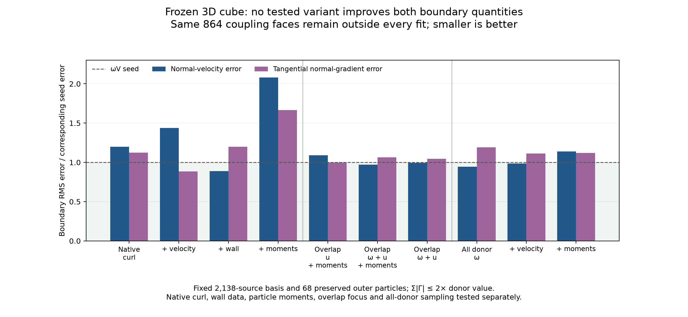

# Native, overlap and conservative reconstruction in the 3D cube

None of the ten tested variants improves both quantities supplied at the small
FVM boundary. These experiments reject several plausible modifications of the
current fixed particle basis; they do not qualify a new production transfer.
The desired hybrid/reference agreement remains unachieved.

The subsequent [native-face investigation](native-face-boundary-followup-3d.md)
qualifies the distinction between these interpolated boundary-gradient targets
and the full FVM's face operators. It retains these frozen reconstruction
measurements and addresses the independent cropped-FVM error.

The subsequent [cell-integral comparison](cell-integral-followup-3d.md) tests the
volume interpretation proposed below. Its joint integral fit improves both
boundary errors relative to the matched point fit, but no tested integral fit
improves both relative to the original donor seed.

All experiments use the same fully three-dimensional coarse cube at physical
time 0.5, h = σ = 0.125, an unchanged 2,138-source basis, 68 preserved outer
particles and the real 108-panel Neumann response. Kernels and solves use f64.
There is no advection, diffusion, FVM advance or fitted force/time alignment.
The 864 actual outer coupling faces remain outside every fit. All candidates
have a strength-magnitude bound of twice the immutable donor value and a donor
penalty of 0.05. Velocity and wall terms have weight 5 where present.

## Common boundary verification

Each row uses the same full-FVM face flux and gradient trace as the earlier
boundary oracle. The production flux correction and rejection threshold remain
in force. Gradient differences are evaluated by centred differences of complete
particle/panel velocity, with a step-halving check. Cell verification sets vary
between the experiments; the boundary verification set does not.

| Fit | Boundary normal-velocity error / U∞ | Tangential normal-gradient error (U∞/D) | Strength magnitude / donor | Particle-impulse change norm |
| --- | ---: | ---: | ---: | ---: |
| Donor ωV seed | 0.004500 | 0.016362 | 1.000 | 0 |
| Native curl | 0.005389 | 0.018404 | 1.668 | 5.452e-01 |
| Native curl + velocity | 0.006466 | 0.014467 | 2.000 | 4.597e-01 |
| Native curl + velocity + wall | 0.003996 | 0.019626 | 2.000 | 4.419e-01 |
| Native curl + velocity + wall + moments | 0.009353 | 0.027275 | 2.000 | 7.892e-13 |
| Overlap velocity + moments | 0.004906 | 0.016340 | 1.504 | 5.020e-16 |
| Overlap ω + velocity + moments | 0.004372 | 0.017382 | 1.473 | 2.224e-15 |
| Overlap ω + velocity | 0.004474 | 0.017135 | 1.271 | 4.224e-01 |
| All donor ω | 0.004248 | 0.019487 | 2.000 | 4.911e-01 |
| All donor ω + velocity | 0.004442 | 0.018188 | 2.000 | 9.394e-02 |
| All donor ω + velocity + moments | 0.005121 | 0.018338 | 2.000 | 7.725e-14 |



## What the ablations establish

The native-curl-only fit reduces independent cell-velocity RMS from 0.06617 to
0.04408 U∞. Its particle-impulse change has norm 0.5452, and both boundary errors
increase. Native curl plus velocity reduces the tangential-gradient error but
increases normal-velocity error. Thus reproducing the native curl more closely
is insufficient evidence for improved coupling.

Adding wall data reduces velocity RMS at the 108 fitted wall points to
0.01435 U∞, while 324 independent wall points still have RMS 0.18397 U∞.
These are three distinct barycentric points per triangle, evaluated just outside
the surface. With particle moments enforced, those errors become 0.01611 and
0.19011 U∞. The wall fit exposes a substantial sampling/representation problem.
The FVM still enforces its own no-slip condition; accuracy of the auxiliary
particle field inside the FVM domain is not substituted for hybrid accuracy.

The moment/budget projector preserves ΣΓ and ½Σ(x×Γ), and is checked against
an independent SLSQP constrained solve. It also passes translation/rotation
covariance and a complete fit-objective comparison. In the native/wall experiment,
the strength-sum and first-moment changes are 2.2e-13 and 7.9e-13 respectively.
Those are **particle sums for the raw full-space Gaussian field**. They do not
by themselves prove physical impulse conservation for the complete hybrid,
which includes the FVM field, body boundary and regional exchange. Enforcing
these sums worsens both boundary errors in this particular ablation.

The overlap experiments use 444 fit cells and 444 independent cells with
max(|x|,|y|,|z|) ≥ 1 in the original renewal dataset. Matching both overlap
vorticity and velocity while preserving moments gives relative vorticity errors
of 0.0263 at fitted cells and 9.222 at independent cells. The target-vorticity RMS
values of these two sets are similar (unweighted 0.05321 and 0.05404), so that
large difference is not explained by a near-zero denominator or grossly
unbalanced target magnitudes. The fit is strongly underdetermined and does not
reconstruct the field between its sample locations.

## Using all donor values changes the data roles

The final family uses all 2,512 original fit and verification cells as training
data. The raw-vorticity system then has more sampled cells than source
coefficients per component. The old verification cells are **not independent
validation in this family**. Verification instead uses the 328 unused cells of
the same small FVM mesh, plus the unchanged 864 boundary faces.

Those 328 cells have max(|x|,|y|,|z|) between 1.375271 and 1.375712; slight native
mesh warping puts them just beyond the renewal limit 1.375. They have weak FVM
vorticity: volume-weighted RMS 0.0010693, below the initial particle-retention
threshold 0.02. Their approximately 100% raw-vorticity relative errors therefore
mean approximately 0.00107 absolute error. They must not be compared directly
with relative errors on the earlier interior verification set.

Including all original cells suppresses their unconstrained interleaved freedom
by putting those values in the objective. It does not provide a new independent
accuracy claim at those locations. The separate boundary audit still rejects
default use: normal-velocity improvements come with larger tangential-gradient
errors. Adding the particle-moment equalities worsens both errors relative to
the donor seed in the all-donor joint fit.

The all-donor result has a metadata-label clarification beside its immutable
numerical record: the overlap metric uses the actual code condition r∞ ≥ 1;
the old text's upper limit 1.375 did not describe its unused outer-layer cells.
No numerical values or original source snapshots were altered.

## Consequences for the next change

These are bounded ablations of one basis, not a proof that every possible
weight or representation must fail. They provide little support for more weight
tuning on the same point-collocation system. The next representation test should
distinguish the FVM's volume-normalized face circulation from point-sampled
Gaussian vorticity. Cell-integrated particle vorticity and continuous curl need
separate checks on the native cell geometry, followed by the same interface audit.

The independent FVM boundary oracle also remains necessary. Its current targets
include interpolated cell gradients, which should be compared with the actual
native face diffusive and pressure fluxes before attributing its residual
hybrid/reference difference to particles. Exact operator identities and local
replay need stronger qualification before promising machine-precision trajectories.

The production renewal and its acceptance gates were not changed in this work.
The new implementations live under studies, including the moment/budget
projector. The focused suite passes 16 tests: twelve existing reconstruction and
native-curl checks plus four new moment/optimization checks. See
[the test record](results/3d-native-moment-regression.xml).

## Reproduction and evidence

Use the OpenONDA Python environment with PYTHONPATH=. and single-threaded BLAS.
Output directories must be new. Defaults reference the saved coarse seed and
failed projection; no new reference trajectory is supplied to a live hybrid.

```sh
python studies/coupler_accuracy/native_reconstruction_3d.py \
  --output /private/tmp/cube-native-fit
python studies/coupler_accuracy/native_reconstruction_3d.py \
  --fit-family overlap --output /private/tmp/cube-overlap-fit
python studies/coupler_accuracy/native_reconstruction_3d.py \
  --fit-family raw --fit-data all_donor --output /private/tmp/cube-all-donor-fit
python studies/coupler_accuracy/native_curl_3d.py \
  --study /private/tmp/cube-native-fit --output /private/tmp/cube-native-boundary
python studies/coupler_accuracy/plot_cube_3d_study.py --plots reconstruction_followup
```

Run the same boundary-audit command for each other fit directory. Each fit
archives its study sources and hashes at startup. Completed records:

- [Native-curl fits](results/cube-3d-native-reconstruction/native-reconstruction-3d.json)
  and [boundary audit](results/cube-3d-native-reconstruction-boundary/native-curl-3d.json).
- [Overlap fits](results/cube-3d-overlap-reconstruction/native-reconstruction-3d.json)
  and [boundary audit](results/cube-3d-overlap-reconstruction-boundary/native-curl-3d.json).
- [All-donor fits](results/cube-3d-all-donor-reconstruction/native-reconstruction-3d.json)
  and [boundary audit](results/cube-3d-all-donor-reconstruction-boundary/native-curl-3d.json).

The [main 3D findings](cube-3d-findings.md) retain the live medium-resolution
comparisons and the broader acceptance requirements.
