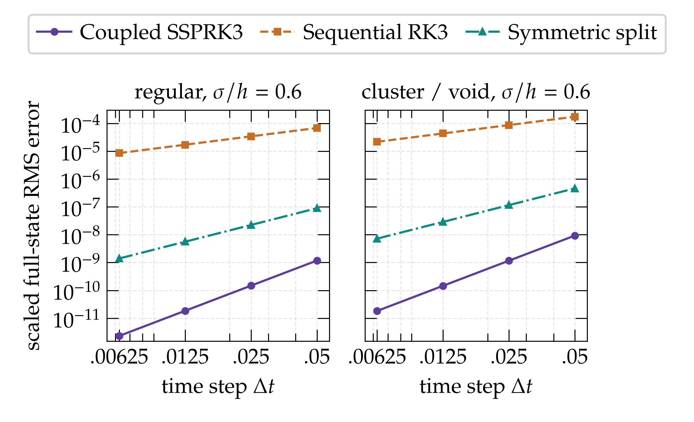

# Coupled position–strength time integration

This study justifies advancing particle positions and vector strengths at the
same Runge–Kutta stages in OpenONDA. Velocity and its gradient are evaluated
from each common stage state; velocity is not an additional independently
integrated particle variable.

**The concrete benefit demonstrated here is third-order temporal accuracy for
the tested fixed-core inviscid particle equations.** The sequential comparison
has first-order accuracy, even with third-order integration of each subproblem.
This supports the coupled formulation as an accuracy-oriented design choice.
It does not establish that it is always more stable.

## Experiment and result

The main experiment uses 27 particles with fixed positive Gaussian cores and
direct induction, with the transposed stretching law. Four clouds—regular, two
seeded jittered distributions, and a clustered distribution with a void—are
tested at core-to-spacing ratios `sigma/h` of 0.6, 1.0 and 1.5, where the
volume-based particle spacing is `h=V_p^(1/3)`. Each of these
12 cases is integrated to time 0.4 with time steps 0.05, 0.025, 0.0125 and
0.00625. Errors use a scaled RMS norm of the complete position–strength state
against a refined numerical reference.

| Update | Observed order, finest pair across 12 cases |
|---|---:|
| Common-stage SSPRK3 | 2.974–3.000 |
| Full advection then full stretching, each using RK3 | 0.99993–1.00010 |
| Symmetric advection/2–stretching–advection/2 split | 1.99995–2.00007 |



See the [all-case order summary](figures/fixed_core_order_summary.pdf) and
[raw temporal table](data/fixed_core/temporal.csv). The smallest errors approach
floating-point/reference resolution; the result should be read as an observed
order comparison, not an unrestricted claim about enormous error-reduction
factors.

The mathematical reason is the coupling between the two subproblems. Writing
the state as `Y = (X, α)`, with `A = (U, 0)` and `B = (0, S)`, a full `A` step
followed by a full `B` step introduces the leading local defect
`Δt² (B′A − A′B)/2`. It generally gives first-order global accuracy. Symmetric
splitting cancels this leading defect and is second order. Common-stage
SSPRK3 instead has local error `O(Δt⁴)` for a sufficiently smooth coupled ODE.
These are standard integration results, applied here to position–strength
coupling: [Strang (1968)](https://doi.org/10.1137/0705041) and
[Gottlieb, Shu and Tadmor (2001)](https://doi.org/10.1137/S003614450036757X).

## Stability and interpretation

The [oscillator comparison](figures/oscillator_stability.pdf) deliberately
tests the limit of a superiority claim. Coupled SSPRK3 has an imaginary-axis
stability boundary at `ωΔt = √3`, whereas the tested exact split subflows are
power-bounded for each fixed `0 < ωΔt < 2`. Their generally non-orthogonal maps
do not preserve physical Euclidean amplitude, and the boundary at 2 is
defective. Thus a split method can have a larger usable modal-stability
interval in this example. The [separate comparator](figures/comparator_convergence.pdf)
also includes a synthetic two-particle model; it is not a production-kernel
validation.

[Finite-cloud moment diagnostics](figures/geometry_moment_defects.pdf) and
[small-cloud tangent estimates](figures/tangent_excess.pdf) document sensitivity
to geometry and perturbations. They do not establish a universal overlap
threshold. The SSP property requires a suitable forward-Euler stability
property in a specified functional; that premise has not been established here
for general three-dimensional vortex stretching.
[Gottlieb, Shu and Tadmor (2001)](https://math.umd.edu/~tadmor/pub/linear-stability/Gottlieb-Shu-Tadmor.SIREV-01.pdf).

## Reproduce and inspect

From this directory, use the installed OpenONDA Python environment. Figure
generation also requires LaTeX, `dvipng`, `newpxtext` and `newpxmath` for the
project's thesis typography:

```sh
python3 scripts/verify.py
python3 scripts/plot_results.py
```

The second command regenerates the six figures from accepted data without
rerunning the experiments. PNG, PDF and SVG exports are in [figures/](figures/).
Equivalent LaTeX PDF exports can have different font-subset identifiers;
after intentionally regenerating figures, refresh hashes with
`python3 scripts/verify.py --write-manifest` from a full repository checkout.
Ordinary verification checks the packaged files without requiring the original
`docs/reviews/` files.
Optional numerical reproduction writes separate `reproduced/` subdirectories:

```sh
python3 scripts/run_fixed_core.py
python3 scripts/run_comparator.py
```

[Frozen scripts](provenance/frozen_scripts/), [result tables](data/), and
[original research reports](provenance/reviews/) preserve the accepted evidence.
The [methodology](METHODS.md), [equation ledger](EQUATIONS.md) and
[source ledger](SOURCES.md) give the definitions and supporting references.
The main probe is a standalone NumPy implementation of the then-current
Gaussian conventions, including the former kernel approximation. These data
were not regenerated after the subsequent Gaussian precision correction and
must not be presented as measurements of that corrected native implementation.
The original reports retain their historical wording and source paths.

## Conclusions and scope

Common-stage integration avoids the leading position–strength splitting defect
and recovers the expected third-order temporal convergence in all 12 tested
cases. This is sufficient evidence for the design justification.

The study fixes particle count and cores and excludes viscosity, LES, core
evolution, particle insertion/deletion, VLM coupling and approximate induction.
It proves neither spatial convergence to the fluid equations nor stability of
the complete production step, long-time rotor stability, or a computational
speedup. No additional noise or turbulence campaign is part of this study.
